# Tnkfactory SDK Rwd

## 목차

1. [SDK 설정하기](#1-sdk-설정하기)

   * [라이브러리 등록](#라이브러리-등록) 
   * [Manifest 설정하기](#manifest-설정하기)
     * [Application ID 설정하기](#application-id-설정하기)
     * [권한 설정](#권한-설정)
     * [Activity tag 추가하기](#activity-tag-추가하기)
   * [Proguard 사용](#proguard-사용)
   * [COPPA 설정](#coppa-설정)

2. [광고 목록 띄우기](#2-광고-목록-띄우기)
    
3. [Publisher API](#3-publisher-api)
 
   가. [광고 목록 출력](#가-광고-목록-출력)
   
   * [유저 식별 값 설정](#유저-식별-값-설정)
     * [Method](#method)
     * [Parameters](#parameters)
   * [광고 목록 띄우기 (Activity)](#광고-목록-띄우기-activity)
     * [Method](#method-1)
     * [Description](#description)
     * [Parameters](#parameters-1)
     * [적용예시](#적용예시)
   * [AdListTabView](#adlisttabview)
     * [Method](#method-2)
     * [Parameters](#parameters-2)
     * [Embed Sample](#embed-sample)
   * [Listener 이용하기](#listener-이용하기)

   나. [포인트 조회 및 인출](#나-포인트-조회-및-인출)

      * [TnkSession.queryPoint()](#tnksessionquerypoint)

   * [TnkSession.purchaseItem()](#tnksessionpurchaseitem)
   * [TnkSession.withdrawPoints()](#tnksessionwithdrawpoints)
   * [TnkSession.getEarnPoints()](#tnksessiongetearnpoints)

   다. [그밖의 기능들](#다-그밖의-기능들)

   * [TnkSession.queryPublishState()](#tnksessionquerypublishstate)
   * [TnkSession.queryAdvertiseCount()](#tnksessionqueryadvertisecount)
   * [TnkSession.enableLogging()](#tnksessionenablelogging)
   * [TnkSession.setAgreePrivacy()](#tnksessionsetagreeprivacy)

   라. [디자인 변경하기](#라-디자인-변경하기)

     * [TnkLayout](#tnklayout)
       * [TnkLayout 객체](#tnklayout-객체)
       * [피드형/아이콘형 설정하기](#피드형아이콘형-설정하기)
       * [적용예시](#적용예시-7)
      * [템플릿 디자인 제공](#템플릿-디자인-제공)
           * [사용방법 예시](#사용방법-예시)
           * [템플릿 디자인](#템플릿-디자인)
   * [문의하기, 스타일 변경, 닫기 버튼 기능 구현](#문의하기-스타일-변경-닫기-버튼-기능-구현)
        * [구현방법](#구현방법)
        * [적용예시](#적용예시-8)

   마. [Callback URL](#마-callback-url)

   * [호출방식](#호출방식)
   * [Parameters](#parameters-12)
   * [리턴값처리](#리턴값-처리)
   * [Callback URL 구현 예시 (Java)](#callback-url-구현-예시-java)

4. [Analytics Report](#4-analytics-report)

   * [기본 설정](#기본-설정)
   * [TNK SDK 초기화](#tnk-sdk-초기화)
     * [Method](#method)
     * [Parameters](#parameters)
   * [사용 활동 분석](#사용-활동-분석)
     * [TnkSession.actionCompleted()](#tnksessionactioncompleted)
   * [구매 활동 분석](#구매-활동-분석)
     * [TnkSession.buyCompleted()](#tnksessionbuycompleted)
   * [사용자 정보 설정](#사용자-정보-설정)

   

## 1. SDK 설정하기

### 라이브러리 등록
TNK SDK는 Maven Central에 배포되어 있습니다.

settings.gradle에 아래와 같이 mavenCentral()가 포함되어있는지 확인합니다.
```gradle
pluginManagement {
    repositories {
        gradlePluginPortal()
        google()
        mavenCentral()
    }
}
dependencyResolutionManagement {
    repositoriesMode.set(RepositoriesMode.FAIL_ON_PROJECT_REPOS)
    repositories {
        google()
        mavenCentral()
    }
}
rootProject.name = "project_name"
include ':app'
```

만약 settings.gradle에 저 부분이 존재하지 않다면 최상위 Level(Project)의 build.gradle에 maven repository를 추가해주세요.
```gradle
repositories {
    mavenCentral()
}
```

아래의 코드를 App Module의 build.gradle 파일에 추가해주세요.
```gradle
dependencies {
    implementation 'com.tnkfactory:rwd:7.30.7'
}
```
### Manifest 설정하기

#### 권한 설정

아래와 같이 권한 사용을 추가합니다.
```xml
// 인터넷
<uses-permission android:name="android.permission.INTERNET" />
// 동영상 광고 재생을 위한 wifi접근
<uses-permission android:name="android.permission.ACCESS_WIFI_STATE" />
// 광고 아이디 획득
<uses-permission android:name="com.google.android.gms.permission.AD_ID"/>
```

#### Application ID 설정하기

Tnk 사이트에서 앱 등록하면 상단에 App ID 가 나타납니다. 이를 AndroidMenifest.xml 파일의 application tag 안에 아래와 같이 설정합니다.
(*your-application-id-from-tnk-site* 부분을 실제 App ID 값으로 변경하세요.)


```xml
<application>

    <meta-data android:name="tnkad_app_id" android:value="your-application-id-from-tnk-site" />

</application>
```


#### Activity tag 추가하기

광고 목록을 띄우기 위한 Activity 2개를 <activity/>로 아래와 같이 설정합니다. 매체앱인 경우에만 설정하시면 됩니다. 광고만 진행하실 경우에는 설정하실 필요가 없습니다.


```xml
<activity android:name="com.tnkfactory.ad.AdWallActivity" android:exported="true"/>
<activity android:name="com.tnkfactory.ad.AdMediaActivity" android:screenOrientation="portrait" android:exported="true"/>

<!-- 또는 아래와 같이 설정-->
<activity android:name="com.tnkfactory.ad.AdMediaActivity" android:screenOrientation="sensorLandscape" android:exported="true"/>
```

AndroidManifest.xml의 내용 예시 
```xml
<?xml version="1.0" encoding="utf-8"?>
<manifest xmlns:android="http://schemas.android.com/apk/res/android"
    package="com.tnkfactory.tnkofferer">

    // 인터넷
    <uses-permission android:name="android.permission.INTERNET" />
    // 동영상 광고 재생을 위한 wifi접근
    <uses-permission android:name="android.permission.ACCESS_WIFI_STATE" />
    // 광고 아이디 획득
    <uses-permission android:name="com.google.android.gms.permission.AD_ID"/>
    // 기타 앱에서 사용하는 권한
    //...
    //...
    
    
    <application
        android:allowBackup="true"
        android:icon="@mipmap/ic_launcher"
        android:label="@string/app_name"
        android:roundIcon="@mipmap/ic_launcher_round"
        android:supportsRtl="true"
        android:theme="@style/AppTheme">

        ...
        ...
        <activity android:name="com.tnkfactory.ad.AdWallActivity" android:exported="true"/>
        <activity android:name="com.tnkfactory.ad.AdMediaActivity" android:screenOrientation="fullSensor" android:exported="true"/>
        ...
        ...
        <!-- App ID -->
        <meta-data
            android:name="tnkad_app_id"
            android:value="30408070-4051-9322-2239-15040708030f" />
        ...
        ...
    </application>
</manifest>
```
	

### Proguard 사용

Proguard를 사용하실 경우 Proguard 설정내에 아래 내용을 반드시 넣어주세요.

```
-keep class com.tnkfactory.** { *;}
```

### COPPA 설정

COPPA는 [미국 어린이 온라인 개인정보 보호법](https://www.ftc.gov/tips-advice/business-center/privacy-and-security/children's-privacy) 및 관련 법규입니다. 구글 에서는 앱이 13세 미만의 아동을 대상으로 서비스한다면 관련 법률을 준수하도록 하고 있습니다. 연령에 맞는 광고가 보일 수 있도록 아래의 옵션을 설정하시기 바랍니다.

```java
TnkSession.setCOPPA(MainActivity.this, true); // ON - 13세 미만 아동을 대상으로 한 서비스 일경우 사용
TnkSession.setCOPPA(MainActivity.this, false); // OFF
```

## 2. 광고 목록 띄우기


```diff
- 주의 : 테스트 상태에서는 테스트하는 장비를 개발 장비로 등록하셔야 광고목록이 정상적으로 나타납니다.
```
링크 : [테스트 단말기 등록방법](https://github.com/tnkfactory/android-sdk-rwd/blob/master/reg_test_device.md)

다음과 같은 과정을 통해 광고 목록을 출력 하실 수 있습니다.

1) TNK SDK 초기화 

2) 유저 식별값 설정

3) COPPA 설정

4) 광고 목록 출력

광고 목록을 출력하는 Activity의 예제 소스

```java
public class MainActivity extends AppCompatActivity {


    @Override
    protected void onCreate(Bundle savedInstanceState) {
        super.onCreate(savedInstanceState);
        setContentView(R.layout.activity_main);

        // 유저 식별 값 설정
        TnkSession.setUserName(MainActivity.this, "유저 식별값");

        // Analytics Report를 사용 할 경우 적용 (앱 시작시 동작하는 activity에서 호출하시기 바랍니다.)
        TnkSession.applicationStarted(this);

        // COPPA 설정 (true - ON / false - OFF)
        TnkSession.setCOPPA(MainActivity.this, false);

        // 광고 출력버튼
        Button btnShowAd = (Button) findViewById(R.id.btn_show_ad);

        btnShowAd.setOnClickListener(new OnClickListener() {
            @Override
            public void onClick(View v) {
                TnkSession.showAdListByType(MainActivity.this, "Basic", AdListType.ALL, AdListType.PPI, AdListType.CPS);
            }
        });

    }
}
```

## 3. Publisher API

게시앱(Publisher)을 위한 가이드입니다.

### 가. 광고 목록 출력

#### 유저 식별 값 설정

앱이 실행되면 우선 앱 내에서 사용자를 식별하는 고유한 ID를 아래의 API를 사용하시어 Tnk SDK에 설정하시기 바랍니다. 

사용자 식별 값으로는 게임의 로그인 ID 등을 사용하시면 되며, 적당한 값이 없으신 경우에는 Device ID 값 등을 사용할 수 있습니다.

(유저 식별 값이 Device ID 나 전화번호, 이메일 등 개인 정보에 해당되는 경우에는 암호화하여 설정해주시기 바랍니다.) 

유저 식별 값을 설정하셔야 이후 사용자가 적립한 포인트를 개발사의 서버로 전달하는 callback 호출 시에  같이 전달받으실 수 있습니다.

##### Method

- void TnkSession.setUserName(Context context, String userName)

##### Parameters

| 파라메터 명칭 | 내용                                                         |
| ------------- | ------------------------------------------------------------ |
| context       | 현재 Activity 또는 Context 객체                              |
| userName      | 앱에서 사용자를 식별하기 위하여 사용하는 고유 ID 값 (로그인 ID 등)  길이는 256 bytes 이하입니다. |

#### 광고 목록 띄우기 (Activity)

자신의 앱에서 광고 목록을 띄우기 위하여 TnkSession.showAdListByType() 함수를 사용합니다. 멀티탭 광고목록을 보여주기 위하여 새로운 Activity를 띄웁니다.

##### Method

- void TnkSession.showAdListByType(Activity activity, AdListType... adListType)
- void TnkSession.showAdListByType(Activity activity, String title, AdListType... adListType)
- void TnkSession.showAdListByType(Activity activity, String title, TnkLayout userLayout, AdListType... adListType)
- void TnkSession.showAdListByType(Activity activity, TnkLayout userLayout, AdListType... adListType)

##### Description

멀티탭 광고 목록 화면 (AdWallActivity)를 화면에 띄웁니다. 

반드시 Main UI Thread 상에서 호출하여야 합니다.

##### Parameters

| 파라메터 명칭 | 내용                                                         |
| ------------- | ------------------------------------------------------------ |
| activity      | 현재 Activity 객체                                           |
| title         | 광고 리스트의 타이틀을 지정함  (기본값 : 무료 포인트 받기)   |
|adListType | 광고 리스트의 타입 (ALL : 보상형과 구매형 모두 표시, PPI : 보상형, CPS : 구매형) |
| userLayout    | 원하는 Layout을 지정할 수 있습니다. 자세한 내용은  [[디자인 변경하기](#라-디자인-변경하기)] 내용을 참고해주세요. |

##### 적용예시

```java
@Override

public void onCreate(Bundle savedInstanceState) {

    ...

    final Button button = (Button)findViewById(R.id.main_ad);

    button.setOnClickListener(new OnClickListener() {

        @Override

        public void onClick(View v) {
            TnkSession.showAdListByType(MainActivity.this,
                                  "Your title here",
                                  AdListType.ALL,
                                  AdListType.PPI,
                                  AdListType.CPS      
                                 );
        }

    });
}
```

#### AdListTabView

AdListTabView 보상형 탭형 광고목록을 제공하는 View 객체입니다. 개발자는 createAdListTabView() 메소드를 사용하여 AdListTabView 객체를 생성할 수 있습니다.

생성된 AdListTabView 객체를 현재 Activity에 팝업형태로 띄우거나 자신의 구성한 화면의 하위 View로 추가(addView) 할 수 있습니다.

##### Method

- AdListTabView TnkSession.createAdListTabView(Activity activity, AdListType... adListType)
- AdListTabView TnkSession.createAdListTabView(Activity activity, String title, AdListType... adListType)
- AdListTabView TnkSession.createAdListTabView(Activity activity, String title, TnkLayout userLayout, AdListType... adListType)
- AdListTabView TnkSession.createAdListTabView(Activity activity, TnkLayout userLayout, AdListType... adListType)

##### Parameters

| 파라메터 명칭 | 내용                                                         |
| ------------- | ------------------------------------------------------------ |
| activity      | 현재 Activity 객체                                           |
| adListType      |  광고 리스트의 타입을 설정합니다. (ALL : 보상형과 구매형 모두 표시, PPI : 보상형, CPS : 구매형)  |
| userLayout    | 원하는 Layout을 지정할 수 있습니다. 자세한 내용은  [[디자인 변경하기](#라-디자인-변경하기)] 내용을 참고해주세요. |

아래의 메소드들은 AdListTabView에서 제공하는 기능들입니다.

###### void setListener(TnkAdListener listener)

- AdListTabView 팝업 화면이 나타날때와 사라질때의 event를 받기 위하여 TnkAdListener 객체를 설정합니다.

- 자세한 내용은 하단의 TnkAdListener 내용을 참고해주세요.

##### Embed Sample

```java
// AdListType은 가변인자로 사용하기 원하는 타입을 n개 넣어주시면 n개만큼 탭이 생성됩니다.
AdListTabView adListTabView = TnkSession.createAdListTabView(this, "Get Free Coins!!", layout, AdListType.ALL, AdListType.PPI, AdListType.CPS);

ViewGroup viewGroup = (ViewGroup)findViewById(R.id.adlist);
viewGroup.addView(adlistView);
```
#### Listener 이용하기

AdListView를 팝업화면으로 화면에 띄울 경우 화면이 나타나는 시점과 화면이 닫히는 시점을 알고 싶을 때 아래의 TnkAdListener 인터페이스를 사용합니다.

TnkAdListener는 원래 전면 광고([Interstitial Ad](http://docs.tnkad.net/tnk-interstitial-ad) 참고)에서 사용되지만 광고 리스트 화면에서도 화면이 팝업형태로 나타날 때 (onShow)와 닫힐 때(onClose)의 이벤트를 받기 위하여 사용될 수 있습니다.

##### TnkAdListener Interface

```java
 // 사용자가 닫기버튼이나 Back key를 눌러서 광고화면을 닫은 경우
 public static final int CLOSE_SIMPLE = 0;

 // 사용자가 광고를 클릭해서 화면이 닫히는 경우
 public static final int CLOSE_CLICK = 1;

 // 종료시 띄워주는 광고화면에서 종료 버튼을 클릭해서 닫은 경우
 public static final int CLOSE_EXIT = 2;

 public static final int FAIL_NO_AD = -1;  // no ad available
 public static final int FAIL_NO_IMAGE = -2; // ad image not available
 public static final int FAIL_TIMEOUT = -3; // ad arrived after 5 secs.
 public static final int FAIL_CANCELED = -4; // ad frequency settings 

 public static final int FAIL_SYSTEM = -9;

 /**
  * 팝업 화면이 닫힐 때 호출됩니다. 
  * 화면이 닫히는 이유를 파라메터로 전달해 줍니다.
  * @param type 
  */
 public void onClose(int type);


 /**
  * 팝업 화면이 나타나는 시점에 호출됩니다.
  */
 public void onShow();

 public void onFailure(int errCode);

 public void onLoad();
}
```

AdListView와 관련되어 TnkAdListener에서 발생하는 이벤트의 내용은 아래와 같습니다.

- onClose(int type) : 팝업 화면이 닫히는 시점에 호출됩니다. 화면이 닫히는 이유가 type 파라메터로 전달됩니다.
- - CLOSE_SIMPLE (0) : 사용자가 전면 화면의 닫기 버튼이나 Back 키를 눌러서 닫은 경우입니다.
  - CLOSE_CLICK (1) : 사용자가 전면 화면의 광고를 클릭하여 해당 광고로 이동하는 경우 입니다.
- onShow() : 팝업화면이 나타날 때 호출됩니다.
- AdListView에서는 위 2가지 이외의 이벤트는 발생하지 않습니다.

### 나. 포인트 조회 및 인출

사용자가 광고참여를 통하여 획득한 포인트는 Tnk서버에서 관리되거나 앱의 자체서버에서 관리될 수 있습니다.

포인트가 Tnk 서버에서 관리되는 경우에는 다음의 포인트 조회 및 인출 API를 사용하시어 필요한 아이템 구매 기능을 구현하실 수 있습니다.

#### TnkSession.queryPoint()

Tnk서버에 적립되어 있는 사용자 포인트 값을 조회합니다. 

동기 방식과 비동기 방식 2가지 호출 방식을 제공하고 있으며 화면 멈춤 현상이 없도록 구현하기 위해서는 비동기 방식을 사용할 것을 권장합니다.

다만 Main UI Thread 가 아닌 별도 Thread를 생성하여 호출하는 경우 (주로 게임 앱)에는 비동기 방식을 사용할 수 없으므로 별도 Thread를 생성하여 동기 방식으로 호출하셔야 합니다.

##### [비동기로 호출하기]

###### Method 

  - void TnkSession.queryPoint(Context context, boolean showProgress, ServiceCallback callback)

###### Description

Tnk 서버에 적립되어 있는 사용자 포인트 값을 조회합니다. 비동기 방식으로 호출되며 결과를 받으면 callback이 호출됩니다. Main UI Thread 상에서만 호출이 가능합니다.
ServiceCallback의 사용법은 아래 적용예시를 참고해주세요.

###### Parameters

| 파라메터 명칭 | 내용                                                         |
| -------------- | ----------------------------------------------------------- |
| context       | 현재 Activity 또는 Context 객체                              |
| showProgress  | 서버에서 결과가 올때까지 화면에 progress dialog를 띄울지 여부를 지정 |
| callback      | 서버에서 결과가 오면 callback 객체의 OnReturn(Context context, Object result) 메소드가 호출됩니다. 메소드 호출은 Main UI Thread 상에서 이루어 집니다. 전달된 result 객체는 Integer 객체이며 사용자 포인트가 담겨 있습니다. |

###### 적용예시

```java
@Override
public void onCreate(Bundle savedInstanceState) {

    // ...

    final TextView pointView = (TextView)findViewById(R.id.main_point);

    TnkSession.queryPoint(this, true, new ServiceCallback() {

        @Override
        public void onReturn(Context context, Object result) {
            Integer point = (Integer)result;
            pointView.setText(String.valueOf(point));
        }
	});

	// ...
}
```

##### [동기방식으로 호출하기]

###### Method 

  - int TnkSession.queryPoint(Context context)

###### Description

Tnk 서버에 적립되어 있는 사용자 포인트 값을 조회하여 그 결과를 int 값으로 반환합니다. 

###### Parameters

| 파라메터 명칭 | 내용                            |
| ------------- | ------------------------------- |
| context       | 현재 Activity 또는 Context 객체 |

###### Return : int

  - 서버에 적립되어 있는 포인트 값

###### 적용예시

```java
static public void getPoint() {

    new Thread() {

        public void run() {
            int point = TnkSession.queryPoint(mActivity);
            showPoint(point); // 결과를 받아서 필요한 로직을 수행한다.
        }
    }.start();
}
```

#### TnkSession.purchaseItem()

TnK 서버에서는 별도로 아이템 목록을 관리하는 기능을 제공하지는 않습니다. 
다만 게시앱에서 제공하는 아이템을 사용자가 구매할 때 Tnk 서버에 해당 포인트 만큼을 차감 할 수 있습니다. 이 API 역시 비동기 방식과 동기 방식을 모두 제공합니다.

##### [비동기로 호출하기]

###### Method 

  - void TnkSession.purchaseItem(Context context, int pointCost, String itemId, boolean showProgress, ServiceCallback callback)

###### Description

Tnk 서버에 적립되어 있는 사용자 포인트를 차감합니다. 차감내역은 Tnk사이트의 보고서 페이지에서 조회하실 수 있습니다.

###### Parameters

| 파라메터 명칭 | 내용                                                         |
| -------------- | ----------------------------------------------------------- |
| context       | 현재 Activity 또는 Context 객체                              |
| pointCost     | 차감할 포인트                                                |
| itemId        | 구매할 아이템의 고유 ID (게시앱에서 정하여 부여한 ID) Tnk 사이트의 보고서 페이지에서 함께 보여줍니다. |
| showProgress  | 서버에서 결과가 올때까지 화면에 progress dialog를 띄울지 여부를 지정 |
| callback      | 서버에서 결과가 오면 callback 객체의 OnReturn(Context context, Object result) 메소드가 호출됩니다. 메소드 호출은 Main UI Thread 상에서 이루어 집니다. 전달된 result 객체는 long[] 객체이며 long[0] 값은 차감 후 남은 포인트 값이며, long[1] 값은 고유한 거래 ID 값이 담겨 있습니다. long[1] 값이 음수 인경우에는 포인트 부족 등으로 오류가 발생한 경우입니다. |

###### 적용예시

```java
@Override
public void onClick(View v) {

    TnkSession.purchaseItem(MainActivity.this, 30, "item.00001", true,

        new ServiceCallback() {

            @Override
            public void onReturn(Context context, Object result) {

                long[] ret = (long[])result;

                if (ret[1] < 0) {
                     // error
                } else {
                     Log.d("tnkad", "current point = " + ret[0] + ", transaction id = " + ret[1]);
                     pointView.setText(String.valueOf(ret[0]));
                }
            }
    	});
}
```

##### [동기방식으로 호출하기]

###### Method 

  - long[] TnkSession.purchaseItem(Context context, int pointCost, String itemId)

###### Description

Tnk 서버에 적립되어 있는 사용자 포인트를 차감하고 그 결과를 long[] 로 반환합니다. 차감내역은 Tnk사이트의 보고서 페이지에서 조회하실 수 있습니다.

###### Parameters

| 파라메터 명칭 | 내용                                                         |
| ------------- | ------------------------------------------------------------ |
| context       | 현재 Activity 또는 Context 객체                              |
| pointCost     | 차감할 포인트                                                |
| itemId        | 구매할 아이템의 고유 ID (게시앱에서 정하여 부여한 ID) Tnk 사이트의 보고서 페이지에서 함께 보여줍니다. |

###### Return : long[]

  - long[0] 은 포인트 차감후 남은 포인트 값입니다.
  - long[1] 은 고유한 거래 번호 값입니다. 이 값이 음수 인 경우에는 오류가 발생한 것입니다. (포인트 부족 등)

#### TnkSession.withdrawPoints()

Tnk 서버에서 관리되는 사용자 포인트 전체를 한번에 인출하는 기능입니다.

##### [비동기로 호출하기]

###### Method 

  - void TnkSession.withdrawPoints(Context context, String desc, boolean showProgress, ServiceCallback callback)

###### Description

Tnk 서버에 적립되어 있는 사용자의 모든 포인트를 차감합니다. 차감내역은 Tnk사이트의 보고서 페이지에서 조회하실 수 있습니다.

###### Parameters

| 파라메터 명칭 | 내용                                                         |
| -------------- | ----------------------------------------------------------- |
| context       | 현재 Activity 또는 Context 객체                              |
| desc          | 인출과 관련된 설명 등을 넣어줍니다. Tnk 사이트의 보고서 페이지에서 함께 보여줍니다. |
| showProgress  | 서버에서 결과가 올때까지 화면에 progress dialog를 띄울지 여부를 지정 |
| callback      | 서버에서 결과가 오면 callback 객체의 OnReturn(Context context, Object result) 메소드가 호출됩니다. 메소드 호출은 Main UI Thread 상에서 이루어 집니다. 전달된 result 객체는 Integer 객체이며 인출된 포인트 값입니다. 해당 사용자에게 충전된 포인트가 없는 경우에는 0이 반환됩니다. |

###### 적용예시

```java
@Override
public void onClick(View v) {

    TnkSession.withdrawPoints(MainActivity.this, "user_delete", true,

        new ServiceCallback() {

            @Override
            public void onReturn(Context context, Object result) {

                int point = (Integer)result;
                Log.d("tnkad", "withdraw point = " + point);
                
                pointView.setText(String.valueOf(point));
            }
        });
}
```

##### [동기방식으로 호출하기]

###### Method 

  - int TnkSession.withdrawPoints(Context context, String desc)

###### Description

Tnk 서버에 적립되어 있는 사용자의 모든 포인트를 차감하고 차감된 포인트 값을 반환합니다. 차감내역은 Tnk사이트의 보고서 페이지에서 조회하실 수 있습니다.

###### Parameters

| 파라메터 명칭 | 내용                                                         |
| ------------- | ------------------------------------------------------------ |
| context       | 현재 Activity 또는 Context 객체                              |
| desc          | 인출과 관련된 설명 등을 넣어줍니다. Tnk 사이트의 보고서 페이지에서 함께 보여줍니다. |

###### Return : int

  - 인출된 포인트 값, 사용자에게 인출할 포인트가 없으면 0이 반환됩니다.

#### TnkSession.getEarnPoints()

Tnk서버에서 사용자가 참여 가능한 모든 광고의 적립 가능한 총 포인트 값을 조회합니다. 
동기 방식을 제공하고 있으며 별도 Thread를 생성하여 호출하셔야 합니다.

##### [동기방식으로 호출하기]

###### Method 

  - long TnkSession.getEarnPoints(Context context)

###### Description

Tnk서버에서 사용자가 참여 가능한 모든 광고의 적립 가능한 총 포인트 값을 조회하여 그 결과를 long 값으로 반환합니다. 

###### Parameters

| 파라메터 명칭 | 내용                            |
| ------------- | ------------------------------- |
| context       | 현재 Activity 또는 Context 객체 |

###### Return : int

  - 참여 가능한 광고의 적립 가능한 총 포인트 값

```java
static public void getEarnPoint() {

    new Thread() {

        public void run() {
            long points = TnkSession.getEarnPoints(mActivity);
            showPoint(points); // 결과를 받아서 필요한 로직을 수행한다.
        }
    }.start();
}
```

### 다. 그밖의 기능들

#### TnkSession.queryPublishState()

Tnk 사이트의 [게시정보]에서 광고 게시 중지를 하게 되면 이후에는 사용자가 광고 목록 창을 띄워도 광고들이 나타나지 않습니다.
그러므로 향후 광고 게시를 중지할 경우를 대비하여 화면에 충전소 버튼 자체를 보이지 않게 하는 기능을 갖추는 것이 바람직합니다.
이를 위하여 현재 게시앱의 광고게시 상태를 조회하는 기능을 제공합니다.

##### Method 

  - void TnkSession.queryPublishState(Context context, boolean showProgress, ServiceCallback callback)

##### Parameters

| 파라메터 명칭 | 내용                                                         |
| -------------- | ----------------------------------------------------------- |
| context       | 현재 Activity 또는 Context 객체                              |
| showProgress  | 서버에서 결과가 올때까지 화면에 progress dialog를 띄울지 여부를 지정 |
| callback      | 서버에서 결과가 오면 callback 객체의 OnReturn(Context context, Object result) 메소드가 호출됩니다. 메소드 호출은 Main UI Thread 상에서 이루어 집니다. 전달된 result 객체는 Integer 객체이며 상태코드가 담겨 있습니다. 상태코드 값이 TnkSession.STATE_YES 인 경우(실제 값은 1)는 광고게시상태를 의미합니다. |

##### 적용예시

```java
final Button button = (Button)findViewById(R.id.main_ad);

// ... 

TnkSession.queryPublishState(this, false, new ServiceCallback() {

    @Override
    public void onReturn(Context context, Object result) {

        int state = (Integer)result;

        if (state == TnkSession.STATE_YES) {
            button.setVisibility(View.VISIBLE);
        }
    }
});
```

#### TnkSession.queryAdvertiseCount()

광고 게시 상태를 확인하여 충전소 버튼을 보이게하거나 안보이게 하는 것으로도 좋지만 실제적으로 현재 적립 가능한 광고가 있는지 여부를 판단해서 버튼을 노출하는 것이 보다 바람직합니다.
이를 위하여 현재 적립가능한 광고 정보를 확인하는 기능을 아래와 같이 제공합니다.

##### Method 

  - void TnkSession.queryAdvertiseCount(Context context, boolean showProgress, ServiceCallback callback)

##### Parameters

| 파라메터 명칭 | 내용                                                         |
| -------------- | ----------------------------------------------------------- |
| context       | 현재 Activity 또는 Context 객체                              |
| showProgress  | 서버에서 결과가 올때까지 화면에 progress dialog를 띄울지 여부를 지정 |
| callback      | 서버에서 결과가 오면 callback 객체의 OnReturn(Context context, Object result) 메소드가 호출됩니다. 메소드 호출은 Main UI Thread 상에서 이루어 집니다. 전달된 result 객체는 int[] 객체이며 int[0]는 광고 건수, int[1] 에는 적립가능한 포인트 합계가 담겨 있습니다. 만약 현재 광고 게시상태가 아니라면 int[0]에는 0이 담겨있습니다. |

#### TnkSession.enableLogging()

Tnk의 SDK에서 생성하는 로그를 출력할지 여부를 결정합니다. 테스트 시에는 true로 설정하시고 Release 빌드시에는 false로 설정해주시기 바랍니다.

##### Method 

  - void TnkSession.enableLogging(boolean trueOrFalse)

#### TnkSession.setAgreePrivacy()

개인정보 수집동의 여부를 설정합니다. true 설정시 오퍼월에서 개인정보 수집동의 팝업이 뜨지 않습니다. 다시 해당 팝업창을 띄우고 싶은 경우 false로 설정해주시기 바랍니다.

##### Method 

  - void TnkSession.queryPoint(Context context, boolean isAgree)

### 라. 디자인 변경하기

광고 리스트 화면(AdListView)는 기본 스타일을 그대로 사용하셔도 충분하지만, 원하시는 경우 매체앱과 통일감 있도록 UI를 변경하실 수 있습니다.

AdListView의 UI를 변경하기 위해서 TemplateLayoutUtils와 TnkLayout 기능을 제공합니다.  TemplateLayoutUtils은 다양한 디자인을 쉽게 사용할 수 있도록 몇가지 디자인을 가지고 있으며 원하시는 디자인을 선택하여 사용하시면 됩니다. 만약 TemplateLayoutUtils에서도 원하는 디자인을 찾을 수 없고 기본 화면 구성과 완전히 다르게 UI를 배치하고자 하신다면 TnkLayout 기능를 사용하시어 원하는 화면 구성으로 완전히 변경하실 수 있습니다.

[**템플릿 디자인 보기**](#템플릿-디자인)

#### TnkLayout

TnkLayout 기능을 사용하면 화면 구성 자체를 원하는 UI로 변경이 가능합니다.

SDK에 포함된 템플릿 또한 TnkLayout을 이용해 구성된 UI로 어떤 형태든 원하는 UI로 변경이 가능합니다.


TnkLayout을 적용하기 위한 단계는 다음과 같습니다.

1. 광고 리스트 화면 구성, 리스트 Item의 화면구성(아이콘형, 피드형), 상세 팝업 화면구성을 위한 Layout을 XML로 정의합니다. 3가지 Layout XML을 모두 작성해야하는 것은 아니며 변경하기를 윈하는 Layout만 작성하시면됩니다.
2. 작성한 Layout XML 내에서 정의한 구성 요소의 ID 들을 TnkLayout 객체에 지정합니다.
3. 화면을 띄울때 TnkLayout 객체를 같이 전달합니다.


#### 피드형/아이콘형 설정하기

오퍼월 SDK설정 중 기본 목록을 피드형태로 출력하고 싶을 경우 아래와 같이 설정하면 
기본 형태를 피드 형태로 출력 가능합니다. 

```java
// 이하 2가지 함수를 사용하여 호출 하실 경우 
TnkSession.showAdList(MainActivity.this, "Basic");
TnkSession.showAdListByType( TabOfferwallTemplateActivity.this, "Title", tnkLayout, AdListType.ALL, AdListType.PPI, AdListType.CPS)

// 아래와 같이 설정하시면 기본 피드형태로 출력됩니다.
// 탭 형태 목록의 각 탭별 기본 형태를 설정
TnkSession.setAdWallStyle(this, 1, 900000000); 
TnkSession.setAdWallStyle(this, 1, 900000100);
TnkSession.setAdWallStyle(this, 1, 900000202);
TnkSession.setAdWallStyle(this, 1, 900000307);

// 그 외 이하 2가지 함수를 사용하여 호출하실 경우에는 
TnkSession.createAdListView(this, layout);
TnkSession.popupAdList(MainActivity.this, "Popup");

// 아래와 같이 설정하시면 피드형태로 출력됩니다.
TnkSession.setAdWallStyle(this, 1, 97); // 팝업이나 동적 생성하는 목록의 기본 형태를 설정

```


##### TnkLayout 객체

TnkLayout 객체를 생성하시고 아래의 속성값을 지정합니다. 모든 속성을 지정할 필요는 없습니다.

| 광고 목록 화면 Layout        | 상세 설명                                                    |
| ---------------------------- | ------------------------------------------------------------ |
| adwall                       | 광고목록 화면의 Layout을 설정하기 위한 속성                  |
| adwall.numColumnsPortrait    | 화면이 세로 모드일때 item의 컬럼수 (기본값 : 1)              |
| adwall.numColumnsLandscape   | 화면이 가로 모드일때 item의 컬럼수 (기본값 : 2)              |
| adwall.layout                | 광고 목록 화면의 Layout ID                                   |
| adwall.idTitle               | 광고 목록 화면내의 상단 타이틀을 출력하기 위한 TextView의 ID |
| adwall.idList                | 광고 목록을 출력하기 위한 ListView의 ID                      |
| adwall.idClose               | 광고 목록 화면 닫기 용 Button 의 ID                          |
| adwall.idHelpdesk            | 포인트 지급 문의 용 Button 의 ID                             |
| adwall.idListStyle           | 리스트 스타일 변경 Button 의 ID                              |
| adwall.bgListStyleIcon       | Icon형 리스트 스타일 변경 Button 의 배경 이미지 Drawable ID  |
| adwall.bgListStyleFeed       | Feed형 리스트 스타일 변경 Button 의 배경 이미지 Drawable ID  |
| adwall.listDividerHeightIcon | Icon형 리스트 아이템 간 구분선 Height                        |
| adwall.listDividerHeightFeed | Feed형 리스트 아이템 간 구분선 Height                        |
| adwall.isHelpDeskPopupStyle  | 이용문의 팝업 스타일 사용 여부                               |

| 광고 목록의 Header Layout   | 상세 설명                                                    |
| --------------------------- | ------------------------------------------------------------ |
| adwall.header               | 광고 목록 상단 지금 획득 가능 포인트 Layout을 설정하기 위한 속성 |
| adwall.header.layout        | 광고 목록 상단 지금 획득 가능 포인트 Layout 의 ID            |
| adwall.header.idPointAmount | 광고 상단 지금 획득 가능 포인트 TextView 의 ID               |
| adwall.header.idPointUnit   | 광고 상단 지금 획득 가능 포인트 단위 TextView 의 ID          |

| 광고 항목 화면 Layout (아이콘형) | 상세 설명                                                    |
| -------------------------------- | ------------------------------------------------------------ |
| adwall.itemIcon                  | 광고 항목의 Layout을 설정하기 위한 속성                      |
| adwall.itemIcon.layout           | 광고 항목 화면의 Layout ID                                   |
| adwall.itemIcon.height           | 광고 항목 화면의 Height                                      |
| adwall.itemIcon.idIcon           | 광고 아이콘 이미지 용 ImageView 의 ID                        |
| adwall.itemIcon.idTitle          | 광고 명칭 TextView 의 ID                                     |
| adwall.itemIcon.idSubtitle       | 광고 설명 TextView 의 ID                                     |
| adwall.itemIcon.idTag            | 광고 태그 표시용 TextView 의 ID                              |
| adwall.itemIcon.idTagPoint       | 광고 적립금 표시용 TextView 의 ID                            |
| adwall.itemIcon.idTagUnit        | 광고 적립금 단위 표시용 TextView 의 ID                       |
| adwall.itemIcon.idCampnType      | 광고 종류 TextView의 ID                                      |
| adwall.itemIcon.idImage          | 광고 전면 이미지 용 ImageView 의 ID                          |
| adwall.itemIcon.bgItemEven       | 광고 항목 배경을 번갈이 다르게 지정하고 싶을 경우 사용.  짝수번째에 표시할 배경 이미지의 Drawable ID를 지정 |
| adwall.itemIcon.bgItemOdd        | 광고 항목 배경을 번갈이 다르게 지정하고 싶을 경우 사용.   홀수번째에 표시할 배경 이미지의 Drawable ID를 지정 |
| adwall.itemIcon.campn            | 광고 종료 TextView의 배경 이미지와 색상을 정의 (아래 별도 설명) |
| adwall.itemIcon.tag              | 광고 적립금 표시용 Tag의 배경 이미지와 색상을 정의 (아래 별도 설명) |

| 광고 항목 화면 Layout (피드형) | 상세 설명                                                    |
| -------------------------------- | ------------------------------------------------------------ |
| adwall.itemFeed              | 광고 항목의 Layout을 설정하기 위한 속성                      |
| adwall.itemFeed.layout       | 광고 항목 화면의 Layout ID                                   |
| adwall.itemFeed.height       | 광고 항목 화면의 Height                                      |
| adwall.itemFeed.idIcon       | 광고 아이콘 이미지 용 ImageView 의 ID                        |
| adwall.itemFeed.idTitle      | 광고 명칭 TextView 의 ID                                     |
| adwall.itemFeed.idSubtitle   | 광고 설명 TextView 의 ID                                     |
| adwall.itemFeed.idTag        | 광고 태그 표시용 TextView 의 ID                              |
| adwall.itemFeed.idTagPoint   | 광고 적립금 표시용 TextView 의 ID                            |
| adwall.itemFeed.idTagUnit    | 광고 적립금 단위 표시용 TextView 의 ID                       |
| adwall.itemFeed.idCampnType  | 광고 종류 TextView의 ID                                      |
| adwall.itemFeed.idImage      | 광고 전면 이미지 용 ImageView 의 ID                          |
| adwall.itemFeed.bgItemEven   | 광고 항목 배경을 번갈이 다르게 지정하고 싶을 경우 사용.  짝수번째에 표시할 배경 이미지의 Drawable ID를 지정 |
| adwall.itemFeed.bgItemOdd    | 광고 항목 배경을 번갈이 다르게 지정하고 싶을 경우 사용.   홀수번째에 표시할 배경 이미지의 Drawable ID를 지정 |
| adwall.itemFeed.campn        | 광고 종료 TextView의 배경 이미지와 색상을 정의 (아래 별도 설명) |
| adwall.itemFeed.tag          | 광고 적립금 표시용 Tag의 배경 이미지와 색상을 정의 (아래 별도 설명) |

| 광고 상세 화면 Layout            | 상세 설명                                                    |
| -------------------------------- | ------------------------------------------------------------ |
| adwall.detail                    | 광고 상세 화면의 Layout을 설정하기 위한 속성                 |
| adwall.detail.layout             | 광고 상세 화면의 Layout ID                                   |
| adwall.detail.idHeaderTitle      | 광고 상세 화면의 헤더 타이틀 TextView ID                     |
| adwall.detail.idIcon             | 광고 아이콘 이미지 용 ImageView 의 ID                        |
| adwall.detail.idTitle            | 광고 명칭 TextView 의 ID                                     |
| adwall.detail.idSubtitle         | 광고 설명 TextView 의 ID                                     |
| adwall.detail.idTag              | 광고 태그 표시용 TextView 의 ID                              |
| adwall.detail.idAction           | 사용자 수행 내용 표시 TextView 의 ID                         |
| adwall.detail.idActionList       | 사용자 수행 내용 표시 리스트 ViewGrop 의 ID                  |
| adwall.detail.idConfirm          | 이동(광고 참여) Button 의 ID                                 |
| adwall.detail.idCancel           | 닫기 Button 의 ID                                            |
| adwall.detail.idJoinDesc         | 참여시 주의사항 TextView 의 ID                               |
| adwall.detail.idAppDesc          | 설명문 TextView 의 ID                                        |
| adwall.detail.idAppDescSeparator | 참여시 주의 사항과 설명문 사이의 구분선 View 의 ID           |
| adwall.detail.idContent          | 광고 컨텐츠 ViewGroup 의 ID (이미지 or 비디오 표시)          |
| adwall.detail.idCampnType        | 광고 종류 TextView의 ID                                      |
| adwall.detail.confirmText        | 이동 버튼 Default Text                                       |
| adwall.detail.confirmTextCPS     | 이동 버튼 Default Text (구매형)                              |
| adwall.detail.campn              | 광고 종료 TextView의 배경 이미지와 색상을 정의 (아래 별도 설명) |
| adwall.detail.tag                | 광고 적립금 표시용 Tag의 배경 이미지와 색상을 정의 (아래 별도 설명) |

| 사용자 수행 내용 Layout | 상세 설명                            |
| --------------------- | -------------------------------------------------------- |
| adwall.detail.actionItem | 사용자 수행 내용 Layout을 설정하기 위한 속성 |
| adwall.detail.actionItem.layout | 사용자 수행 내용 Layout ID |
| adwall.detail.actionItem.idTag | 태그 TextView 의 ID |
| adwall.detail.actionItem.idAction | 설명 TextView 의 ID |
| adwall.detail.actionItem.idTagPoint | 태그 포인트 TextView 의 ID |
| adwall.detail.actionItem.idTagUnit | 태그 포인트 단위 TextView 의 ID |

| Campaign 속성 | 상세 설명                            |
| ------------- | ------------------------------------ |
| bgCampnCPI    | CPI인 경우 배경 이미지의 Drawable ID |
| bgCampnCPS    | CPS인 경우 배경 이미지의 Drawable ID |
| tcCampnCPI    | CPI인 경우 Text Color 값 (ARGB)      |
| tcCampnCPS    | CPS의 Text Color 값 (ARGB)           |

| Tag 속성        | 상세 설명                                               |
| --------------- | ------------------------------------------------------- |
| bgTagNormal     | 참여 전 대상 태그 TextView 의 배경 이미지 Drawable ID   |
| bgTagCheck      | 참여 확인 대상 태그 TextView 의 배경 이미지 Drawable ID |
| tcTagNormal     | 참여 전 대상 태그 TextView 의 Text Color 값 (ARGB)      |
| tcTagCheck      | 참여 확인 대상 태그 TextView 의 Text Color 값 (ARGB)    |
| tagNormalFormat | 참여 전 대상 태그 TextView 의 텍스트 포맷               |
| tagCheckformat  | 참여 확인 대상 태그 TextView 의 텍스트 포맷             |
| pointFormat     | 포인트 TextView 의 포맷                                 |
| pointUnitFormat | 포인트 단위 TextView 의 포맷                            |


##### 적용예시

###### 광고 목록 화면 Layout XML 작성

> offerwall_layout.xml

```xml
<?xml version="1.0" encoding="utf-8"?>
<LinearLayout xmlns:android="http://schemas.android.com/apk/res/android"
    xmlns:tools="http://schemas.android.com/tools"
    android:layout_width="match_parent"
    android:layout_height="match_parent"
    android:orientation="vertical">

    <RelativeLayout
        android:id="@+id/com_tnk_offerwall_layout_header"
        android:layout_width="match_parent"
        android:layout_height="50dp"
        android:background="@color/com_tnk_offerwall_list_header_blue">

        <Button
            android:id="@+id/com_tnk_offerwall_layout_help"
            android:layout_width="24dp"
            android:layout_height="24dp"
            android:layout_alignParentLeft="true"
            android:layout_centerVertical="true"
            android:layout_marginLeft="10dp"
            android:background="@drawable/com_tnk_icon_help"/>

        <TextView
            android:id="@+id/com_tnk_offerwall_layout_title"
            android:layout_width="match_parent"
            android:layout_height="wrap_content"
            android:layout_toRightOf="@+id/com_tnk_offerwall_layout_help"
            android:layout_toLeftOf="@+id/com_tnk_offerwall_layout_style"
            android:layout_centerVertical="true"
            android:layout_marginLeft="45dp"
            android:layout_marginRight="10dp"
            android:textColor="@color/color_white"
            android:textSize="20dp"
            android:maxLines="1"
            android:ellipsize="end"
            android:gravity="center"
            tools:text="Test Title Test TitleTest Title Test Title" />

        <Button
            android:id="@+id/com_tnk_offerwall_layout_style"
            android:layout_width="20dp"
            android:layout_height="20dp"
            android:layout_toLeftOf="@+id/com_tnk_offerwall_layout_close"
            android:layout_centerVertical="true"
            android:layout_marginRight="15dp"
            android:background="@drawable/com_tnk_icon_feed"/>

        <Button
            android:id="@+id/com_tnk_offerwall_layout_close"
            android:layout_width="20dp"
            android:layout_height="20dp"
            android:layout_alignParentRight="true"
            android:layout_centerVertical="true"
            android:layout_marginRight="10dp"
            android:background="@drawable/com_tnk_icon_close"/>

    </RelativeLayout>

    <ListView
        android:id="@+id/com_tnk_offerwall_layout_adlist"
        android:layout_width="match_parent"
        android:layout_height="match_parent"
        android:divider="#EEEEEE"
        android:dividerHeight="5dp"
        android:background="@color/com_tnk_offerwall_list_bg_color"/>
</LinearLayout>
```

###### 광고 목록의 Header Layout XML 작성

> offerwall_layout_header.xml

```xml
<?xml version="1.0" encoding="utf-8"?>
<RelativeLayout xmlns:android="http://schemas.android.com/apk/res/android"
    xmlns:tools="http://schemas.android.com/tools"
    android:layout_width="match_parent"
    android:layout_height="wrap_content"
    android:background="@color/color_white">

    <TextView
        android:id="@+id/com_tnk_offerwall_layout_header_msg"
        android:layout_width="match_parent"
        android:layout_height="40dp"
        android:layout_alignParentLeft="true"
        android:layout_toLeftOf="@+id/com_tnk_offerwall_layout_header_point"
        android:layout_marginLeft="10dp"
        android:textSize="14dp"
        android:lines="1"
        android:maxLines="1"
        android:ellipsize="end"
        android:gravity="center_vertical"
        android:text="지금 획득 가능한 코인"/>

    <TextView
        android:id="@+id/com_tnk_offerwall_layout_header_point"
        android:layout_width="wrap_content"
        android:layout_height="40dp"
        android:layout_toLeftOf="@+id/com_tnk_offerwall_layout_header_unit"
        android:textColor="@color/color_blue"
        android:textSize="16dp"
        android:textStyle="bold"
        android:lines="1"
        android:maxLines="1"
        android:gravity="center"
        tools:text="9999999"/>

    <TextView
        android:id="@+id/com_tnk_offerwall_layout_header_unit"
        android:layout_width="wrap_content"
        android:layout_height="40dp"
        android:layout_alignParentRight="true"
        android:layout_marginLeft="5dp"
        android:layout_marginRight="10dp"
        android:textColor="@color/color_blue"
        android:textSize="16dp"
        android:textStyle="bold"
        android:lines="1"
        android:maxLines="1"
        android:gravity="center"
        android:text="코인"/>
</RelativeLayout>
```


###### 광고 항목 화면 Layout XML 작성

리스트 스타일은 아이콘형과 피드형 총 2가지가 존재합니다. 둘 다 변경을 원하시는 경우 두 레이아웃 모두 작성하셔야 합니다.

> offerwall_item_icon.xml (아이콘형)

```xml
<?xml version="1.0" encoding="utf-8"?>
<RelativeLayout xmlns:android="http://schemas.android.com/apk/res/android"
    xmlns:tools="http://schemas.android.com/tools"
    android:layout_width="match_parent"
    android:layout_height="wrap_content"
    android:padding="10dp"
    android:background="@drawable/com_tnk_offerwall_item_bg">

    <ImageView
        android:id="@+id/com_tnk_offerwall_item_icon"
        android:layout_width="70dp"
        android:layout_height="70dp"
        android:layout_centerVertical="true"
        android:layout_alignParentLeft="true"
        android:layout_marginRight="8dp"
        android:scaleType="fitXY"
        tools:background="@color/color_orange"/>

    <RelativeLayout
        android:layout_width="match_parent"
        android:layout_height="70dp"
        android:layout_toRightOf="@+id/com_tnk_offerwall_item_icon"
        android:layout_toLeftOf="@+id/com_tnk_offerwall_item_tag_container">

        <TextView
            android:id="@+id/com_tnk_offerwall_item_title"
            android:layout_width="match_parent"
            android:layout_height="wrap_content"
            android:layout_alignParentTop="true"
            android:layout_above="@+id/com_tnk_offerwall_item_campaign"
            android:textColor="@color/com_tnk_offerwall_item_title_text_color"
            android:textSize="15dp"
            android:textStyle="bold"
            android:maxLines="2"
            android:ellipsize="end"
            android:gravity="center_vertical"
            tools:text="Test Title Test Title Test Title Test Title Test Title Test Title Test Title Test Title Test Title"
            tools:background="@color/color_blue"/>

        <TextView
            android:id="@+id/com_tnk_offerwall_item_campaign"
            android:layout_width="wrap_content"
            android:layout_height="20dp"
            android:layout_alignParentBottom="true"
            android:paddingLeft="10dp"
            android:paddingRight="10dp"
            android:textSize="11dp"
            android:lines="1"
            android:maxLines="1"
            android:ellipsize="end"
            android:gravity="center_vertical"
            tools:text="액션형"
            tools:textColor="@color/color_blue"
            tools:background="@drawable/com_tnk_campaign_label_cpi"/>
    </RelativeLayout>

    <RelativeLayout
        android:id="@+id/com_tnk_offerwall_item_tag_container"
        android:layout_width="55dp"
        android:layout_height="55dp"
        android:layout_centerVertical="true"
        android:layout_alignParentRight="true"
        android:layout_marginLeft="8dp" >

        <TextView
            android:id="@+id/com_tnk_offerwall_item_tag"
            android:layout_width="match_parent"
            android:layout_height="match_parent"
            android:paddingTop="10dp"
            android:textSize="13dp"
            android:textColor="@color/color_blue"
            android:textStyle="bold"
            android:gravity="center_horizontal"
            tools:text="7777777"
            tools:background="@drawable/com_tnk_tag_label_square_blue" />

        <TextView
            android:id="@+id/com_tnk_offerwall_item_tag_unit"
            android:layout_width="match_parent"
            android:layout_height="17dp"
            android:layout_alignParentBottom="true"
            android:textSize="11dp"
            android:textColor="@color/color_white"
            android:gravity="center_horizontal"
            tools:text="코인받기"/>
    </RelativeLayout>
</RelativeLayout>
```

> offerwall_item_feed.xml (피드형)

```xml
<?xml version="1.0" encoding="utf-8"?>
<RelativeLayout
    xmlns:android="http://schemas.android.com/apk/res/android"
    xmlns:tools="http://schemas.android.com/tools"
    android:layout_width="match_parent"
    android:layout_height="wrap_content"
    android:background="@color/color_white">

    <ImageView
        android:id="@+id/com_tnk_offerwall_item_image"
        android:layout_width="match_parent"
        android:layout_height="wrap_content"
        android:layout_alignParentTop="true"
        android:adjustViewBounds="true"
        tools:layout_height="250dp"
        tools:background="#FF9800"/>

    <RelativeLayout
        android:layout_width="match_parent"
        android:layout_height="80dp"
        android:layout_below="@+id/com_tnk_offerwall_item_image"
        android:layout_margin="10dp">

        <TextView
            android:id="@+id/com_tnk_offerwall_item_title"
            android:layout_width="match_parent"
            android:layout_height="wrap_content"
            android:layout_toLeftOf="@+id/com_tnk_offerwall_item_tag_container"
            android:textSize="15dp"
            android:textColor="@color/com_tnk_offerwall_item_title_text_color"
            android:textStyle="bold"
            android:lines="1"
            android:maxLines="1"
            android:ellipsize="end"
            tools:text="Test Title Test Title Test Title Test Title Test Title"
            tools:background="@color/color_blue"/>

        <TextView
            android:id="@+id/com_tnk_offerwall_item_sub_title"
            android:layout_width="match_parent"
            android:layout_height="wrap_content"
            android:layout_below="@+id/com_tnk_offerwall_item_title"
            android:layout_above="@+id/com_tnk_offerwall_item_campaign"
            android:layout_toLeftOf="@+id/com_tnk_offerwall_item_tag_container"
            android:textSize="13dp"
            android:textColor="@color/com_tnk_offerwall_item_subtitle_text_color"
            android:lines="2"
            android:maxLines="2"
            android:ellipsize="end"
            tools:text="Test Sub Title Test Sub Title Test Sub Title Test Sub Title Test Sub Title Test Sub Title Test Sub Title Test Sub Title"
            tools:background="@color/color_yellow"/>

        <TextView
            android:id="@+id/com_tnk_offerwall_item_campaign"
            android:layout_width="wrap_content"
            android:layout_height="20dp"
            android:layout_alignParentBottom="true"
            android:paddingLeft="10dp"
            android:paddingRight="10dp"
            android:textSize="11dp"
            android:lines="1"
            android:maxLines="1"
            android:ellipsize="end"
            android:gravity="center_vertical"
            tools:text="액션형"
            tools:textColor="@color/color_blue"
            tools:background="@drawable/com_tnk_campaign_label_cpi"/>

        <RelativeLayout
            android:id="@+id/com_tnk_offerwall_item_tag_container"
            android:layout_width="55dp"
            android:layout_height="55dp"
            android:layout_centerVertical="true"
            android:layout_alignParentRight="true"
            android:layout_marginLeft="8dp" >

            <TextView
                android:id="@+id/com_tnk_offerwall_item_tag"
                android:layout_width="match_parent"
                android:layout_height="match_parent"
                android:paddingTop="10dp"
                android:textSize="13dp"
                android:textColor="@color/color_blue"
                android:textStyle="bold"
                android:gravity="center_horizontal"
                tools:text="7777777"
                tools:background="@drawable/com_tnk_tag_label_square_blue" />

            <TextView
                android:id="@+id/com_tnk_offerwall_item_tag_unit"
                android:layout_width="match_parent"
                android:layout_height="17dp"
                android:layout_alignParentBottom="true"
                android:textSize="11dp"
                android:textColor="@color/color_white"
                android:gravity="center_horizontal"
                tools:text="코인받기"/>
        </RelativeLayout>
    </RelativeLayout>
</RelativeLayout>
```

###### 광고 상세 화면 Layout XML 작성

> offerwall_detail.xml

```xml
<?xml version="1.0" encoding="utf-8"?>
<RelativeLayout xmlns:android="http://schemas.android.com/apk/res/android"
    xmlns:tools="http://schemas.android.com/tools"
    android:layout_width="match_parent"
    android:layout_height="match_parent"
    android:background="@color/color_white">

    <RelativeLayout
        android:id="@+id/com_tnk_offerwall_detail_header"
        android:layout_width="match_parent"
        android:layout_height="50dp"
        android:background="@color/com_tnk_offerwall_list_header_blue">

        <TextView
            android:id="@+id/com_tnk_offerwall_detail_header_title"
            android:layout_width="match_parent"
            android:layout_height="wrap_content"
            android:layout_toLeftOf="@+id/com_tnk_offerwall_detail_close"
            android:layout_centerVertical="true"
            android:layout_marginLeft="34dp"
            android:textColor="@color/color_white"
            android:textSize="20dp"
            android:gravity="center"
            android:text="무료 코인 받기" />

        <Button
            android:id="@+id/com_tnk_offerwall_detail_close"
            android:layout_width="20dp"
            android:layout_height="20dp"
            android:layout_alignParentRight="true"
            android:layout_centerVertical="true"
            android:layout_marginRight="10dp"
            android:background="@drawable/com_tnk_icon_close"/>
    </RelativeLayout>

    <ScrollView
        android:layout_width="match_parent"
        android:layout_height="wrap_content"
        android:layout_below="@+id/com_tnk_offerwall_detail_header">

        <RelativeLayout
            android:layout_width="match_parent"
            android:layout_height="wrap_content"
            android:layout_below="@+id/com_tnk_offerwall_detail_header">

            <ImageView
                android:id="@+id/com_tnk_offerwall_detail_image"
                android:layout_width="match_parent"
                android:layout_height="wrap_content"
                android:layout_alignParentTop="true"
                android:adjustViewBounds="true"
                tools:layout_height="350dp"
                tools:background="#FF9800"/>

            <TextView
                android:id="@+id/com_tnk_offerwall_detail_title"
                android:layout_width="match_parent"
                android:layout_height="wrap_content"
                android:layout_below="@+id/com_tnk_offerwall_detail_image"
                android:layout_marginTop="15dp"
                android:layout_marginLeft="10dp"
                android:layout_marginRight="10dp"
                android:textColor="@color/com_tnk_offerwall_detail_title_text_color"
                android:textSize="17sp"
                android:textStyle="bold"
                android:maxLines="2"
                android:ellipsize="end"
                tools:text="Test Title Tes Test Title Test Title Test Title Test Title Tes Test Title Test Title Test Title Test Title Test Title"
                tools:background="@color/color_blue"/>

            <TextView
                android:id="@+id/com_tnk_offerwall_detail_sub_title"
                android:layout_width="match_parent"
                android:layout_height="wrap_content"
                android:layout_below="@+id/com_tnk_offerwall_detail_title"
                android:layout_marginTop="5dp"
                android:layout_marginLeft="10dp"
                android:layout_marginRight="10dp"
                android:textColor="@color/com_tnk_offerwall_detail_subtitle_text_color"
                android:textSize="13sp"
                android:maxLines="2"
                android:ellipsize="end"
                tools:text="Test Description Test Description Test Description Test Description Test Description Test Description Test Description Test Description"
                tools:background="@color/color_yellow"/>

            <View
                android:id="@+id/com_tnk_offerwall_detail_separator_1"
                android:layout_width="match_parent"
                android:layout_height="0.5dp"
                android:layout_below="@+id/com_tnk_offerwall_detail_sub_title"
                android:layout_marginTop="15dp"
                android:layout_marginBottom="10dp"
                android:background="#aaa" />

            <LinearLayout
                android:id="@+id/com_tnk_offerwall_detail_action_items"
                android:layout_width="match_parent"
                android:layout_height="wrap_content"
                android:layout_below="@+id/com_tnk_offerwall_detail_separator_1"
                android:layout_marginBottom="10dp"
                android:orientation="vertical"
                tools:layout_height="50dp"/>

            <TextView
                android:id="@+id/com_tnk_offerwall_detail_confirm"
                android:layout_width="match_parent"
                android:layout_height="60dp"
                android:layout_below="@+id/com_tnk_offerwall_detail_action_items"
                android:textSize="25dp"
                android:textStyle="bold"
                android:textColor="@color/color_white"
                android:gravity="center"
                android:background="@color/color_blue"
                tools:text="코인받기" />

            <TextView
                android:id="@+id/com_tnk_offerwall_detail_join_desc"
                android:layout_width="match_parent"
                android:layout_height="wrap_content"
                android:layout_below="@+id/com_tnk_offerwall_detail_confirm"
                android:paddingTop="10dp"
                android:paddingLeft="15dp"
                android:paddingRight="15dp"
                android:textSize="13sp"
                android:textColor="@color/com_tnk_offerwall_detail_desc_text_color"
                android:lineSpacingExtra="2dp"
                tools:text="참여시 주의사항"/>

            <View
                android:id="@+id/com_tnk_offerwall_detail_separator_2"
                android:layout_width="match_parent"
                android:layout_height="0.5dp"
                android:layout_below="@+id/com_tnk_offerwall_detail_join_desc"
                android:layout_marginLeft="10dp"
                android:layout_marginRight="10dp"
                android:layout_marginBottom="35dp"
                android:background="#aaa" />

            <TextView
                android:id="@+id/com_tnk_offerwall_detail_app_desc"
                android:layout_width="match_parent"
                android:layout_height="wrap_content"
                android:layout_below="@+id/com_tnk_offerwall_detail_separator_2"
                android:paddingLeft="15dp"
                android:paddingRight="15dp"
                android:textSize="13sp"
                android:textColor="@color/com_tnk_offerwall_detail_desc_text_color"
                android:lineSpacingExtra="2dp"
                tools:text="앱 설명문"/>

            <View
                android:id="@+id/com_tnk_offerwall_detail_bottom_margin"
                android:layout_width="match_parent"
                android:layout_height="40dp"
                android:layout_below="@id/com_tnk_offerwall_detail_app_desc"/>
        </RelativeLayout>
    </ScrollView>
</RelativeLayout>
```


###### TnkLayout 객체 생성 및 AdListView 띄우기

```java
public class OfferwallTemplateActivity extends AppCompatActivity {
	...
    
    @Override
    protected void onCreate(Bundle savedInstanceState) {
    	...
        
        TnkSession.showAdList(OfferwallTemplateActivity.this, "Title", makeCustomLayout());
    
    	...
    }

    private TnkLayout makeCustomLayout() {
        TnkLayout res = new TnkLayout();

        res.adwall.layout = com.tnkfactory.ad.R.layout.com_tnk_offerwall_layout_blue;
        res.adwall.idTitle = com.tnkfactory.ad.R.id.com_tnk_offerwall_layout_title;
        res.adwall.idList = com.tnkfactory.ad.R.id.com_tnk_offerwall_layout_adlist;
        res.adwall.idClose = com.tnkfactory.ad.R.id.com_tnk_offerwall_layout_close;
        res.adwall.idHelpdesk = com.tnkfactory.ad.R.id.com_tnk_offerwall_layout_help;
        res.adwall.idListStyle = com.tnkfactory.ad.R.id.com_tnk_offerwall_layout_style;
        res.adwall.bgListStyleIcon = com.tnkfactory.ad.R.drawable.com_tnk_icon_list;
        res.adwall.bgListStyleFeed = com.tnkfactory.ad.R.drawable.com_tnk_icon_feed;
        res.adwall.listDividerHeightIcon = 3;
        res.adwall.listDividerHeightFeed = 20;

        res.adwall.header.layout = com.tnkfactory.ad.R.layout.com_tnk_offerwall_layout_header_blue;
        res.adwall.header.idPointAmount = com.tnkfactory.ad.R.id.com_tnk_offerwall_layout_header_point;
        res.adwall.header.idPointUnit = com.tnkfactory.ad.R.id.com_tnk_offerwall_layout_header_unit;

        res.adwall.itemIcon.layout = com.tnkfactory.ad.R.layout.com_tnk_offerwall_item_icon_square;
        res.adwall.itemIcon.idIcon = com.tnkfactory.ad.R.id.com_tnk_offerwall_item_icon;
        res.adwall.itemIcon.idTitle = com.tnkfactory.ad.R.id.com_tnk_offerwall_item_title;
        res.adwall.itemIcon.idTag = com.tnkfactory.ad.R.id.com_tnk_offerwall_item_tag;
        res.adwall.itemIcon.idTagUnit = com.tnkfactory.ad.R.id.com_tnk_offerwall_item_tag_unit;
        res.adwall.itemIcon.idCampnType = com.tnkfactory.ad.R.id.com_tnk_offerwall_item_campaign;
        res.adwall.itemIcon.campn.bgCampnCPI = com.tnkfactory.ad.R.drawable.com_tnk_campaign_label_cpi;
        res.adwall.itemIcon.campn.bgCampnCPS = com.tnkfactory.ad.R.drawable.com_tnk_campaign_label_cps;
        res.adwall.itemIcon.campn.tcCampnCPI = Color.parseColor("#28A5FF");
        res.adwall.itemIcon.campn.tcCampnCPS = Color.parseColor("#CC003F");
        res.adwall.itemIcon.tag.bgTagNoraml = com.tnkfactory.ad.R.drawable.com_tnk_tag_label_square_blue;
        res.adwall.itemIcon.tag.bgTagCheck = com.tnkfactory.ad.R.drawable.com_tnk_tag_label_square_grey;
        res.adwall.itemIcon.tag.tcTagNormal = Color.parseColor("#28A5FF");
        res.adwall.itemIcon.tag.tcTagCheck = Color.parseColor("#BDBDBD");
        res.adwall.itemIcon.tag.tagNormalFormat = "{point}";
        res.adwall.itemIcon.tag.tagCheckFormat = "{point}";
        res.adwall.itemIcon.tag.pointUnitFormat = "{unit}받기";

        res.adwall.itemFeed.layout = com.tnkfactory.ad.R.layout.com_tnk_offerwall_item_feed_square;
        res.adwall.itemFeed.idImage = com.tnkfactory.ad.R.id.com_tnk_offerwall_item_image;
        res.adwall.itemFeed.idTitle = com.tnkfactory.ad.R.id.com_tnk_offerwall_item_title;
        res.adwall.itemFeed.idSubtitle = com.tnkfactory.ad.R.id.com_tnk_offerwall_item_sub_title;
        res.adwall.itemFeed.idTag = com.tnkfactory.ad.R.id.com_tnk_offerwall_item_tag;
        res.adwall.itemFeed.idTagUnit = com.tnkfactory.ad.R.id.com_tnk_offerwall_item_tag_unit;
        res.adwall.itemFeed.idCampnType = com.tnkfactory.ad.R.id.com_tnk_offerwall_item_campaign;
        res.adwall.itemFeed.campn.bgCampnCPI = com.tnkfactory.ad.R.drawable.com_tnk_campaign_label_cpi;
        res.adwall.itemFeed.campn.bgCampnCPS = com.tnkfactory.ad.R.drawable.com_tnk_campaign_label_cps;
        res.adwall.itemFeed.campn.tcCampnCPI = Color.parseColor("#28A5FF");
        res.adwall.itemFeed.campn.tcCampnCPS = Color.parseColor("#CC003F");
        res.adwall.itemFeed.tag.bgTagNoraml = com.tnkfactory.ad.R.drawable.com_tnk_tag_label_square_blue;
        res.adwall.itemFeed.tag.bgTagCheck = com.tnkfactory.ad.R.drawable.com_tnk_tag_label_square_grey;
        res.adwall.itemFeed.tag.tcTagNormal = Color.parseColor("#28A5FF");
        res.adwall.itemFeed.tag.tcTagCheck = Color.parseColor("#BDBDBD");
        res.adwall.itemFeed.tag.tagNormalFormat = "{point}";
        res.adwall.itemFeed.tag.tagCheckFormat = "{point}";
        res.adwall.itemFeed.tag.pointUnitFormat = "{unit}받기";

        res.adwall.detail.layout = com.tnkfactory.ad.R.layout.com_tnk_offerwall_detail_blue;
        res.adwall.detail.idHeaderTitle = com.tnkfactory.ad.R.id.com_tnk_offerwall_detail_header_title;
        res.adwall.detail.idCancel = com.tnkfactory.ad.R.id.com_tnk_offerwall_detail_close;
        res.adwall.detail.idImage = com.tnkfactory.ad.R.id.com_tnk_offerwall_detail_image;
        res.adwall.detail.idTitle = com.tnkfactory.ad.R.id.com_tnk_offerwall_detail_title;
        res.adwall.detail.idSubtitle = com.tnkfactory.ad.R.id.com_tnk_offerwall_detail_sub_title;
        res.adwall.detail.idConfirm = com.tnkfactory.ad.R.id.com_tnk_offerwall_detail_confirm;
        res.adwall.detail.idJoinDesc = com.tnkfactory.ad.R.id.com_tnk_offerwall_detail_join_desc;
        res.adwall.detail.idAppDescSeparator = com.tnkfactory.ad.R.id.com_tnk_offerwall_detail_separator_2;
        res.adwall.detail.idAppDesc = com.tnkfactory.ad.R.id.com_tnk_offerwall_detail_app_desc;
        res.adwall.detail.idActionList = com.tnkfactory.ad.R.id.com_tnk_offerwall_detail_action_items;
        res.adwall.detail.actionItem.layout = com.tnkfactory.ad.R.layout.com_tnk_offerwall_detail_action_item_blue;
        res.adwall.detail.actionItem.idAction = com.tnkfactory.ad.R.id.com_tnk_offerwall_detail_aciton_item_desc;
        res.adwall.detail.actionItem.idTagPoint = com.tnkfactory.ad.R.id.com_tnk_offerwall_detail_aciton_item_point;
        res.adwall.detail.actionItem.idTagUnit = com.tnkfactory.ad.R.id.com_tnk_offerwall_detail_aciton_item_unit;
        res.adwall.detail.confirmText = "{unit}받기";
        res.adwall.detail.confirmTextCPS = "구매하고 {unit}받기";
        return res;
    }
  
  ...
}
```

#### 템플릿 디자인 제공

SDK는 템플릿 디자인 16가지를 내장하고 있습니다. 내장되어 있는 디자인은 TemplateLayoutUtils을 통해 사용이 가능합니다.

```java
// Blue Style 
TemplateLayoutUtils.getBlueStyle_01(); // IconItem : Basic Square / FeedItem : Square
TemplateLayoutUtils.getBlueStyle_02(); // IconItem : Basic Square / FeedItem : Button
TemplateLayoutUtils.getBlueStyle_03(); // IconItem : Basic Ellipse / FeedItem : Square
TemplateLayoutUtils.getBlueStyle_04(); // IconItem : Basic Ellipse / FeedItem : Button
TemplateLayoutUtils.getBlueStyle_05(); // IconItem : Tall Square / FeedItem : Square
TemplateLayoutUtils.getBlueStyle_06(); // IconItem : Tall Square / FeedItem : Button
TemplateLayoutUtils.getBlueStyle_07(); // IconItem : Tall Ellipse / FeedItem : Square
TemplateLayoutUtils.getBlueStyle_08(); // IconItem : Tall Ellipse / FeedItem : Button

// Red Style
TemplateLayoutUtils.getRedStyle_01(); // IconItem : Basic Square / FeedItem : Square
TemplateLayoutUtils.getRedStyle_02(); // IconItem : Basic Square / FeedItem : Button
TemplateLayoutUtils.getRedStyle_03(); // IconItem : Basic Ellipse / FeedItem : Square
TemplateLayoutUtils.getRedStyle_04(); // IconItem : Basic Ellipse / FeedItem : Button
TemplateLayoutUtils.getRedStyle_05(); // IconItem : Tall Square / FeedItem : Square
TemplateLayoutUtils.getRedStyle_06(); // IconItem : Tall Square / FeedItem : Button
TemplateLayoutUtils.getRedStyle_07(); // IconItem : Tall Ellipse / FeedItem : Square
TemplateLayoutUtils.getRedStyle_08(); // IconItem : Tall Ellipse / FeedItem : Button

													   
// Custom Color
// 1. 탭이 없는 레이아웃용
TemplateLayoutUtils.getCustomPrimaryColor_nor("#999933");

// 2. 카테고리 탭이 있는 레이아웃용
TemplateLayoutUtils.getCustomPrimaryColor_tab("#999933");

```

##### 사용방법 예시

```java
// 광고 목록 (Activity)
TnkSession.showAdList(this, "Title", TemplateLayoutUtils.getBlueStyle_01());

// 광고 목록 (View)
TnkSession.popupAdList(this, "Title", null, TemplateLayoutUtils.getBlueStyle_01());

// AdListView
TnkSession.createAdListView(this, TemplateLayoutUtils.getBlueStyle_01());
													   


// 탭이 없는 레이아웃 커스텀 컬러
TnkLayout layoutNor = TemplateLayoutUtils.getCustomPrimaryColor_nor("#999933");
TnkSession.showAdList(OfferwallTemplateActivity.this, "타이틀", layoutNor);

// 탭이 있는 레이아웃 커스텀 컬러
TnkLayout layoutTab = TemplateLayoutUtils.getCustomPrimaryColor_tab("#999933");
TnkSession.showAdListByType(OfferwallTemplateActivity.this, "타이틀", layoutTab, AdListType.ALL, AdListType.PPI, AdListType.CPS);

```

##### 템플릿 디자인

###### BlueStyle_01

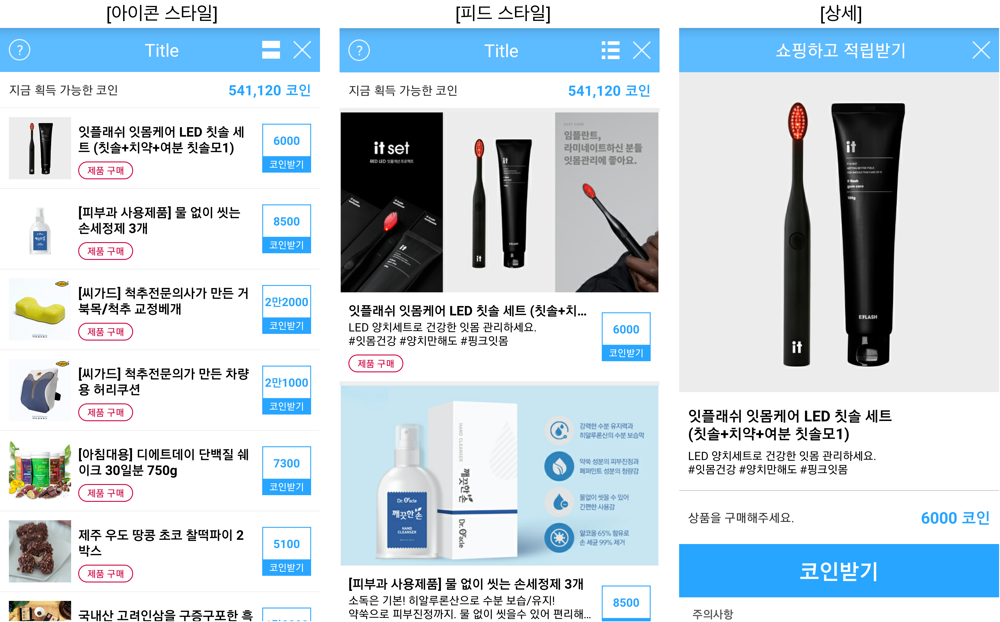

###### BlueStyle_02

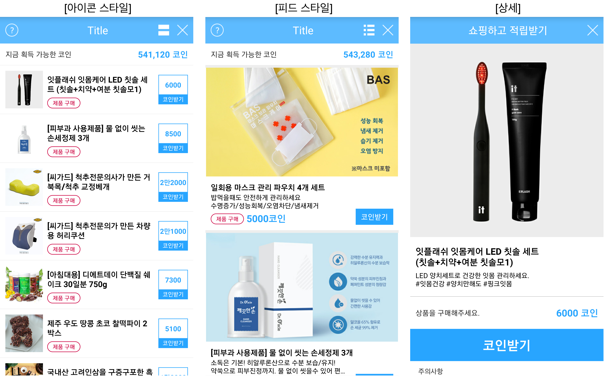

###### BlueStyle_03

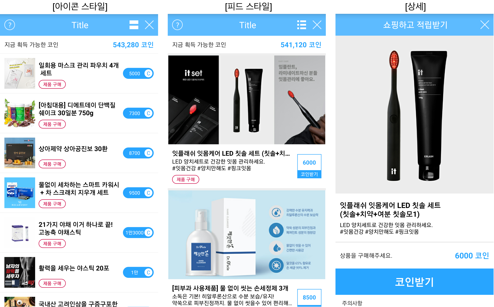

###### BlueStyle_04

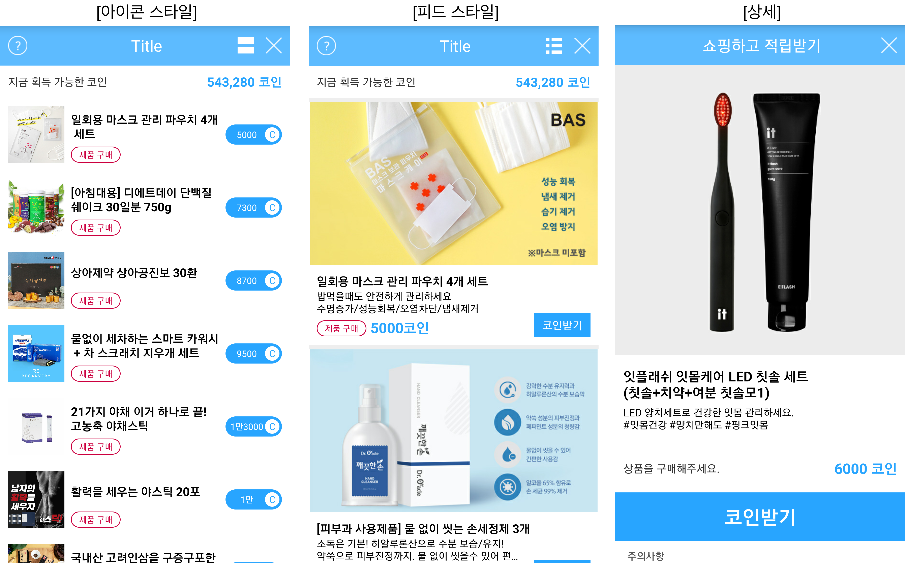

###### BlueStyle_05

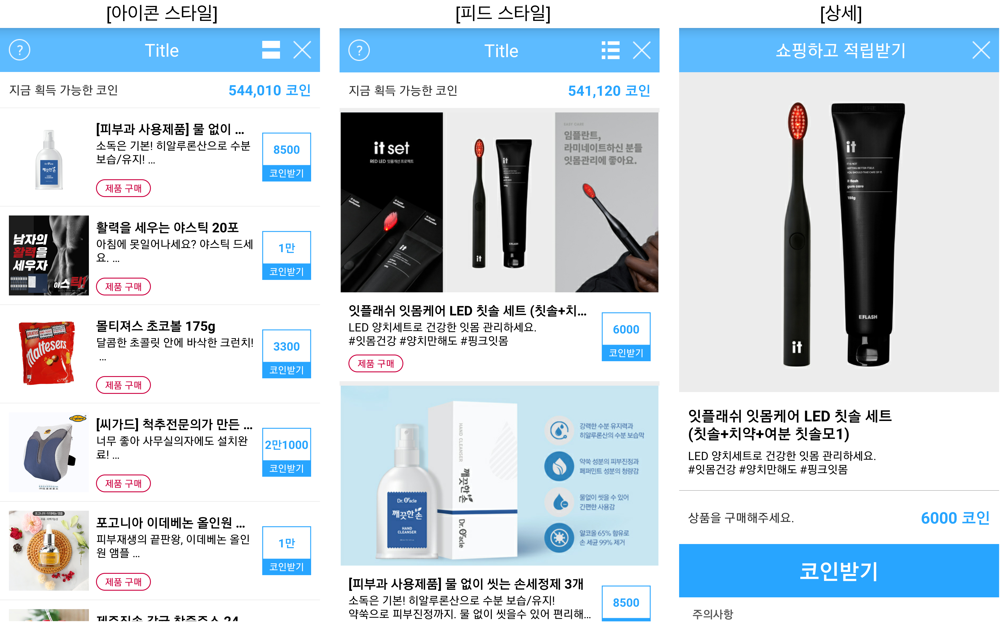

###### BlueStyle_06

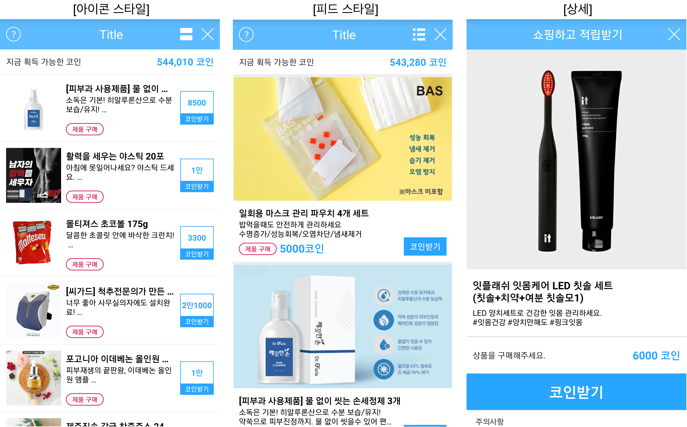

###### BlueStyle_07

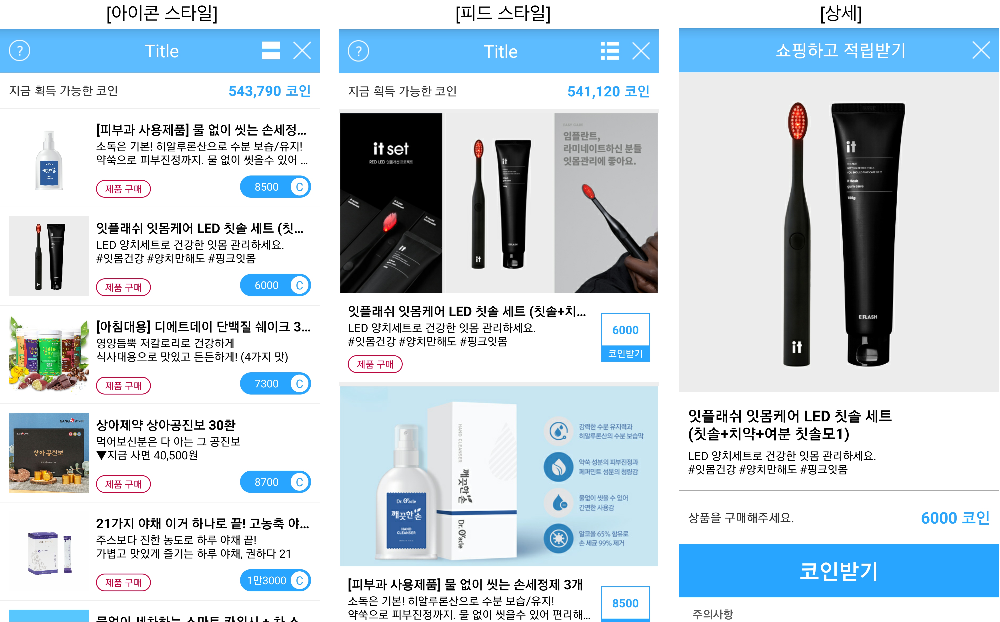

###### BlueStyle_08

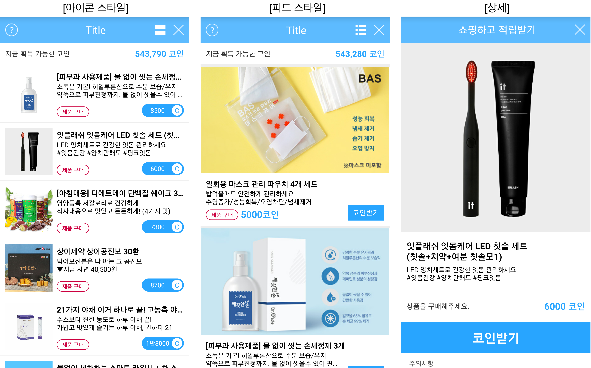


###### RedStyle_01

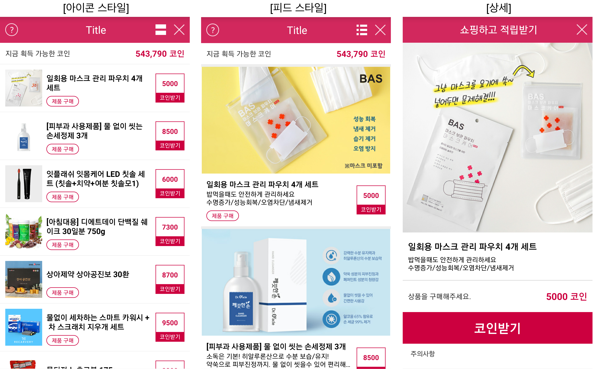

###### RedStyle_02

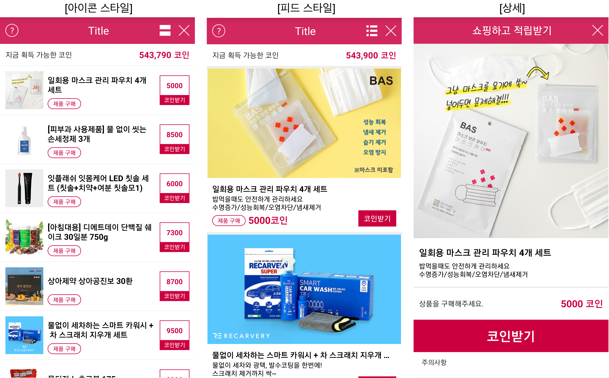

###### RedStyle_03

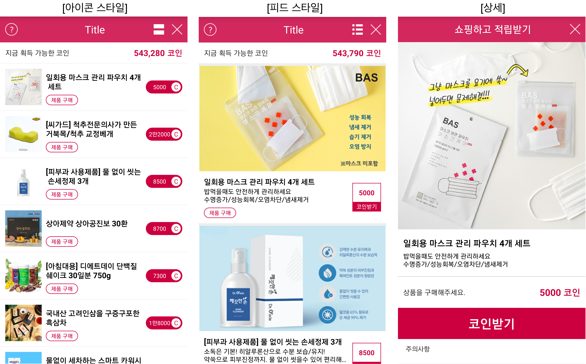

###### RedStyle_04

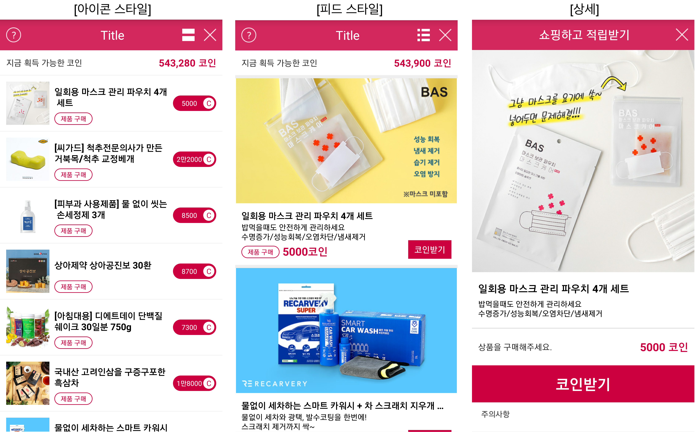
###### RedStyle_05

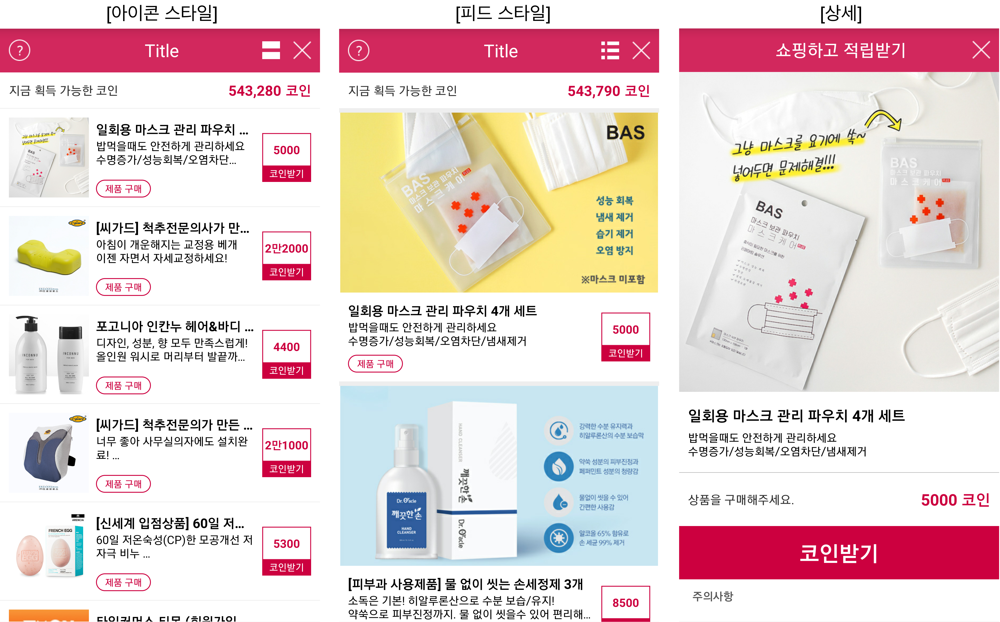
###### RedStyle_06

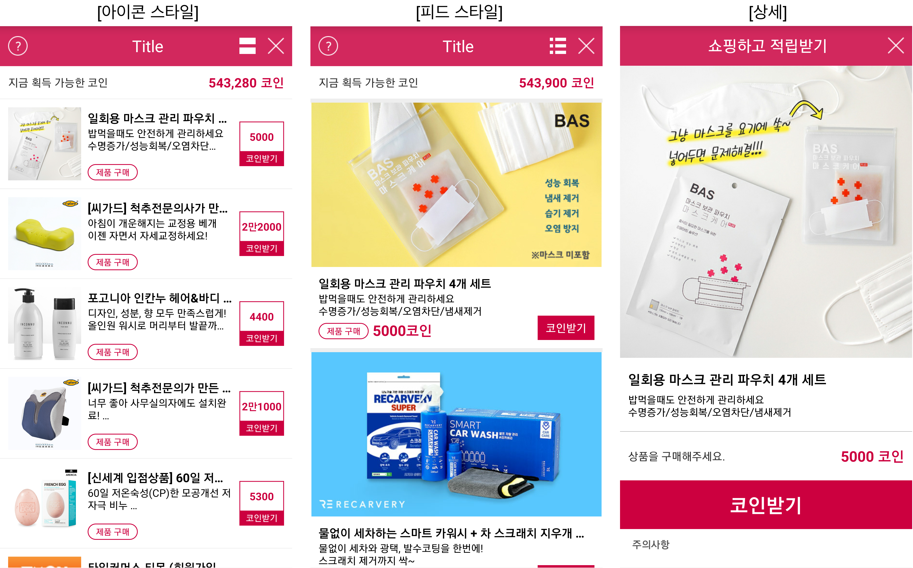
###### RedStyle_07

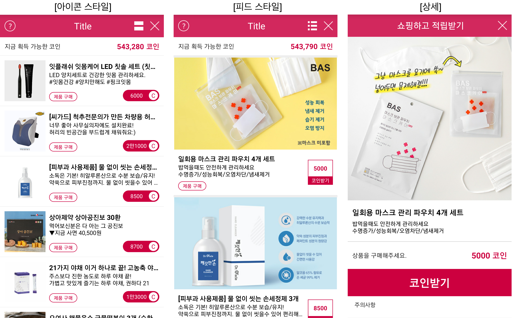
###### RedStyle_08

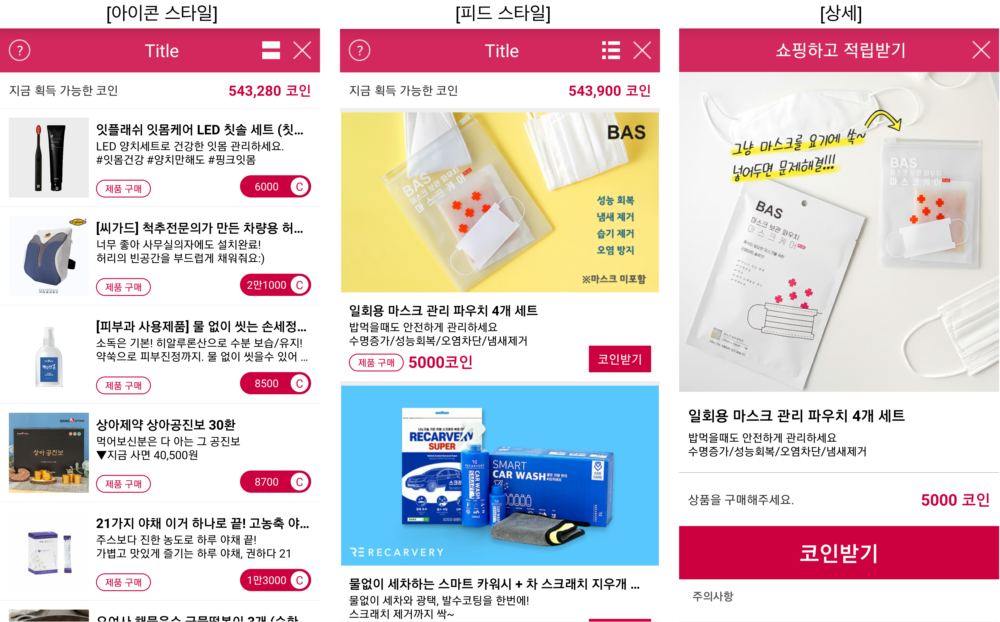

#### 문의하기, 스타일 변경, 닫기 버튼 기능 구현

TnkLayout을 사용하면 통합오퍼월의 거의 모든 디자인을 변경할 수 있어 문의하기, 스타일 변경, 닫기 버튼의 위치나 이미지의 변경이 가능합니다.

##### 구현방법

- 커스텀 레이아웃 Xml 생성
- 커스텀 레이아웃과 각 뷰의 ID를 TnkLayout에 연결
- TnkLayout 사용하여 AdListView 생성

##### 적용예시

###### custom_offerwall_layout.xml 생성

```xml
<RelativeLayout xmlns:android="http://schemas.android.com/apk/res/android"
    xmlns:app="http://schemas.android.com/apk/res-auto"
    xmlns:tools="http://schemas.android.com/tools"
    android:layout_width="match_parent"
    android:layout_height="match_parent">

    <RelativeLayout
        android:id="@+id/layout_title"
        android:layout_width="match_parent"
        android:layout_height="50dp"
        android:layout_alignParentTop="true"
        android:background="#000000">

        <Button
            android:id="@+id/btn_style"
            android:layout_width="20dp"
            android:layout_height="20dp"
            android:layout_alignParentLeft="true"
            android:layout_centerVertical="true"
            android:layout_marginLeft="15dp"
            android:background="@drawable/icon_feed"/>

        <TextView
            android:id="@+id/txt_title"
            android:layout_width="match_parent"
            android:layout_height="wrap_content"
            android:layout_toRightOf="@+id/btn_style"
            android:layout_toLeftOf="@+id/btn_close"
            android:layout_centerVertical="true"
            android:textColor="#FFFFFF"
            android:textSize="20dp"
            android:maxLines="1"
            android:ellipsize="end"
            android:gravity="center"
            tools:text="Test Title" />

        <Button
            android:id="@+id/btn_close"
            android:layout_width="20dp"
            android:layout_height="20dp"
            android:layout_alignParentRight="true"
            android:layout_centerVertical="true"
            android:layout_marginRight="10dp"
            android:background="@drawable/icon_close"/>
    </RelativeLayout>

    <ListView
        android:id="@+id/list_ad"
        android:layout_width="match_parent"
        android:layout_height="match_parent"
        android:layout_below="@+id/layout_title"
        android:layout_above="@+id/btn_help"
        android:divider="#EEEEEE"
        android:dividerHeight="3dp"
        android:background="#FFFFFF"/>

    <Button
        android:id="@+id/btn_help"
        android:layout_width="match_parent"
        android:layout_height="50dp"
        android:layout_alignParentBottom="true"
        android:text="포인트 지급 관련 문의하기"/>
</RelativeLayout>
```

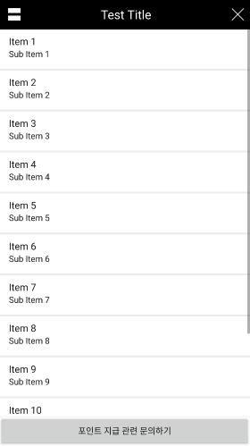

###### activity_layout_custom.xml

```xml
<LinearLayout xmlns:android="http://schemas.android.com/apk/res/android"
    xmlns:app="http://schemas.android.com/apk/res-auto"
    xmlns:tools="http://schemas.android.com/tools"
    android:layout_width="match_parent"
    android:layout_height="match_parent"
    android:orientation="vertical">

    <!-- 오퍼월을 삽입할 컨테이너 -->
    <FrameLayout
        android:id="@+id/container"
        android:layout_width="match_parent"
        android:layout_height="match_parent"
        android:layout_below="@id/my_text"
        android:layout_above="@id/bottom_buttons" />
</LinearLayout>
```

###### LayoutCustomActivity

```java
public class LayoutCustomActivity extends AppCompatActivity {

    @Override
    protected void onCreate(Bundle savedInstanceState) {
        super.onCreate(savedInstanceState);
        setContentView(R.layout.activity_layout_custom);

        // 기본 스타일 TnkLayout 가져오기 (베이스 디자인)
        TnkLayout customLayout = TemplateLayoutUtils.getBlueStyle_01();

        /*
         * 레이아웃 커스텀을 위해 custom_offerwall_layout.xml을 생성 후 각 뷰의 id를 TnkLayout에 연결해줍니다.
         */
        // 레이아웃 xml 지정 (필수)
        customLayout.adwall.layout = R.layout.custom_offerwall_layout;
        // 리스트 뷰 id 연결 (필수)
        customLayout.adwall.idList = R.id.list_ad;
        // 타이틀 텍스트뷰 id 연결
        customLayout.adwall.idTitle = R.id.txt_title;
        // 닫기 버튼 뷰 id 연결
        customLayout.adwall.idClose = R.id.btn_close;
        // 문의하기 버튼 뷰 id 연결
        customLayout.adwall.idHelpdesk = R.id.btn_help;
        // 스타일 변경 버튼 뷰 id 연결
        customLayout.adwall.idListStyle = R.id.btn_style;
        // 스타일 변경 버튼 이미지 지정 - 아이콘형
        customLayout.adwall.bgListStyleIcon = R.drawable.icon_list;
        // 스타일 변경 버튼 이미지 지정 - 피드형
        customLayout.adwall.bgListStyleFeed = R.drawable.icon_feed;
        // 리스트 아이템 간격 지정 - 아이콘형 스타일
        customLayout.adwall.listDividerHeightIcon = 3;
        // 리스트 아이템 간격 지정 - 피드형 스타일
        customLayout.adwall.listDividerHeightFeed = 20;

        // AdListView 생성 - 위에서 만든 customLayout 사용
        AdListView offerwallView = TnkSession.createAdListView(this, customLayout);

        // AdListView 삽입
        ViewGroup.LayoutParams layoutParams = new ViewGroup.LayoutParams(ViewGroup.LayoutParams.MATCH_PARENT, ViewGroup.LayoutParams.MATCH_PARENT);
        addContentView(offerwallView, layoutParams);

        // 리스트 로드
        offerwallView.loadAdList();

        // 닫기 버튼
        Button btn_close = offerwallView.getCloseButton();
        btn_close.setOnClickListener(new View.OnClickListener() {
            @Override
            public void onClick(View view) {
                finish();
            }
        });
    }
}
```

### 마. Callback URL

사용자가 광고참여를 통하여 획득한 포인트를 개발사의 서버에서 관리하실 경우 다음과 같이 진행합니다.

* 매체 정보 설정 화면에서 아래와 같이 '포인트 관리' 항목을 '자체서버에서 관리'로 선택합니다.
* URL 항목에 포인트 적립 정보를 받을 URL을 입력합니다.

이후에는 사용자에게 포인트가 적립될 때 마다 실시간으로 위 URL로 적립 정보를 받을 수 있습니다.

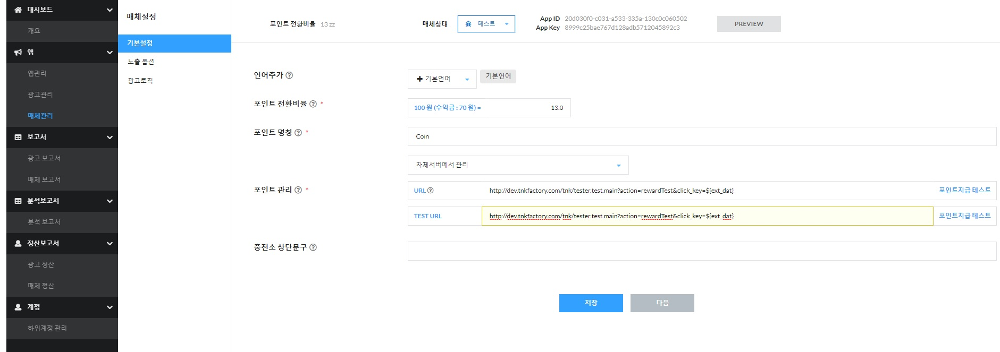

##### 호출방식

HTTP POST

##### Parameters

| 파라메터   | 상세 내용                                                    | 최대길이 |
| ---------- | ------------------------------------------------------------ |---- |
| seq_id     | 포인트 지급에 대한 고유한 ID 값이다. URL이 반복적으로 호출되더라도 이 값을 사용하여 중복지급여부를 확인할 수 있다. | string(50) |
| pay_pnt    | 사용자에게 지급되어야 할 포인트 값이다.                      | long |
| md_user_nm | 게시앱에서 사용자 식별을 하기 위하여 전달되는 값이다. 이 값을 받기 위해서는 매체앱내에서 setUserName() API를 사용하여 사용자 식별 값을 설정하여야 한다. | string(256) |
| md_chk     | 전달된 값이 유효한지 여부를 판단하기 위하여 제공된다. 이 값은 app_key + md_user_nm + seq_id 의 MD5 Hash 값이다. app_key 값은 앱 등록시 부여된 값으로 Tnk 사이트에서 확인할 수 있다. | string(32) |
| app_id     | 사용자가 참여한 광고앱의 고유 ID 값이다.                     | long |
| pay_dt     | 포인트 지급시각이다. (System milliseconds) 예) 1577343412017 | long |
| app_nm     | 참여한 광고명 이다.                                          |  string(120) |
|pay\_amt|정산되는 금액.|long|
|actn\_id|<p>- 0 : 설치형</p><p>- 1 : 실행형</p><p>- 2 : 액션형</p><p>- 5 : 구매형</p>|int|

##### 리턴값 처리

Tnk 서버에서는 위 URL을 호출하고 HTTP 리턴코드로 200이 리턴되면 정상적으로 처리되었다고 판단합니다. 
만약 200이 아닌 값이 리턴된다면 Tnk 서버는 비정상처리로 판단하고 이후에는 5분 단위 및 1시간 단위로 최대 24시간 동안 반복적으로 호출합니다.

* 중요! 동일한 Request가 반복적으로 호출될 수 있으므로 seq_id 값을 사용하시어 반드시 중복체크를 하셔야합니다.


##### Callback URL 구현 예시 (Java)

```java
// 해당 사용자에게 지급되는 포인트

int payPoint = Integer.parseInt(request.getParameter("pay_pnt"));

// tnk 내부에서 생성한 고유 번호로 이 거래에 대한 Id이다.

String seqId = request.getParameter("seq_id");

// 전달된 파라메터가 유효한지 여부를 판단하기 위하여 사용한다. (아래 코딩 참고)

String checkCode = request.getParameter("md_chk");

// 게시앱에서 사용자 구분을 위하여 사용하는 값(전화번호나 로그인 ID 등)을 앱에서 TnkSession.setUserName()으로 설정한 후 받도록한다.

String mdUserName = request.getParameter("md_user_nm");

// 앱 등록시 부여된 app_key (tnk 사이트에서 확인가능)

String appKey = "d2bbd...........19c86c8b021";

// 유효성을 검증하기 위하여 아래와 같이 verifyCode를 생성한다. DigestUtils는 Apache의 commons-codec.jar 이 필요하다. 다른 md5 해시함수가 있다면 그것을 사용해도 무방하다.

String verifyCode = DigestUtils.md5Hex(appKey + mdUserName + seqId);

// 생성한 verifyCode와 chk_cd 파라메터 값이 일치하지 않으면 잘못된 요청이다.

if (checkCode == null || !checkCode.equals(verifyCode)) {

    // 오류

    log.error("tnkad() check error : " + verifyCode + " != " + checkCode);

} else {

    log.debug("tnkad() : " + mdUserName + ", " + seqId);


    // 포인트 부여하는 로직수행 (예시)

    purchaseManager.getPointByAd(mdUserName, payPoint, seqId);

}
```


## 4. Analytics Report

Analytics 적용을 위해서는 Tnk 사이트에서 앱 등록 및 프로젝트 상의 SDK 관련 설정이 우선 선행되어야합니다.

[[SDK 설정하기](#1-sdk-설정하기)]의 내용을 우선 확인해주세요.

### 기본 설정

AndroidMenifest.xml 파일 내에 Tnk 앱 등록세 발급 받은 App ID를 설정하시고 그 아래에 아래와 같이 tnkad_tracking 값을 true로 설정합니다.

이후 더 이상 tracking을 원하지 않을 경우에는 false로 설정하시기 바랍니다.

```xml
<application>
    ...
    <meta-data android:name="tnkad_app_id"  android:value="your-app-id-from-tnk-sites" />
    <meta-data android:name="tnkad_tracking" android:value="true" />
    ...
</application>
```

앱의 유입경로 파악을 위해서는 Google Install Referrer 라이브러리가 필요합니다. 아래와 같이 build.gradle (Module: app) 안에 라이브러리를 설정합니다.

\- GooglePlay에서 다운받은 앱에 대해서만 유입 경로 파악 기능이 제공됩니다.

```gradle
dependencies {
    ...
    implementation 'com.android.installreferrer:installreferrer:2.2'
    ...
}
```

SDK가 요구하는 permission들을 추가합니다.

\- 앱의 유입 경로 기능을 사용하기 위해서는 BIND_GET_INSTALL_REFERRER_SERVICE 권한은 필수입니다.

```xml
<uses-permission android:name="android.permission.INTERNET" />

<uses-permission android:name="android.permission.ACCESS_WIFI_STATE" />

<uses-permission android:name="com.google.android.finsky.permission.BIND_GET_INSTALL_REFERRER_SERVICE" />
```

전체적인 AndroidMenifest 파일의 모습은 아래와 같습니다.

```xml
<manifest xmlns:android="http://schemas.android.com/apk/res/android" package="com.myapplication" >

    <uses-permission android:name="android.permission.INTERNET" /> 
    <uses-permission android:name="android.permission.ACCESS_WIFI_STATE" />
    <uses-permission android:name="com.google.android.finsky.permission.BIND_GET_INSTALL_REFERRER_SERVICE" />


    <application android:icon="@drawable/ic_launcher" android:label="@string/app_name"> 

        ... your activities ...

 

        <meta-data android:name="tnkad_app_id" android:value="your-app-id-from-tnk-sites" />

        <meta-data android:name="tnkad_tracking" android:value="true" />    

    </application>

</manifest> 
```

### TNK SDK 초기화

앱이 실행되는 시점에 TnkSession.applicationStarted()를 호출합니다.

#### TnkSession.applicationStarted()

##### Method

- void TnkSession.applicationStarted(Context context)

##### Description

앱이 실행되는 시점에 호출합니다. 다른 API 보다 가장 먼저 호출되어야 합니다.

##### Parameters

| 파라메터 명칭 | 내용         |
| ------------- | ------------ |
| context       | Context 객체 |

##### 적용 예시

```java
TnkSession.applicationStarted(context)
```

### 사용 활동 분석

사용자가 앱을 설치하고 처음 실행했을 때 어떤 행동을 취하는지 분석하고자 할 때 아래의 API를 사용합니다.

예를 들어 로그인, 아이템 구매, 친구 추천 등의 행동이 이루어 질때 해당 행동에 대한 구분자와 함께 호출해주시면 사용자가 어떤 패턴으로 앱을 이용하는지 또는 어떤 단계에서 많이 이탈하는지 등의 분석이 가능해집니다.

#### TnkSession.actionCompleted()

##### Method

- void TnkSession.actionCompleted(Context context, String actionName)

##### Description

사용자의 특정 액션 발생시 호출합니다.

동일 액션에 대해서는 최초 발생시에만 데이터가 수집됩니다.

##### Parameters

| 파라메터 명칭 | 내용                                                         |
| -------------------- | ------------------------------------------------------------ |
| context       | Context 객체                                                 |
| actionName    | 사용자 액션을 구별하기 위한 문자열 (예를 들어 "user_login" 등) 사용하시는 actionName 들은 모두 Tnk 사이트의 분석보고서 화면에서 등록되어야 합니다. |

##### 적용예시

```java
// 추가 데이터 다운로드 완료시 
TnkSession.actionCompleted(this, "resource_loaded");

// 회원 가입 완료시 
TnkSession.actionCompleted(this, "signup_completed");

// 프로필 작성 완료시 
TnkSession.actionCompleted(this, "profile_entered");

// 친구 추천시 
TnkSession.actionCompleted(this, "friend_invite"); 
```

### 구매 활동 분석

사용자가 유료 구매 등의 활동을 하는 경우 이에 대한 분석데이터를 얻고자 할 경우에는 아래의 API를 사용합니다. 

구매활동 분석 API 적용시에는 유입경로별로 구매횟수와 구매 사용자 수 파악이 가능하며, 하루 사용자 중에서 몇명의 유저가 구매 활동을 하였는 지 또 사용자가 앱을 처음 실행한 후 얼마정도가 지나야 구매활동을 하는지 등의 데이터 분석이 가능합니다. 분석 보고서에서 제공하는 데이터에 각 아이템별 가격을 대입시키면 ARPU 및 ARPPU 값도 산출하실 수 있습니다.

#### TnkSession.buyCompleted()

##### Method

- void TnkSession.buyCompleted(Context context, String itemName)

##### Description

사용자가 유료 구매를 완료하였을 때 호출합니다.

##### Parameters

| 파라메터 명칭 | 내용                                                        |
| ------------- | ----------------------------------------------------------- |
| context       | Context 객체                                                |
| itemName      | 구매한 item을 구별하기 위한 문자열 (예를 들어 "item_01" 등) |

##### 적용예시

```java
// item_01 구매 완료시 
TnkSession.buyCompleted(this, "item_01");

//item_02 구매 완료시
TnkSession.buyCompleted(this, "item_02");
```

### 사용자 정보 설정

사용자의 성별 및 나이 정보를 설정하시면 보고서에서 해당 내용이 반영되어 추가적인 데이터를 확인하실 수 있습니다.

```java
// 나이 설정 
TnkSession.setUserAge(this,23);

// 성별 설정 (남) 
TnkSession.setUserGender(this,TnkCode.MALE);

// 성별 설정 (여) 
TnkSession.setUserGender(this,TnkCode.FEMALE); 
```

