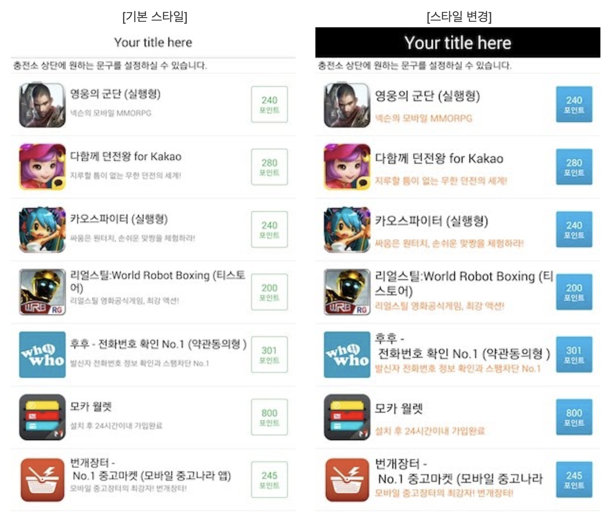
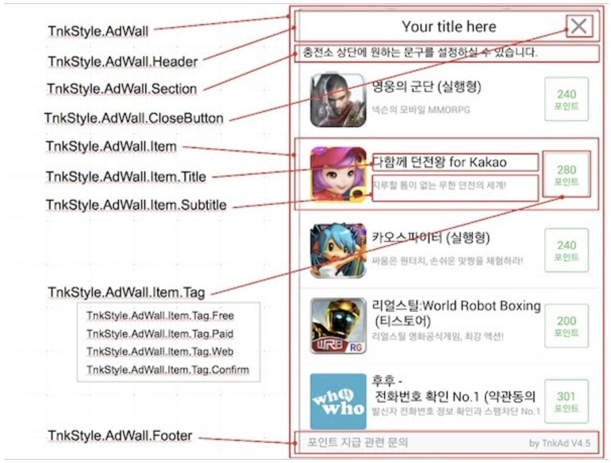
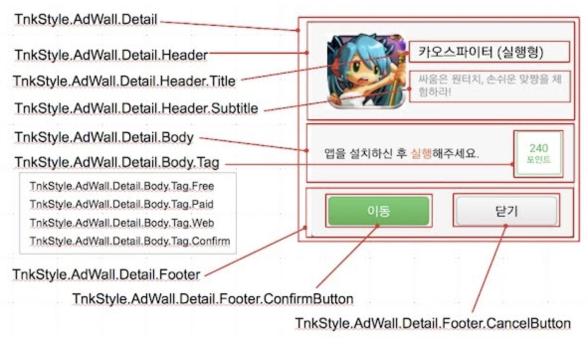
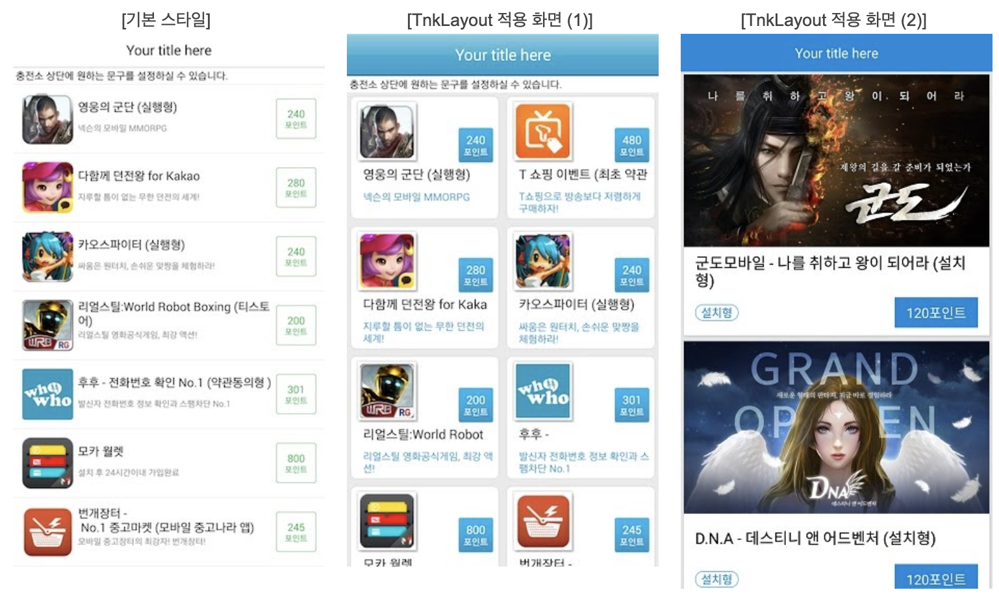

# Tnkfactory SDK Rwd


## 1. SDK 설정하기

### 1) 라이브러리 등록

아래의 코드를 App Module의 build.gradle 파일에 추가해주세요.
[](https://bintray.com/tnkfactory/android-sdk-rwd/android-sdk-rwd/6.61/link)

```gradle
dependencies {
    implementation 'com.tnkfactory.ad:android-sdk-rwd:x.y.z'
}
```


### 2) Manifest 설정하기

#### Application ID 설정하기

Tnk 사이트에서 앱 등록하면 상단에 App ID 가 나타납니다. 이를 AndroidMenifest.xml 파일의 <application> tag 안에 아래와 같이 설정합니다. 

(*your-application-id-from-tnk-site* 부분을 실제 App ID 값으로 변경하세요.)

```xml
<application>

     ...

    <meta-data android:name="tnkad_app_id" android:value="your-application-id-from-tnk-site" />

</application>
```


#### uses-permission tag 설정하기

```xml
<uses-permission android:name="android.permission.INTERNET" />
```


#### Activity tag 추가하기

광고 목록을 띄우기 위한 Activity 2개를 <activity>로 아래와 같이 설정합니다. 매체앱인 경우에만 설정하시면 됩니다. 광고만 진행하실 경우에는 설정하실 필요가 없습니다.

```xml
<activity android:name="com.tnkfactory.ad.AdWallActivity" />
<activity android:name="com.tnkfactory.ad.AdMediaActivity" android:screenOrientation="landscape"/>

<!-- 또는 아래와 같이 설정-->
<activity android:name="com.tnkfactory.ad.AdMediaActivity" android:screenOrientation="sensorLandscape"/>

<!-- 동영상 세로 화면으로 설정하려면 아래와 같이 설정 -->
<activity android:name="com.tnkfactory.ad.AdMediaActivity" android:screenOrientation="portrait"/>
```


### 3) Proguard 사용

Proguard를 사용하실 경우 Proguard 설정내에 아래 내용을 반드시 넣어주세요.

```
-keep class com.tnkfactory.** { *;}
```


### 4) 동영상 광고 설정

동영상 광고 적용 시 ACCESS_WIFI_STATE 권한은 필수 설정 권한입니다.

```xml
<uses-permission android:name="android.permission.ACCESS_WIFI_STATE" />
```


### 5) COPPA 설정 예시

COPPA는 [미국 어린이 온라인 개인정보 보호법](https://www.ftc.gov/tips-advice/business-center/privacy-and-security/children's-privacy) 및 관련 법규입니다. 구글 에서는 앱이 13세 미만의 아동을 대상으로 서비스한다면 관련 법률을 준수하도록 하고 있습니다. 연령에 맞는 광고가 보일 수 있도록 아래의 옵션을 설정하시기 바랍니다.

```java
TnkSession.setCOPPA(MainActivity.this, true);
```


## 2. Publisher API

게시앱(Publisher)을 위한 가이드입니다.

이를 위해서는 Tnk 사이트에서 앱 등록 및 Android프로젝트의 [SDK 설정하기](#1.-SDK-설정하기)가 우선 선행되어야합니다.


Tnk의 SDK를 적용하여 게시앱을 구현하는 것은 크게 3단계로 이루어집니다.

1) Tnk 사이트에서 앱 등록 및 매체 정보 등록

2) 앱 내에 Tnk 충전소로 이동하는 버튼 구현

3) 사용자가 충전한 포인트 조회 및 사용


### 가. 광고 목록 띄우기

<u>테스트 상태에서는 테스트하는 장비를 개발 장비로 등록하셔야 광고목록이 정상적으로 나타납니다.</u>


#### 1) 유저 식별 값 설정

앱이 실행되면 우선 앱 내에서 사용자를 식별하는 고유한 ID를 아래의 API를 사용하시어 Tnk SDK에 설정하시기 바랍니다. 

사용자 식별 값으로는 게임의 로그인 ID 등을 사용하시면 되며, 적당한 값이 없으신 경우에는 Device ID 값 등을 사용할 수 있습니다.

(유저 식별 값이 Device ID 나 전화번호, 이메일 등 개인 정보에 해당되는 경우에는 암호화하여 설정해주시기 바랍니다.) 

유저 식별 값을 설정하셔야 이후 사용자가 적립한 포인트를 개발사의 서버로 전달하는 callback 호출 시에  같이 전달받으실 수 있습니다.

##### Method

- void TnkSession.setUserName(Context context, String userName)


##### Parameters

| 파라메터 명칭 | 내용                                                         |
| ------------- | ------------------------------------------------------------ |
| context       | 현재 Activity 또는 Context 객체                              |
| userName      | 앱에서 사용자를 식별하기 위하여 사용하는 고유 ID 값 (로그인 ID 등)  길이는 256 bytes 이하입니다. |


#### 2) 광고 목록 띄우기 (Activity)

자신의 앱에서 광고 목록을 띄우기 위하여 TnkSession.showAdList() 함수를 사용합니다. 광고목록을 보여주기 위하여 새로운 Activity를 띄웁니다.

##### Method

- void TnkSession.showAdList(Activity activity)

- void TnkSession.showAdList(Activity activity, String title)

- void TnkSession.showAdList(Activity activity, String title, TnkLayout userLayout)


##### Description

광고 목록 화면 (AdWallActivity)를 화면에 띄웁니다. 

반드시 Main UI Thread 상에서 호출하여야 합니다.


##### Parameters

| 파라메터 명칭 | 내용                                                         |
| ------------- | ------------------------------------------------------------ |
| context       | 현재 Activity 객체                                           |
| title         | 광고 리스트의 타이틀을 지정함  (기본값 : 무료 포인트 받기)   |
| userLayout    | 원하는 Layout을 지정할 수 있습니다. 자세한 내용은  [[디자인 변경하기](#디자인-변경하기)] 내용을 참고해주세요. |


##### 적용예시

```java
@Override

public void onCreate(Bundle savedInstanceState) {

    // ...

    final Button button = (Button)findViewById(R.id.main_ad);

    button.setOnClickListener(new OnClickListener() {

        @Override

        public void onClick(View v) {

            TnkSession.showAdList(MainActivity.this,"Your title here");

        }

    });
}
```


#### 3) 광고목록 띄우기 (View)

광고 목록을 현재 화면에 팝업으로 띄우기 위하여 TnkSession.popupAdList() 함수를 사용합니다. 광고목록을 보여주기 위하여 AdListView를 생성하여 현재 화면에 팝업형태로 띄워줍니다.

##### Method

- void TnkSession.popupAdList(Activity activity)

- void TnkSession.popupAdList(Activity activity, String title)

- void TnkSession.popupAdList(Activity activity, String title, TnkAdListener listener)

- void TnkSession.popupAdList(Activity activity, String title, TnkAdListener listener, TnkLayout userLayout)

  Description

  

##### Description

광고 목록 화면 (AdListView)를 현재 화면에 팝업형태로 띄웁니다.

반드시 Main UI Thread 상에서 호출하여야 합니다.


##### Parameters

| 파라메터 명칭 | 내용                                                         |
| ------------- | ------------------------------------------------------------ |
| activity      | 현재 Activity 객체                                           |
| title         | 광고 리스트의 타이틀을 지정함  (기본값 : 무료 포인트 받기)   |
| listnener     | TnkAdListener 객체. 자세한 내용은 아래 [[Listener 이용하기](#5-Listener-이용하기)] 내용을 참고해주세요. |
| userLayout    | 원하는 Layout을 지정할 수 있습니다. 자세한 내용은  [[라. 디자인 변경하기](#디자인-변경하기)] 내용을 참고해주세요. |


##### 적용예시

```java
@Override

public void onCreate(Bundle savedInstanceState) {

    // ...

    final Button button = (Button)findViewById(R.id.main_ad);

    button.setOnClickListener(new OnClickListener() {

        @Override

        public void onClick(View v) {

            TnkSession.popupAdList(MainActivity.this,"Your title here");

        }

    });
}
```


#### 4) AdListView

AdListView는 보상형 광고목록을 제공하는 View 객체입니다. 개발자는 createAdListView() 메소드를 사용하여 AdListView 객체를 생성할 수 있습니다.

생성된 AdListView 객체를 현재 Activity에 팝업형태로 띄우거나 자신의 구성한 화면의 하위 View로 추가(addView) 할 수 있습니다.

##### Method

- AdListView TnkSession.createAdListView(Activity activity, boolean popupStyle)
- AdListView TnkSession.createAdListView(Activity activity, TnkLayout userLayout)


##### Parameters

| 파라메터 명칭 | 내용                                                         |
| ------------- | ------------------------------------------------------------ |
| context       | 현재 Activity 객체                                           |
| popupStyle    | 생성되는 AdListView 화면을 팝업 화면 형태(true) 또는 전체 화면 형태(false)로 지정합니다. |
| userLayout    | 원하는 Layout을 지정할 수 있습니다. 자세한 내용은  [[라. 디자인 변경하기](#디자인-변경하기)] 내용을 참고해주세요. |


아래의 메소드들은 AdListView에서 제공하는 기능들입니다.

\- void loadAdList()

- 광고목록을 서버에서 가져와 화면에 뿌려줍니다.

- 주로 AdListView를 하위 View로 추가하는 경우에 사용합니다. 

  

- void show(Activity activity)

- AdListView를 현재 Activity의 최상위 View로 팝업형태로 띄워줍니다. 
- 내부적으로는 activity의 addContentView() 를 사용합니다.
- 화면에 나타날때에 Animation 효과가 적용됩니다.  아래의 setAnimationType() 메소드를 참고하세요.
- 화면에 나타난 후에는 내부적으로 loadAdList()가 호출되어 바로 광고목록이 나타납니다.


\- void setTitle(String title)

- 광고목록 상단 타이틀을 설정합니다.

  

\- void setListener(TnkAdListener listener)

- AdListView 팝업 화면이 나타날때와 사라질때의 event를 받기 위하여 TnkAdListener 객체를 설정합니다.

- show() 메소드를 사용할 때에만 적용됩니다.

- 자세한 내용은 하단의 TnkAdListener 내용을 참고해주세요.

  

\- void setAnimationType(int showType, int hideType)

- AdListView를 화면에 팝업으로 띄울 때 사용하는 애니메이션을 지정합니다.
- 나타날 때(showType)와 사라질 때(hideType)을 별도로 지정합니다.
- show() 메소드를 사용할 때에만 적용됩니다.
- 사용가능한 Animation의 종류들은 아래와 같습니다.

 

| 값                          | 나타날때                                        | 사라질때                                        |
| --------------------------- | ----------------------------------------------- | ----------------------------------------------- |
| TnkSession.ANIMATION_RANDOM | 임의의 애니메이션이 적용됩니다.                 | 임의의 애니메이션이 적용됩니다.                 |
| TnkSession.ANIMATION_NONE   | 애니메이션이 적용되지 않습니다.                 | 애니메이션이 적용되지 않습니다.                 |
| TnkSession.ANIMATION_ALPHA  | 서서히 화면에 나타납니다.                       | 서서히 화면에서 사라집니다.                     |
| TnkSession.ANIMATION_BOTTOM | 아래에서 위로 슬라이드되어 나타납니다.          | 아래로 슬라이드되어 사라집니다.                 |
| TnkSession.ANIMATION_TOP    | 화면 위에서 아래로 슬라이드되어 나타납니다.     | 화면 위로 슬라이드되어 사라집니다.              |
| TnkSession.ANIMATION_LEFT   | 화면 왼쪽에서 슬라이드되어 나타납니다.          | 화면 왼쪽으로 슬라이드되어 사라집니다.          |
| TnkSession.ANIMATION_RIGHT  | 화면 오른쪽에서 슬라이드되어 나타납니다.        | 화면 오른쪽으로 슬라이드되어 사라집니다.        |
| TnkSession.ANIMATION_SPIN   | 화면 중앙에서 빙빙돌면서 커지면서 나타납니다.   | 화면 중앙에서 빙빙돌면서 작아지면서 사라집니다. |
| TnkSession.ANIMATION_FLIP   | 화면 왼쪽에서부터 뒤집히는 방식으로 나타납니다. | 화면 오른쪽으로 뒤집히면서 사라집니다.          |


##### Popup Sample

```java
AdListView adlistView = TnkSession.createAdListView(MainActivity.this, true);
adlistView.setListener(new TnkAdListener() {
  @Override
  public void onClose(int type) {
    Log.d("tnkad", "#### onClose " + type);
  }

  @Override
  public void onShow() {
    Log.d("tnkad", "#### onShow "); 
  }

  @Override
  public void onFailure(int errCode) {
  }

  @Override
  public void onLoad() {
  }
});

adlistView.setTitle("Get Free Coins!!");

adlistView.setAnimationType(TnkSession.ANIMATION_BOTTOM, TnkSession.ANIMATION_BOTTOM);

adlistView.show(MainActivity.this);
```


##### Embed Sample

```java
AdListView adlistView = TnkSession.createAdListView(MainActivity.this, true);
adlistView.setTitle("Get Free Coins!!");

ViewGroup viewGroup = (ViewGroup)findViewById(R.id.adlist);
viewGroup.addView(adlistView);

adlistView.loadAdList();
```


#### 5) Listener 이용하기

AdListView를 팝업화면으로 화면에 띄울 경우 화면이 나타나는 시점과 화면이 닫히는 시점을 알고 싶을 때 아래의 TnkAdListener 인터페이스를 사용합니다.

TnkAdListener는 원래 전면 광고([Interstitial Ad](http://docs.tnkad.net/tnk-interstitial-ad) 참고)에서 사용되지만 광고 리스트 화면에서도 화면이 팝업형태로 나타날 때 (onShow)와 닫힐 때(onClose)의 이벤트를 받기 위하여 사용될 수 있습니다.

##### TnkAdListener Interface

```java
 // 사용자가 닫기버튼이나 Back key를 눌러서 광고화면을 닫은 경우
 public static final int CLOSE_SIMPLE = 0;

 // 사용자가 광고를 클릭해서 화면이 닫히는 경우
 public static final int CLOSE_CLICK = 1;

 // 종료시 띄워주는 광고화면에서 종료 버튼을 클릭해서 닫은 경우
 public static final int CLOSE_EXIT = 2;

 public static final int FAIL_NO_AD = -1;  // no ad available
 public static final int FAIL_NO_IMAGE = -2; // ad image not available
 public static final int FAIL_TIMEOUT = -3; // ad arrived after 5 secs.
 public static final int FAIL_CANCELED = -4; // ad frequency settings 

 public static final int FAIL_SYSTEM = -9;

 /**
  * 팝업 화면이 닫힐 때 호출됩니다. 
  * 화면이 닫히는 이유를 파라메터로 전달해 줍니다.
  * @param type 
  */
 public void onClose(int type);


 /**
  * 팝업 화면이 나타나는 시점에 호출됩니다.
  */
 public void onShow();

 public void onFailure(int errCode);

 public void onLoad();
}
```

AdListView와 관련되어 TnkAdListener에서 발생하는 이벤트의 내용은 아래와 같습니다.

- onClose(int type) : 팝업 화면이 닫히는 시점에 호출됩니다. 화면이 닫히는 이유가 type 파라메터로 전달됩니다.
- - CLOSE_SIMPLE (0) : 사용자가 전면 화면의 닫기 버튼이나 Back 키를 눌러서 닫은 경우입니다.
  - CLOSE_CLICK (1) : 사용자가 전면 화면의 광고를 클릭하여 해당 광고로 이동하는 경우 입니다.
- onShow() : 팝업화면이 나타날 때 호출됩니다.
- AdListView에서는 위 2가지 이외의 이벤트는 발생하지 않습니다.


### 나. 포인트 조회 및 인출

사용자가 광고참여를 통하여 획득한 포인트는 Tnk서버에서 관리되거나 앱의 자체서버에서 관리될 수 있습니다.

포인트가 Tnk 서버에서 관리되는 경우에는 다음의 포인트 조회 및 인출 API를 사용하시어 필요한 아이템 구매 기능을 구현하실 수 있습니다.


#### 1) TnkSession.queryPoint()

Tnk서버에 적립되어 있는 사용자 포인트 값을 조회합니다. 

동기 방식과 비동기 방식 2가지 호출 방식을 제공하고 있으며 화면 멈춤 현상이 없도록 구현하기 위해서는 비동기 방식을 사용할 것을 권장합니다.

다만 Main UI Thread 가 아닌 별도 Thread를 생성하여 호출하는 경우 (주로 게임 앱)에는 비동기 방식을 사용할 수 없으므로 별도 Thread를 생성하여 동기 방식으로 호출하셔야 합니다.


> #### [비동기로 호출하기]

##### Method 

  - void TnkSession.queryPoint(Context context, boolean showProgress, ServiceCallback callback)


##### Description

Tnk 서버에 적립되어 있는 사용자 포인트 값을 조회합니다. 비동기 방식으로 호출되며 결과를 받으면 callback이 호출됩니다. Main UI Thread 상에서만 호출이 가능합니다.
ServiceCallback의 사용법은 아래 적용예시를 참고해주세요.


##### Parameters

| 파라메터 명칭 | 내용                                                         |
| -------------- | ----------------------------------------------------------- |
| context       | 현재 Activity 또는 Context 객체                              |
| showProgress  | 서버에서 결과가 올때까지 화면에 progress dialog를 띄울지 여부를 지정 |
| callback      | 서버에서 결과가 오면 callback 객체의 OnReturn(Context context, Object result) 메소드가 호출됩니다. 메소드 호출은 Main UI Thread 상에서 이루어 집니다. 전달된 result 객체는 Integer 객체이며 사용자 포인트가 담겨 있습니다. |


##### 적용예시

```java
@Override
public void onCreate(Bundle savedInstanceState) {

    // ...

    final TextView pointView = (TextView)findViewById(R.id.main_point);

    TnkSession.queryPoint(this, true, new ServiceCallback() {

        @Override
        public void onReturn(Context context, Object result) {
            Integer point = (Integer)result;
            pointView.setText(String.valueOf(point));
        }
	});

	// ...
}
```


> #### [동기방식으로 호출하기]

##### Method 

  - int TnkSession.queryPoint(Context context)


##### Description

Tnk 서버에 적립되어 있는 사용자 포인트 값을 조회하여 그 결과를 int 값으로 반환합니다. 


##### Parameters

| 파라메터 명칭 | 내용                            |
| ------------- | ------------------------------- |
| context       | 현재 Activity 또는 Context 객체 |


##### Return : int

  - 서버에 적립되어 있는 포인트 값


##### 적용예시

```java
static public void getPoint() {

    new Thread() {

        public void run() {
            int point = TnkSession.queryPoint(mActivity);
            showPoint(point); // 결과를 받아서 필요한 로직을 수행한다.
        }
    }.start();
}
```


#### 2) TnkSession.purchaseItem()

TnK 서버에서는 별도로 아이템 목록을 관리하는 기능을 제공하지는 않습니다. 
다만 게시앱에서 제공하는 아이템을 사용자가 구매할 때 Tnk 서버에 해당 포인트 만큼을 차감 할 수 있습니다. 이 API 역시 비동기 방식과 동기 방식을 모두 제공합니다.


> #### [비동기로 호출하기]

##### Method 

  - void TnkSession.purchaseItem(Context context, int pointCost, String itemId, boolean showProgress, ServiceCallback callback)


##### Description

Tnk 서버에 적립되어 있는 사용자 포인트를 차감합니다. 차감내역은 Tnk사이트의 보고서 페이지에서 조회하실 수 있습니다.


##### Parameters

| 파라메터 명칭 | 내용                                                         |
| -------------- | ----------------------------------------------------------- |
| context       | 현재 Activity 또는 Context 객체                              |
| pointCost     | 차감할 포인트                                                |
| itemId        | 구매할 아이템의 고유 ID (게시앱에서 정하여 부여한 ID) Tnk 사이트의 보고서 페이지에서 함께 보여줍니다. |
| showProgress  | 서버에서 결과가 올때까지 화면에 progress dialog를 띄울지 여부를 지정 |
| callback      | 서버에서 결과가 오면 callback 객체의 OnReturn(Context context, Object result) 메소드가 호출됩니다. 메소드 호출은 Main UI Thread 상에서 이루어 집니다. 전달된 result 객체는 long[] 객체이며 long[0] 값은 차감 후 남은 포인트 값이며, long[1] 값은 고유한 거래 ID 값이 담겨 있습니다. long[1] 값이 음수 인경우에는 포인트 부족 등으로 오류가 발생한 경우입니다. |


##### 적용예시

```java
@Override
public void onClick(View v) {

    TnkSession.purchaseItem(MainActivity.this, 30, "item.00001", true,

        new ServiceCallback() {

            @Override
            public void onReturn(Context context, Object result) {

                long[] ret = (long[])result;

                if (ret[1] < 0) {
                     // error
                } else {
                     Log.d("tnkad", "current point = " + ret[0] + ", transaction id = " + ret[1]);
                     pointView.setText(String.valueOf(ret[0]));
                }
            }
    	});
}
```


> #### [동기방식으로 호출하기]

##### Method 

  - long[] TnkSession.purchaseItem(Context context, int pointCost, String itemId)


##### Description

Tnk 서버에 적립되어 있는 사용자 포인트를 차감하고 그 결과를 long[] 로 반환합니다. 차감내역은 Tnk사이트의 보고서 페이지에서 조회하실 수 있습니다.


##### Parameters

| 파라메터 명칭 | 내용                                                         |
| ------------- | ------------------------------------------------------------ |
| context       | 현재 Activity 또는 Context 객체                              |
| pointCost     | 차감할 포인트                                                |
| itemId        | 구매할 아이템의 고유 ID (게시앱에서 정하여 부여한 ID) Tnk 사이트의 보고서 페이지에서 함께 보여줍니다. |


##### Return : long[]

  - long[0] 은 포인트 차감후 남은 포인트 값입니다.
  - long[1] 은 고유한 거래 번호 값입니다. 이 값이 음수 인 경우에는 오류가 발생한 것입니다. (포인트 부족 등)


#### 3) TnkSession.withdrawPoints()

Tnk 서버에서 관리되는 사용자 포인트 전체를 한번에 인출하는 기능입니다.


> #### [비동기로 호출하기]

##### Method 

  - void TnkSession.withdrawPoints(Context context, String desc, boolean showProgress, ServiceCallback callback)


##### Description

Tnk 서버에 적립되어 있는 사용자의 모든 포인트를 차감합니다. 차감내역은 Tnk사이트의 보고서 페이지에서 조회하실 수 있습니다.


##### Parameters

| 파라메터 명칭 | 내용                                                         |
| -------------- | ----------------------------------------------------------- |
| context       | 현재 Activity 또는 Context 객체                              |
| desc          | 인출과 관련된 설명 등을 넣어줍니다. Tnk 사이트의 보고서 페이지에서 함께 보여줍니다. |
| showProgress  | 서버에서 결과가 올때까지 화면에 progress dialog를 띄울지 여부를 지정 |
| callback      | 서버에서 결과가 오면 callback 객체의 OnReturn(Context context, Object result) 메소드가 호출됩니다. 메소드 호출은 Main UI Thread 상에서 이루어 집니다. 전달된 result 객체는 Integer 객체이며 인출된 포인트 값입니다. 해당 사용자에게 충전된 포인트가 없는 경우에는 0이 반환됩니다. |


##### 적용예시

```java
@Override
public void onClick(View v) {

    TnkSession.withdrawPoints(MainActivity.this, "user_delete", true,

        new ServiceCallback() {

            @Override
            public void onReturn(Context context, Object result) {

                int point = (Integer)result;
                Log.d("tnkad", "withdraw point = " + point);
                
                pointView.setText(String.valueOf(point));
            }
        });
}
```


> #### [동기방식으로 호출하기]

##### Method 

  - int TnkSession.withdrawPoints(Context context, String desc)


##### Description

Tnk 서버에 적립되어 있는 사용자의 모든 포인트를 차감하고 차감된 포인트 값을 반환합니다. 차감내역은 Tnk사이트의 보고서 페이지에서 조회하실 수 있습니다.


##### Parameters

| 파라메터 명칭 | 내용                                                         |
| ------------- | ------------------------------------------------------------ |
| context       | 현재 Activity 또는 Context 객체                              |
| desc          | 인출과 관련된 설명 등을 넣어줍니다. Tnk 사이트의 보고서 페이지에서 함께 보여줍니다. |


#### Return : int

  - 인출된 포인트 값, 사용자에게 인출할 포인트가 없으면 0이 반환됩니다.


#### 4) TnkSession.getEarnPoints()

Tnk서버에서 사용자가 참여 가능한 모든 광고의 적립 가능한 총 포인트 값을 조회합니다. 
동기 방식을 제공하고 있으며 별도 Thread를 생성하여 호출하셔야 합니다.


> #### [동기방식으로 호출하기]

##### Method 

  - int TnkSession.getEarnPoints(Context context)


##### Description

Tnk서버에서 사용자가 참여 가능한 모든 광고의 적립 가능한 총 포인트 값을 조회하여 그 결과를 int 값으로 반환합니다. 


##### Parameters

| 파라메터 명칭 | 내용                            |
| ------------- | ------------------------------- |
| context       | 현재 Activity 또는 Context 객체 |


##### Return : int

  - 참여 가능한 광고의 적립 가능한 총 포인트 값

```java
static public void getEarnPoint() {

    new Thread() {

        public void run() {
            int points = TnkSession.getEarnPoints(mActivity);
            showPoint(points); // 결과를 받아서 필요한 로직을 수행한다.
        }
    }.start();
}
```


### 다. 그밖의 기능들


#### 1) TnkSession.queryPublishState()

Tnk 사이트의 [게시정보]에서 광고 게시 중지를 하게 되면 이후에는 사용자가 광고 목록 창을 띄워도 광고들이 나타나지 않습니다.
그러므로 향후 광고 게시를 중지할 경우를 대비하여 화면에 충전소 버튼 자체를 보이지 않게 하는 기능을 갖추는 것이 바람직합니다.
이를 위하여 현재 게시앱의 광고게시 상태를 조회하는 기능을 제공합니다.


##### Method 

  - void TnkSession.queryPublishState(Context context, boolean showProgress, ServiceCallback callback)


##### Parameters

| 파라메터 명칭 | 내용                                                         |
| -------------- | ----------------------------------------------------------- |
| context       | 현재 Activity 또는 Context 객체                              |
| showProgress  | 서버에서 결과가 올때까지 화면에 progress dialog를 띄울지 여부를 지정 |
| callback      | 서버에서 결과가 오면 callback 객체의 OnReturn(Context context, Object result) 메소드가 호출됩니다. 메소드 호출은 Main UI Thread 상에서 이루어 집니다. 전달된 result 객체는 Integer 객체이며 상태코드가 담겨 있습니다. 상태코드 값이 TnkSession.STATE_YES 인 경우(실제 값은 1)는 광고게시상태를 의미합니다. |


##### 적용예시

```java
final Button button = (Button)findViewById(R.id.main_ad);

// ... 

TnkSession.queryPublishState(this, false, new ServiceCallback() {

    @Override
    public void onReturn(Context context, Object result) {

        int state = (Integer)result;

        if (state == TnkSession.STATE_YES) {
            button.setVisibility(View.VISIBLE);
        }
    }
});
```


#### 2) TnkSession.queryAdvertiseCount()

광고 게시 상태를 확인하여 충전소 버튼을 보이게하거나 안보이게 하는 것으로도 좋지만 실제적으로 현재 적립 가능한 광고가 있는지 여부를 판단해서 버튼을 노출하는 것이 보다 바람직합니다.
이를 위하여 현재 적립가능한 광고 정보를 확인하는 기능을 아래와 같이 제공합니다.


##### Method 

  - void TnkSession.queryAdvertiseCount(Context context, boolean showProgress, ServiceCallback callback)


##### Parameters

| 파라메터 명칭 | 내용                                                         |
| -------------- | ----------------------------------------------------------- |
| context       | 현재 Activity 또는 Context 객체                              |
| showProgress  | 서버에서 결과가 올때까지 화면에 progress dialog를 띄울지 여부를 지정 |
| callback      | 서버에서 결과가 오면 callback 객체의 OnReturn(Context context, Object result) 메소드가 호출됩니다. 메소드 호출은 Main UI Thread 상에서 이루어 집니다. 전달된 result 객체는 int[] 객체이며 int[0]는 광고 건수, int[1] 에는 적립가능한 포인트 합계가 담겨 있습니다. 만약 현재 광고 게시상태가 아니라면 int[0]에는 0이 담겨있습니다. |


### 3) TnkSession.enableLogging()

Tnk의 SDK에서 생성하는 로그를 출력할지 여부를 결정합니다. 테스트 시에는 true로 설정하시고 Release 빌드시에는 false로 설정해주시기 바랍니다.


##### Method 

  - void TnkSession.enableLogging(boolean trueOrFalse)


### 라. 디자인 변경하기

광고 리스트 화면(AdListView)는 기본 스타일을 그대로 사용하셔도 충분하지만, 원하시는 경우 매체앱과 통일감 있도록 UI를 변경하실 수 있습니다.

AdListView의 UI를 변경하는 방법은 TnkStyle과 TnkLayout의 2가지 방식을 제공합니다. TnkStyle은 기본 화면 구성에서 벗어나지 않고 배경 이미지나 글자 폰트 크기, 색상 등만 변경하시고자 할 경우에 사용하시면 됩니다. 만약 기본 화면 구성과 완전히 다르게 UI를 배치하고자 하신다면 TnkLayout 기능를 사용하시어 원하는 화면 구성으로 완전히 변경하실 수 있습니다.


#### 1) TnkStyle

TnkStyle 기능은 기본 화면 구성은 유지하면서 화면의 이미지나 폰트 크기, 색상 등 만을 간단히 변경하고자 할 때 사용하실 수 있습니다.

아래의 그림은 광고목록 창의 기본 스타일 화면과 스타일을 다르게 적용한 이미지입니다. 대부분의 구성 요소들을 모두 변경할 수 있습니다.





##### 가) TnkStyle 객체

스타일 변경을 위해서 화면의 구성 요소별로 미리 지정되어 있는 TnkStyle 객체들의 속성 값을 설정합니다. 

TnkStyle 객체에서 공통적으로 제공하는 속성은 다음과 같습니다. 아래의 공통 속성 이외에도 화면의 구성요소에 따라 추가적으로 정의된 속성들이 존재할 수 있습니다.

| 속성명          | 상세설명                                                     |
| --------------- | ------------------------------------------------------------ |
| background      | 배경 이미지 (Drawable의 resource ID)                         |
| backgroundColor | 배경 색상 ARGB 값 (background 지정된 경우에는 사용되지 않음) |
| textColor       | 글자 색상 ARGB 값                                            |
| textSize        | 글자 크기 (DIP)                                              |


##### 나) 광고 리스트 화면 스타일

광고 리스트 화면과 관련된 TnkStyle 객체들은 다음과 같습니다.

| TnkStyle 객체                    | 상세 설명                                                    |
| -------------------------------- | ------------------------------------------------------------ |
| TnkStyle.AdWall                  | 광고목록 화면 전체 속성                                      |
| TnkStyle.AdWall.Header           | 광고목록 상단의 타이틀 영역                                  |
| TnkStyle.AdWall.Section          | 광고목록 상단 타이틀 아래의 충전소 문구 부분                 |
| TnkStyle.AdWall.Footer           | 광고목록 하단의 포인트 지급문의 부분                         |
| TnkStyle.AdWall.Item             | 광고목록 리스트 Item 전체 속성                               |
| TnkStyle.AdWall.Item.Title       | 광고목록 리스트의 앱 이름 영역                               |
| TnkStyle.AdWall.Item.Subtitle    | 광고목록 리스트 Item의 앱 이름 하단의 설명 문구 부분         |
| TnkStyle.AdWall.Item.Tag         | 광고목록 리스트 Item의 오른쪽 Tag 이미지 부분                |
| TnkStyle.AdWall.Item.Tag.Free    | 무료 광고 Tag                                                |
| TnkStyle.AdWall.Item.Tag.Paid    | 유료 광고 Tag                                                |
| TnkStyle.AdWall.Item.Tag.Web     | 웹 이벤트 광고 Tag                                           |
| TnkStyle.AdWall.Item.Tag.Confirm | 참여 확인 Tag                                                |
| TnkStyle.AdWall.CloseButton      | 광고리스트 닫기 버튼 (팝업형태로 띄울 경우에 나타나는 X 버튼) |




추가 설정 항목

- TnkStyle.AdWall.dividerHeight : ListView의 divider 높이 지정 (pixel)
- TnkStyle.AdWall.dividerColor : ListView의 divider 색상 (ARGB 값)
- TnkStyle.AdWall.Item.backgroundStrip : 광고리스트 Item의 배경 이미지를 번갈아 다르게 설정하고 싶은 경우 이미지 Drawable의 resource ID를 지정 
- TnkStyle.AdWall.Item.backgroundColor : 광고리스트 Item의 배경 색상을 번갈아 다르게 설정하고 싶은 경우 ARGB 값을 지정


##### 다) 상세 화면 스타일

광고를 클릭했을때 나타나는 상세 팝업 창과 관련된 TnkStyle 객체들은 다음과 같습니다.

| TnkStyle 객체                               | 상세 설명                          |
| ------------------------------------------- | ---------------------------------- |
| TnkStyle.AdWall.Detail                      | 광고 상세설명 팝업화면의 전체 속성 |
| TnkStyle.AdWall.Detail.Header               | 팝업 화면의 상단 부분              |
| TnkStyle.AdWall.Detail.Header.Title         | 상단영역의 앱 이름 부분            |
| TnkStyle.AdWall.Detail.Header.Subtitle      | 앱 이름 하단의 설명 문구 부분      |
| TnkStyle.AdWall.Detail.Body                 | 팝업 화면의 본문 영역부분          |
| TnkStyle.AdWall.Detail.Body.Tag             | 팝업 화면 오른쪽의 Tag 이미지 부분 |
| TnkStyle.AdWall.Detail.Footer               | 팝업 화면의 하단 부분              |
| TnkStyle.AdWall.Detail.Footer.ConfirmButton | 하단 이동 버튼                     |
| TnkStyle.AdWall.Detail.Footer.CancelButton  | 하단 취소 버튼                     |




##### 라) 적용예시

```java
private void setTnkStyle() {
    TnkStyle.clear(); // clear previous style

    TnkStyle.AdWall.backgroundColor = 0xff505050;

    TnkStyle.AdWall.background = R.drawable.contents_title_bg;
    TnkStyle.AdWall.dividerHeight = 1;
    TnkStyle.AdWall.CloseButton.background = R.drawable.bt_close;

    TnkStyle.AdWall.Header.background = R.drawable.contents_title_bg;
    TnkStyle.AdWall.Header.textColor = 0xffffffff;
    TnkStyle.AdWall.Header.textSize = 22;

    TnkStyle.AdWall.Section.backgroundColor = 0xff505050;
    TnkStyle.AdWall.Section.textColor = 0xffffffff;
    TnkStyle.AdWall.Section.textSize = 15;

    TnkStyle.AdWall.Footer.background = R.drawable.contents_title_bg;
    TnkStyle.AdWall.Footer.textColor = 0xffffffff;
    TnkStyle.AdWall.Footer.height = 25;

    TnkStyle.AdWall.Item.background = R.drawable.list_item_bg;
    TnkStyle.AdWall.Item.backgroundStripe = R.drawable.list_item_bg2;

    TnkStyle.AdWall.Item.Title.textColor = 0xff50ff50;
    TnkStyle.AdWall.Item.Subtitle.textColor = 0xff2c2c7c;
    TnkStyle.AdWall.Item.Subtitle.textColor = 0xffff871c;

    TnkStyle.AdWall.Item.Tag.Free.background = R.drawable.az_list_bt_free;
    TnkStyle.AdWall.Item.Tag.Free.textColor = 0xffffffff;
    TnkStyle.AdWall.Item.Tag.Paid.background = R.drawable.az_list_bt_pay;
    TnkStyle.AdWall.Item.Tag.Paid.textColor = 0xffffffff;
    TnkStyle.AdWall.Item.Tag.Web.background = R.drawable.az_list_bt_web;
    TnkStyle.AdWall.Item.Tag.Web.textColor = 0xffffffff;
    TnkStyle.AdWall.Item.Tag.Confirm.background = R.drawable.az_list_bt_install;
    TnkStyle.AdWall.Item.Tag.Confirm.textColor = 0xffffffff;

    TnkStyle.AdWall.Detail.Header.background = R.drawable.contents_title_bg;
    TnkStyle.AdWall.Detail.Header.Title.textColor = 0xffffffff;
    TnkStyle.AdWall.Detail.Header.Subtitle.textColor = 0xff000000;
      
    TnkStyle.AdWall.Detail.Footer.background = R.drawable.contents_title_bg;
    TnkStyle.AdWall.Detail.Footer.ConfirmButton.background = R.drawable.btn_top_navi;
    TnkStyle.AdWall.Detail.Footer.ConfirmButton.textColor = 0xffff5050;
    TnkStyle.AdWall.Detail.Footer.CancelButton.background = R.drawable.btn_top_navi;

    TnkStyle.AdWall.Detail.Body.backgroundColor = 0xffff871c;
    TnkStyle.AdWall.Detail.Body.textColor = 0xffffffff;

    TnkStyle.AdWall.Detail.Body.Tag.Free.background = R.drawable.az_list_bt_free;
    TnkStyle.AdWall.Detail.Body.Tag.Free.textColor = 0xffffffff;
    TnkStyle.AdWall.Detail.Body.Tag.Paid.background = R.drawable.az_list_bt_pay;
    TnkStyle.AdWall.Detail.Body.Tag.Paid.textColor = 0xffffffff;
    TnkStyle.AdWall.Detail.Body.Tag.Web.background = R.drawable.az_list_bt_web;
    TnkStyle.AdWall.Detail.Body.Tag.Web.textColor = 0xffffffff;
    TnkStyle.AdWall.Detail.Body.Tag.Confirm.background = R.drawable.az_list_bt_install;
    TnkStyle.AdWall.Detail.Body.Tag.Confirm.textColor = 0xffffffff;
 }

// 광고 목록 띄우기 전에 스타일 설정한다.
setTnkStyle();
TnkSession.showAdList(MainActivity.this, getResources().getString(R.string.tnk_title));
```


#### 2) TnkLayout

TnkStyle 기능을 사용하면 기본 구성화면의 이미지나 색상들을 손쉽게 변경할 수 있으나, 화면의 배치 자체를 바꿀 수는 없습니다.

만약 화면 구성 자체를 변경하기를 원한다면 TnkLayout 기능을 사용하셔야합니다.

아래 화면은 기본 화면을 TnkLayout을 사용하여 변경한 예시입니다.




TnkLayout을 적용하기 위한 단계는 다음과 같습니다.

1. 광고 리스트 화면 구성, 리스트 Item의 화면구성, 상세 팝업 화면구성을 위한 Layout을 XML로 정의합니다. 3가지 Layout XML을 모두 작성해야하는 것은 아니며 변경하기를 윈하는 Layout만 작성하시면됩니다.
2. 작성한 Layout XML 내에서 정의한 구성 요소의 ID 들을 TnkLayout 객체에 지정합니다.
3. 화면을 띄울때 TnkLayout 객체를 같이 전달합니다.


##### 가) TnkLayout 객체

TnkLayout 객체를 생성하시고 아래의 속성값을 지정합니다. 모든 속성을 지정할 필요는 없습니다.

| 광고 목록 화면 Layout      | 상세 설명                                                    |
| -------------------------- | ------------------------------------------------------------ |
| adwall                     | 광고목록 화면의 Layout을 설정하기 위한 속성                  |
| adwall.numColumnsPortrait  | 화면이 세로 모드일때 item의 컬럼수 (기본값 : 1)              |
| adwall.numColumnsLandscape | 화면이 가로 모드일때 item의 컬럼수 (기본값 : 2)              |
| adwall.layout              | 광고 목록 화면의 Layout ID                                   |
| adwall.idTitle             | 광고 목록 화면내의 상단 타이틀을 출력하기 위한 TextView의 ID |
| adwall.idList              | 광고 목록을 출력하기 위한 ListView의 ID                      |
| adwall.idClose             | 광고 목록 화면 닫기 용 Button 의 ID                          |
| adwall.idHelpdesk          | 포인트 지급 문의 용 Button 의 ID                             |
| adwall.idPrivacy           | 개인 정보 정책 Button 의 ID                                  |

| 광고 항목 화면 Layout   | 상세 설명                                                    |
| ----------------------- | ------------------------------------------------------------ |
| adwall.item             | 광고 항목의 Layout을 설정하기 위한 속성                      |
| adwall.item.layout      | 광고 항목 화면의 Layout ID                                   |
| adwall.item.height      | 광고 항목 화면의 Height (DIP)                                |
| adwall.item.idIcon      | 광고 아이콘 이미지 용 ImageView 의 ID                        |
| adwall.item.idImage     | 광고 전면 이미지 용 ImageView 의 ID                          |
| adwall.item.idTitle     | 광고 명칭 TextView 의 ID                                     |
| adwall.item.idSubtitle  | 광고 설명 TextView 의 ID                                     |
| adwall.item.idTag       | 광고 적립금 표시용 TextView 의 ID                            |
| adwall.item.idCampnType | 광고 종류 TextView의 ID                                      |
| adwall.item.bgItemEven  | 광고 항목 배경을 번갈이 다르게 지정하고 싶을 경우 사용.  짝수번째에 표시할 배경 이미지의 Drawable ID를 지정 |
| adwall.item.bgItemOdd   | 광고 항목 배경을 번갈이 다르게 지정하고 싶을 경우 사용.   홀수번째에 표시할 배경 이미지의 Drawable ID를 지정 |
| adwall.item.colorBg     | 광고 항목이 비어 있는 경우 배경 색상을 지정 (ARGB 값)        |
| adwall.item.tag         | 광고 적립금 표시용 Tag의 배경 이미지와 색상을 정의 (아래 별도 설명) |

| 광고 상세 화면 Layout    | 상세 설명                                                    |
| ------------------------ | ------------------------------------------------------------ |
| adwall.detail            | 광고 상세 화면의 Layout을 설정하기 위한 속성                 |
| adwall.detail.layout     | 광고 상세 화면의 Layout ID                                   |
| adwall.detail.idIcon     | 광고 아이콘 이미지 용 ImageView 의 ID                        |
| adwall.detail.idTitle    | 광고 명칭 TextView 의 ID                                     |
| adwall.detail.idSubtitle | 광고 설명 TextView 의 ID                                     |
| adwall.detail.idTag      | 광고 적립금 표시용 TextView 의 ID                            |
| adwall.detail.idAction   | 사용자 수행 내용 표시 TextView 의 ID                         |
| adwall.detail.idConfirm  | 이동(광고 참여) Button 의 ID                                 |
| adwall.detail.idCancel   | 취소 Button 의 ID                                            |
| adwall.item.tag          | 광고 적립금 표시용 Tag의 배경 이미지와 색상을 정의 (아래 별도 설명) |

| 광고 목록의 Header Layout | 상세 설명                                  |
| ------------------------- | ------------------------------------------ |
| adwall.header             | 광고 상단 문구 Layout을 설정하기 위한 속성 |
| adwall.header.layout      | 광고 상단 문구 화면의 Layout ID            |
| adwall.header.idText      | 광고 상단 문구 출력 용 TextView의 ID       |

| 광고 목록의 Footer Layout | 상세 설명                                           |
| ------------------------- | --------------------------------------------------- |
| adwall.footer             | 광고 목록의 Footer 영역 Layout을 설정하기 위한 속성 |
| adwall.footer.layout      | 광고 목록 Footer 화면의 Layout ID                   |
| adwall.footer.idHelpdesk  | 포인트 지급 문의 용 Button 의 ID                    |
| adwall.footer.idPrivacy   | 개인 정보 정책 Button 의 ID                         |

| Tag 속성   | 상세 설명                                  |
| ---------- | ------------------------------------------ |
| bgTagFree  | 무료 앱인 경우 배경 이미지의 Drawable ID   |
| bgTagPaid  | 유료 앱인 경우 배경 이미지의 Drawable ID   |
| bgTagWeb   | 웹 이벤트인 경우 배경 이미지의 Drawable ID |
| bgTagCheck | 참여 확인 대상의 배경 이미지의 Drawable ID |
| tcTagFree  | 무료 앱인 경우 Text Color 값 (ARGB)        |
| tcTagPaid  | 유료 앱인 경우 Text Color 값 (ARGB)        |
| tcTagWeb   | 웹 이벤트인 경우 Text Color 값 (ARGB)      |
| tcTagCheck | 참여 확인 대상의 Text Color 값 (ARGB)      |


##### 나) 적용 예시 (1)

광고 목록 화면 Layout XML 작성

> myofferwall_popup.xml

```xml
<?xml version="1.0" encoding="utf-8"?>
<RelativeLayout xmlns:android="http://schemas.android.com/apk/res/android"
    android:layout_width="match_parent"
    android:layout_height="match_parent"
    android:background="#80000000">

    <LinearLayout 
        android:id="@+id/main_layout"
        android:orientation="vertical"
        android:layout_width="match_parent"
        android:layout_height="match_parent"
        android:layout_gravity="center"
        android:layout_margin="30dp"
        android:background="@android:color/white">

        <RelativeLayout
            android:layout_width="match_parent"
            android:layout_height="50dp"
            android:background="@drawable/myofferwall_title_bg">

            <TextView  
                android:id="@+id/offerwall_title"
                android:layout_width="match_parent" 
                android:layout_height="match_parent" 
                android:gravity="center"
                android:textColor="#ffffffff"
                android:textSize="18sp"/>

            <Button 
                android:id="@+id/close_button"
                android:layout_width="wrap_content"
                android:layout_height="wrap_content"
                android:layout_alignParentLeft="true"
                android:layout_centerVertical="true"
                android:text="Close"/>

        </RelativeLayout>

        <ListView
              android:id="@+id/offerwall_adlist"
              android:layout_width="match_parent"
              android:layout_height="match_parent"
              android:divider="#ffe5e5e5"
              android:dividerHeight="0dp"
              android:background="#ffe5e5e5"/>

    </LinearLayout>
</RelativeLayout>
```


광고 항목 화면 Layout XML 작성

> myofferwall_item.xml

```xml
<?xml version="1.0" encoding="utf-8"?>
<RelativeLayout
    xmlns:android="http://schemas.android.com/apk/res/android"
    android:layout_width="match_parent"
    android:layout_height="wrap_content"
    android:background="@drawable/list_item">

    <ImageView
        android:id="@+id/ad_icon"
        android:layout_width="72dp"
        android:layout_height="72dp"
        android:layout_alignParentTop="true"
        android:layout_alignParentLeft="true"
        android:padding="4dp"
        android:scaleType="fitXY"/>

    <ImageView
        android:id="@+id/ad_icon_frame"
        android:layout_width="72dp"
        android:layout_height="72dp"
        android:layout_alignParentTop="true"
        android:layout_alignParentLeft="true"
        android:background="@drawable/myofferwall_ad_icon_frame"/>

    <TextView
        android:id="@+id/ad_tag"
        android:layout_width="40dp"
        android:layout_height="40dp"
        android:layout_alignParentRight="true"
        android:layout_alignBottom="@id/ad_icon"
        android:gravity="center"
        android:textSize="13sp"/>

    <TextView
        android:id="@+id/ad_title"
        android:layout_width="fill_parent"
        android:layout_height="wrap_content"
        android:layout_below="@id/ad_icon_frame"
        android:layout_marginTop="3dp"
        android:layout_marginLeft="8dp"
        android:gravity="center_vertical"
        android:textColor="#ff020202"
        android:textSize="15sp"
        android:maxLines="1"/>

    <TextView
        android:id="@+id/ad_desc"
        android:layout_width="fill_parent"
        android:layout_height="wrap_content"
        android:layout_below="@id/ad_title"
        android:layout_marginLeft="8dp"
        android:layout_marginTop="8dp"
        android:gravity="center_vertical"
        android:textColor="#ff179dce"
        android:textSize="12sp"
        android:maxLines="2"/>

</RelativeLayout>
```


광고 상세 화면 Layout XML 작성

> myofferwall_detail.xml

```xml
<?xml version="1.0" encoding="utf-8"?>
<RelativeLayout
    xmlns:android="http://schemas.android.com/apk/res/android"
    android:layout_width="match_parent"
    android:layout_height="match_parent"
    android:background="#80000000">

    <RelativeLayout
        android:layout_width="match_parent"
        android:layout_height="wrap_content"
        android:layout_margin="40dp"
        android:layout_centerVertical="true"
        android:padding="6dp"
        android:background="@drawable/list_item_bg">

        <RelativeLayout
            android:id="@+id/header_layout"
            android:layout_width="match_parent"
            android:layout_height="wrap_content"
            android:layout_alignParentTop="true">

            <TextView
                android:id="@+id/ad_tag"
                android:layout_width="40dp"
                android:layout_height="40dp"
                android:layout_alignParentRight="true"
                android:layout_centerVertical="true"
                android:gravity="center"
                android:textSize="13sp"/>

            <ImageView
                android:id="@+id/ad_icon"
                android:layout_width="72dp"
                android:layout_height="72dp"
                android:layout_alignParentTop="true"
                android:layout_alignParentLeft="true"
                android:padding="4dp"
                android:scaleType="fitXY"/>

            <ImageView
                android:id="@+id/ad_icon_frame"
                android:layout_width="72dp"
                android:layout_height="72dp"
                android:layout_alignParentTop="true"
                android:layout_alignParentLeft="true"
                android:background="@drawable/myofferwall_ad_icon_frame"/>

            <TextView
                android:id="@+id/ad_desc"
                android:layout_width="fill_parent"
                android:layout_height="wrap_content"
                android:layout_toRightOf="@id/ad_icon_frame"
                android:layout_toLeftOf="@id/ad_tag"
                android:layout_alignParentTop="true"
                android:layout_marginLeft="8dp"
                android:layout_marginTop="8dp"
                android:gravity="center_vertical"
                android:textColor="#ff179dce"
                android:textSize="13sp"/>

            <TextView
                android:id="@+id/ad_title"
                android:layout_width="fill_parent"
                android:layout_height="wrap_content"
                android:layout_toRightOf="@id/ad_icon_frame"
                android:layout_toLeftOf="@id/ad_tag"
                android:layout_below="@id/ad_desc"
                android:layout_marginTop="3dp"
                android:layout_marginLeft="8dp"
                android:gravity="center_vertical"
                android:textColor="#ff020202"
                android:textSize="17sp"/>

        </RelativeLayout>

        <TextView
            android:id="@+id/ad_action"
            android:layout_width="fill_parent"
            android:layout_height="wrap_content"
            android:layout_below="@id/header_layout"
            android:layout_marginTop="10dp"
            android:gravity="center_vertical"
            android:textColor="#ff020202"
            android:textSize="17sp"/>

        <LinearLayout
            android:layout_width="match_parent"
            android:layout_height="wrap_content"
            android:layout_below="@id/ad_action"
            android:orientation="horizontal"
            android:padding="10dp">

            <Button 
                android:id="@+id/ad_ok"
                android:layout_width="10dp"
                android:layout_height="50dp"
                android:layout_weight="1"
                android:text="Confirm"/>

            <Button 
                android:id="@+id/ad_cancel"
                android:layout_width="10dp"
                android:layout_height="50dp"
                android:layout_weight="1"
                android:text="Cancel"/>

        </LinearLayout>
    </RelativeLayout>
</RelativeLayout>
```


TnkLayout 객체 생성 및 AdListView 띄우기

```java
private TnkLayout makePopupLayout() {
	TnkLayout res = new TnkLayout();

	res.adwall.numColumnsPortrait = 2;
 	res.adwall.numColumnsLandscape = 3;

 	res.adwall.layout = R.layout.myofferwall_popup;
 	res.adwall.idTitle = R.id.offerwall_title;
 	res.adwall.idList = R.id.offerwall_adlist;
 	res.adwall.idClose = R.id.close_button;

 	res.adwall.item.layout = R.layout.myofferwall_item;
 	res.adwall.item.height = 150;
	res.adwall.item.idIcon = R.id.ad_icon;
	res.adwall.item.idTitle = R.id.ad_title;
	res.adwall.item.idSubtitle = R.id.ad_desc;
	res.adwall.item.idTag = R.id.ad_tag;

 	//res.adwall.item.bgItemEven = R.drawable.list_item_bg;
 	//res.adwall.item.bgItemOdd = R.drawable.list_item_bg2;

 	res.adwall.item.tag.bgTagFree = R.drawable.az_list_bt_free;
 	res.adwall.item.tag.bgTagPaid = R.drawable.az_list_bt_pay;
 	res.adwall.item.tag.bgTagWeb = R.drawable.az_list_bt_web;
 	res.adwall.item.tag.bgTagCheck = R.drawable.az_list_bt_install;

 	res.adwall.item.tag.tcTagFree = 0xffffffff;
 	res.adwall.item.tag.tcTagPaid = 0xffffffff;
 	res.adwall.item.tag.tcTagWeb = 0xffffffff;
 	res.adwall.item.tag.tcTagCheck = 0xffffffff;

 	res.adwall.detail.layout = R.layout.myofferwall_detail;
 	res.adwall.detail.idIcon = R.id.ad_icon;
 	res.adwall.detail.idTitle = R.id.ad_title;
 	res.adwall.detail.idSubtitle = R.id.ad_desc;
 	res.adwall.detail.idTag = R.id.ad_tag;
 	res.adwall.detail.idAction = R.id.ad_action;
 	res.adwall.detail.idConfirm = R.id.ad_ok;
 	res.adwall.detail.idCancel = R.id.ad_cancel;

 	return res;
}

// Popup AdListView using your own layout
TnkLayout layout = makePopupLayout();
TnkSession.popupAdList(MainActivity.this,"Your title here", null, layout);
```


##### 다) 적용 예시

광고 목록 화면 Layout XML 작성

> offerwall_adlist.xml

```xml
<?xml version="1.0" encoding="utf-8"?>
<LinearLayout xmlns:android="http://schemas.android.com/apk/res/android"
    android:id="@+id/main_layout"
    android:orientation="vertical"
    android:layout_width="match_parent"
    android:layout_height="match_parent"
    android:background="@android:color/white">

    <RelativeLayout
        android:layout_width="match_parent"
        android:layout_height="50dp"
        android:background="#ff1387da">

        <TextView  
		    android:id="@+id/offerwall_title"
		    android:layout_width="match_parent"
		    android:layout_height="match_parent"
		    android:gravity="center"
		    android:textColor="#ffffffff"
		    android:textSize="18sp"/>

        <Button 
		    android:id="@+id/event_button"
		    android:layout_width="wrap_content"
		    android:layout_height="wrap_content"
		    android:layout_alignParentLeft="true"
		    android:layout_centerVertical="true"
		    android:text="Event"
		    android:visibility="invisible"/>

        <Button 
		    android:id="@+id/close_button"
		    android:layout_width="wrap_content"
		    android:layout_height="wrap_content"
		    android:layout_alignParentRight="true"
		    android:layout_centerVertical="true"
		    android:text="Close"
		    android:visibility="invisible"/>

    </RelativeLayout>

    <ListView
        android:id="@+id/offerwall_adlist"
        android:layout_width="match_parent"
        android:layout_height="match_parent"
        android:divider="#ffe5e5e5"
        android:dividerHeight="0dp"
        android:background="#ffe5e5e5"/>

</LinearLayout>
```


광고 항목 화면 Layout XML 작성

> offerwall_adlist_item.xml

```xml
<?xml version="1.0" encoding="utf-8"?>
<RelativeLayout
    xmlns:android="http://schemas.android.com/apk/res/android"
    android:layout_width="match_parent"
    android:layout_height="wrap_content"
    android:background="@drawable/list_item_frame">

    <ImageView
        android:id="@+id/ad_image"
        android:layout_width="match_parent"
        android:layout_height="wrap_content"
        android:layout_alignParentTop="true"
        android:layout_above="@id/line_01"
        android:adjustViewBounds="true"/>

    <View
        android:id="@+id/line_01"
        android:layout_width="match_parent"
        android:layout_height="0.7dp"
        android:layout_above="@id/ad_title"
        android:background="#ffe0e0e0"/>

    <TextView
        android:id="@+id/ad_title"
        android:layout_width="match_parent"
        android:layout_height="49dp"
        android:layout_above="@id/ad_tag_layout"
        android:gravity="left|center_vertical"
        android:textColor="#ff020202"
        android:textSize="@dimen/adlist_item_title_size"
        android:maxLines="2"
        android:ellipsize="end"
        android:paddingLeft="15dp"
        android:paddingRight="15dp"
        android:layout_marginTop="7dp"
        android:layout_marginBottom="10dp"/>

    <RelativeLayout
        android:id="@+id/ad_tag_layout"
        android:layout_width="match_parent"
        android:layout_height="wrap_content"
        android:layout_alignParentBottom="true"
        android:layout_marginLeft="15dp"
        android:layout_marginRight="15dp"
        android:layout_marginBottom="10dp">

        <TextView
            android:id="@+id/ad_campaign_type"
            android:layout_width="wrap_content"
            android:layout_height="wrap_content"
            android:layout_alignParentLeft="true"
            android:layout_centerVertical="true"
            android:gravity="center"
            android:singleLine="true"/>

        <TextView
            android:id="@+id/ad_tag"
            android:layout_width="@dimen/adlist_item_tag_width"
            android:layout_height="@dimen/adlist_item_tag_height"
            android:layout_alignParentRight="true"
            android:gravity="center"
            android:textSize="@dimen/adlist_item_tag_size"
            android:singleLine="true"
            android:paddingLeft="5dp"
            android:paddingRight="5dp"/>
            
    </RelativeLayout>
</RelativeLayout>
```


TnkLayout 객체 생성 및 AdListView 띄우기

```java
private TnkLayout makeTnkLayout() {
    TnkLayout res = new TnkLayout();

    res.adwall.numColumnsPortrait = 1;
    res.adwall.numColumnsLandscape = 2;

    res.adwall.layout = R.layout.offerwall_adlist;
    res.adwall.idTitle = R.id.offerwall_title;
    res.adwall.idList = R.id.offerwall_adlist;

    res.adwall.item.layout = R.layout.offerwall_adlist_item;

    if (getResources().getConfiguration().orientation == Configuration.ORIENTATION_PORTRAIT) {
        res.adwall.item.height = getResources().getDimensionPixelSize(R.dimen.adlist_item_height_portrait);
    }
    else {
        res.adwall.item.height = getResources().getDimensionPixelSize(R.dimen.adlist_item_height_landscape);
    }

    res.adwall.item.idTitle = R.id.ad_title;
    //res.adwall.item.idSubtitle = R.id.ad_desc;
    res.adwall.item.idTag = R.id.ad_tag;
    res.adwall.item.colorBg = 0xffe5e5e5;
    res.adwall.item.idCampnType = R.id.ad_campaign_type;

    res.adwall.item.idImage = R.id.ad_image;
    res.adwall.imgType = TnkLayout.IMAGE_LANDSCAPE; // 전면 이미지 종류 지정

    res.adwall.item.tag.pointLabelFormat = "{point}{unit}";

    res.adwall.item.tag.bgTagFree = R.color.ad_tag_bg_color;
    res.adwall.item.tag.bgTagPaid = R.color.ad_tag_bg_color;
    res.adwall.item.tag.bgTagWeb = R.color.ad_tag_bg_color;
    res.adwall.item.tag.bgTagCheck = R.color.ad_tag_bg_color;

    res.adwall.item.tag.tcTagFree = 0xffffffff;
    res.adwall.item.tag.tcTagPaid = 0xffffffff;
    res.adwall.item.tag.tcTagWeb = 0xffffffff;
    res.adwall.item.tag.tcTagCheck = 0xffffffff;

    setTnkStyle();

    return res;
}

private void setTnkStyle() {
    TnkStyle.AdWall.showCloseButton = false;
    TnkStyle.AdWall.showFooter = false;

    // 리스트 아이템 캠페인 타입 리소스 설정
    TnkStyle.AdWall.Item.CampnType.Install.textSize = getResources().getInteger(R.integer.adlist_item_campn_type_size);
    TnkStyle.AdWall.Item.CampnType.Install.textColor = 0xff1387da;
    TnkStyle.AdWall.Item.CampnType.Install.background = R.drawable.campaign_label_01;
    TnkStyle.AdWall.Item.CampnType.Run.textSize = getResources().getInteger(R.integer.adlist_item_campn_type_size);
    TnkStyle.AdWall.Item.CampnType.Run.textColor = 0xffff4b50;
    TnkStyle.AdWall.Item.CampnType.Run.background = R.drawable.campaign_label_02;
    TnkStyle.AdWall.Item.CampnType.Action.textSize = getResources().getInteger(R.integer.adlist_item_campn_type_size);
    TnkStyle.AdWall.Item.CampnType.Action.textColor = 0xffff6100;
    TnkStyle.AdWall.Item.CampnType.Action.background = R.drawable.campaign_label_03;
    TnkStyle.AdWall.Item.CampnType.Reservation.textSize = getResources().getInteger(R.integer.adlist_item_campn_type_size);
    TnkStyle.AdWall.Item.CampnType.Reservation.textColor = 0xff51c701;
    TnkStyle.AdWall.Item.CampnType.Reservation.background = R.drawable.campaign_label_04;
    TnkStyle.AdWall.Item.CampnType.SNS.textSize = getResources().getInteger(R.integer.adlist_item_campn_type_size);
    TnkStyle.AdWall.Item.CampnType.SNS.textColor = 0xff421ee0;
    TnkStyle.AdWall.Item.CampnType.SNS.background = R.drawable.campaign_label_05;
    TnkStyle.AdWall.Item.CampnType.Join.textSize = getResources().getInteger(R.integer.adlist_item_campn_type_size);
    TnkStyle.AdWall.Item.CampnType.Join.textColor = 0xffca0006;
    TnkStyle.AdWall.Item.CampnType.Join.background = R.drawable.campaign_label_06;
    TnkStyle.AdWall.Item.CampnType.Video.textSize = getResources().getInteger(R.integer.adlist_item_campn_type_size);
    TnkStyle.AdWall.Item.CampnType.Video.textColor = 0xff00b293;
    TnkStyle.AdWall.Item.CampnType.Video.background = R.drawable.campaign_label_07;
    TnkStyle.AdWall.Item.CampnType.Etc.textSize = getResources().getInteger(R.integer.adlist_item_campn_type_size);
    TnkStyle.AdWall.Item.CampnType.Etc.textColor = 0xff696969;
    TnkStyle.AdWall.Item.CampnType.Etc.background = R.drawable.campaign_label_08;
}

// Show AdListView using your own layout
TnkLayout layout = makeTnkLayout();
TnkSession.showAdList(MainActivity.this, "Your title here", layout);
```


#### 3) 기본 피드형 스타일

피드형 스타일 사용 설정 예시

```java
TnkSession.enableAdWallFeedStyle(MainActivity.this,true);
TnkSession.showAdList(MainActivity.this,"Your title here");
```


아래의 그림과 같이 기본 적용된 피드형 스타일을 사용하시려면 광고 리스트 호출 시 해당 옵션을 설정하시기 바랍니다.

