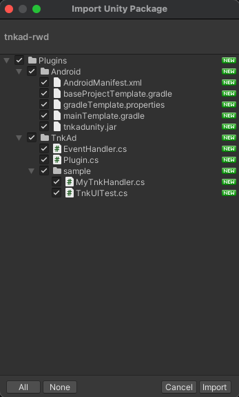
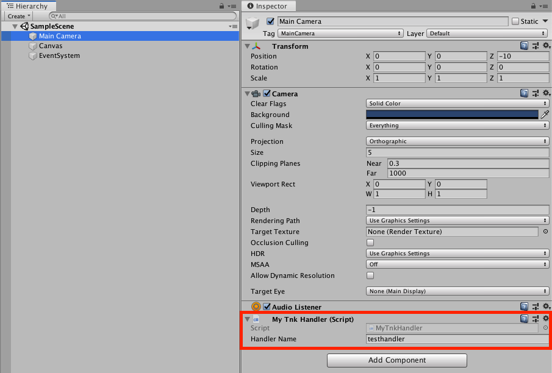

# Unity Plugin Guide

## 목차

1. [Unity Settings](#1-unity-settings)
   * [Plugin Download](#plugin-download)
   * [Plugin Import](#plugin-import)
   * [AdnroidMenifest.xml 설정](#adnroidmenifestxml-설정)
     * [Permission 설정](#permission-설정)
     * [Tnk App ID 설정](#tnk-app-id-설정)
     * [Offerwall Activity 설정](#offerwall-activity-설정)
     * [UnityPlayer](#unityplayer-설정)
   * [COPPA 설정](#coppa-설정)
2. [Publisher API](#2-publisher-api)

   가. [광고 목록 띄우기](#가-광고-목록-띄우기)

   * [유저 식별 값 설정](#유저-식별-값-설정)
     * [Method](#method)
     * [Parameters](#parameters)
   * [광고 목록 띄우기 (전체화면)](#광고-목록-띄우기-전체화면)
     * [Method](#method-1)
     * [Description](#description)
     * [Parameters](#parameters-1)
     * [적용 예시](#적용-예시)
   * [광고 띄우기 (팝업화면)](#광고-띄우기-팝업화면)
     * [Method](#method-2)
     * [Description](#description-1)
     * [Parameters](#parameters-2)
     * [적용 예시](#적용-예시-1)

   나. [EventHandler](#나-eventhandler)

   * [EventHandler 스크립트 만들기](#eventhandler-스크립트-만들기)
   * [GameObject에 추가하고 Handler Name 지정](#gameobject에-추가하고-handler-name-지정)
   * [설정한 Handler Name을 사용하여 Plugin API 호출](#설정한-handler-name을-사용하여-plugin-api-호출)

   다. [포인트 조회 및 인출](#다-포인트-조회-및-인출)

   * [TnkAd.Plugin - queryPoint()](#tnkadplugin---querypoint)
     * [Method](#method-3)
     * [Description](#description-2)
     * [Parameters](#parameters-3)
   * [TnkAd.Plugin - purchaseItem()](#tnkadplugin---purchaseitem)
     * [Method](#method-4)
     * [Description](#description-3)
     * [Parameters](#parameters-4)
   * [TnkAd.Plugin - withdrawPoints()](#tnkadplugin---withdrawpoints)
     * [Method](#method-5)
     * [Description](#description-4)
     * [Parameters](#parameters-5)
     * [포인트 조회 및 인출 기능 적용예시](#포인트-조회-및-인출-기능-적용예시)

   라. [그밖의 기능들](#라-그밖의-기능들)

   * [TnkAd.Plugin - queryPublishState()](#tnkadplugin---querypublishstate)
     * [Method](#method-6)
     * [Parameters](#parameters-6)
     * [적용 예시](#적용-예시-2)
   
3. [Interstitial Ad](#3-interstitial-ad)
   * [Incentive Interstitial Ad](#incentive-interstitial-ad)
   * [Interstitial Ad APIs](#interstitial-ad-apis)
     * [TnkAd.Plugin - prepareInterstitialAdForPPI()](#tnkadplugin---prepareinterstitialadforppi)
       * [Method](#method-7)
       * [Description](#description-5)
       * [Parameters](#parameters-7)
     * [TnkAd.Plugin - showInterstitialAdForPPI()](#tnkadplugin---showinterstitialadforppi)
       * [Method](#method-8)
       * [Description](#description-6)
       * [Parameters](#parameters-8)
     * [EventHandler 이용하기](#eventhandler-이용하기)
     * [Sample](#sample)

4. [Analytics Report](#4-analytics-report)

   * [기본 설정](#기본-설정)
   * [필수 호출](#필수-호출)
     * [TnkSession.applicationStarted()](#tnkadplugin---applicationstarted)
   * [사용 활동 분석](#사용-활동-분석)
     * [TnkSession.actionCompleted()](#tnkadplugin---actioncompleted)
   * [구매 활동 분석](#구매-활동-분석)
     * [TnkSession.buyCompleted()](#tnkadplugin---buycompleted)
   * [사용자 정보 설정](#사용자-정보-설정)


## 1. Unity Settings

### Plugin Download

Tnk에서 제공하는 tnkad-rwd.unitypackage 파일을 다운 받습니다.

**[[Unity Plugin Download v7.08.1](./sdk/tnkad-rwd.unitypackage)]**

### Plugin Import

적용할 Unity 프로젝트를 연 상태에서 다운로드 받은 tnkad-rwd.unitypackage 파일을 실행하면 아래와 같이 Plugin 파일들에 대한 import 창이 열립니다. 



모두 선택된 상태에서 [import] 버튼을 누르면 Plugin 파일들이 프로젝트로 import 됩니다.

### AdnroidMenifest.xml 설정

Plugin 내에는 TnkAdAndroidMenifest.xml 파일이 포함되어 있습니다. 이 파일의 내용을 참고하시어 AndroidMenifest.xml 파일을 직접 작성하시거나 또는 Android project로 export 하신 후 생성된 AndroidMenifest.xml 파일을 기초로 TnkAd Rwd SDK에서 필요로 하는 내용을 추가하시기 바랍니다.

작성하신 AndroidMenifest.xml 파일은 Unity 프로젝트의 Plugins/Android 폴더 저장하시기 바랍니다.

아래는 TnkAdAndroidMenifest.xml 파일의 내용입니다. 주석으로 되어 있는 부분의 설명을 확인하시고 본인의 AndroidMenifest.xml 파일에 반영해주세요.

> ##### TnkAdAndroidMenifest.xml

```xml
<?xml version="1.0" encoding="utf-8"?>
<manifest 
  xmlns:android="http://schemas.android.com/apk/res/android" 
  package="your.package.name" 
  android:theme="@android:style/Theme.NoTitleBar" 
  android:versionName="1.0" 
  android:versionCode="1" 
  android:installLocation="preferExternal">

  <uses-sdk android:minSdkVersion="16"/>
  
  <supports-screens 
    android:smallScreens="true" 
    android:normalScreens="true" 
    android:largeScreens="true" 
    android:xlargeScreens="true" 
    android:anyDensity="true" />
  
  <!-- permissions for TnkAd -->
  <uses-permission android:name="android.permission.INTERNET" />
  <uses-permission android:name="android.permission.ACCESS_WIFI_STATE" />
  <uses-permission android:name="com.google.android.finsky.permission.BIND_GET_INSTALL_REFERRER_SERVICE"/>
  
  <application 
    android:icon="@drawable/app_icon" 
    android:label="@string/app_name">

    <activity 
      android:label="@string/app_name" 
      android:screenOrientation="portrait" 
      android:launchMode="singleTask" 
      android:configChanges="mcc|mnc|locale|touchscreen|keyboard|keyboardHidden|navigation|orientation|screenLayout|uiMode|screenSize|smallestScreenSize|fontScale" 
      android:name="com.unity3d.player.UnityPlayerNativeActivity">

      <intent-filter>
        <action android:name="android.intent.action.MAIN" />
        <category android:name="android.intent.category.LAUNCHER" />
      </intent-filter>

      <meta-data android:name="unityplayer.UnityActivity" android:value="true" />
      <meta-data android:name="unityplayer.ForwardNativeEventsToDalvik" android:value="true" /> <!-- set true -->
    </activity>
    
    <!-- TnkAd  Offerwall Activities -->
    <activity android:name="com.tnkfactory.ad.AdWallActivity" android:screenOrientation="sensor"/>
    <activity android:name="com.tnkfactory.ad.AdMediaActivity" android:screenOrientation="landscape"/>
    
    <!-- Set your Tnk App_ID here -->
    <meta-data android:name="tnkad_app_id" android:value="your-appid-from-tnk-site" />
  </application>
  
  <uses-feature android:glEsVersion="0x00020000" />
  <supports-gl-texture android:name="GL_OES_compressed_ETC1_RGB8_texture" />
</manifest>
```

#### Permission 설정

TnkAd SDK 가 필요로 하는 permission을 아래와 같이 설정합니다.

```xml
<uses-permission android:name="android.permission.INTERNET" />
```

앱의 유입 경로 기능을 사용하기 위해서는 BIND_GET_INSTALL_REFERRER_SERVICE 권한은 필수입니다.

```xml
<uses-permission android:name="com.google.android.finsky.permission.BIND_GET_INSTALL_REFERRER_SERVICE"/>
```

#### Tnk App ID 설정

Tnk 사이트에서 앱 등록하면 상단에 App ID 가 나타납니다. 이를 AndroidMenifest.xml 파일의 <application> tag 안에 아래와 같이 설정합니다. 

(*your-application-id-from-tnk-site* 부분을 실제 App ID 값으로 변경하세요.)

```xml
<application>

     ...

    <meta-data android:name="tnkad_app_id" android:value="your-application-id-from-tnk-site" />

</application>
```

#### Offerwall Activity 설정

Offerwall Activity는 보상형 광고목록이 출력되는 Activity입니다. 매체앱으로서 충전소 기능을 탑제하시려면 아래의 <activity/> 설정을 추가하셔야합니다. 

```xml
<activity android:name="com.tnkfactory.ad.AdWallActivity" android:screenOrientation="sensor"/>
<activity android:name="com.tnkfactory.ad.AdMediaActivity" android:screenOrientation="landscape"/>
```

#### UnityPlayer 설정

Unity 4.3 이상 버전을 사용하신다면 아래와 같이 ForwardNativeEventsToDalvik 옵션을 true로 설정하셔야 화면에 touch 이벤트가 동작합니다. 매체앱으로서 전면 중간광고 창을 띄우고자 하신다면 반드시 아래와 같이 설정해주세요. 광고만 진행하시는 경우에는 설정하실 필요가 없습니다.

```xml
<activity 
  android:label="@string/app_name" 
  android:screenOrientation="portrait" 
  android:launchMode="singleTask" 
  android:configChanges="mcc|mnc|locale|touchscreen|keyboard|keyboardHidden|navigation|orientation|screenLayout|uiMode|screenSize|smallestScreenSize|fontScale" 
  android:name="com.tnkfactory.spaceshootler.UnityPlayerNativeActivity">

  <intent-filter>
    <action android:name="android.intent.action.MAIN" />
    <category android:name="android.intent.category.LAUNCHER" />
  </intent-filter>

  <meta-data android:name="unityplayer.UnityActivity" android:value="true" />
  <meta-data android:name="unityplayer.ForwardNativeEventsToDalvik" android:value="true" /> <!-- set true -->
</activity>
```

### COPPA 설정

COPPA는 [미국 어린이 온라인 개인정보 보호법](https://www.ftc.gov/tips-advice/business-center/privacy-and-security/children's-privacy) 및 관련 법규입니다. 구글 에서는 앱이 13세 미만의 아동을 대상으로 서비스한다면 관련 법률을 준수하도록 하고 있습니다. 연령에 맞는 광고가 보일 수 있도록 아래의 옵션을 설정하시기 바랍니다.

```c#
using UnityEngine;
using System.Collections;

public class TnkUITest : MonoBehaviour {

  void Start ()
  {
  	TnkAd.Plugin.Instance.setCOPPA(true); // ON - 13세 미안 아동을 대상으로 한 서비스 일경우 사용
  	TnkAd.Plugin.Instance.setCOPPA(false); // OFF - 기본값
  
  // ...
}
```

## 2. Publisher API

Unity용 Plugin 으로 TnkAd.Plugin 클래스와 TnkAd.EventHandler 클래스가 제공됩니다.
Plugin 클래스는 광고목록이나 중간 전면광고 등의 TnkAd의 기능을 사용하기 위해서는 제공되는 클래스입니다. EventHandler 클래스는 API 중 비동기로 결과를 받아야 하는 경우에 사용되는 클래스입니다. 

### 가. 광고 목록 띄우기

#### 유저 식별 값 설정

앱이 실행되면 우선 앱 내에서 사용자를 식별하는 고유한 ID를 아래의 API를 사용하시어 Tnk SDK에 설정하시기 바랍니다. 
사용자 식별 값으로는 게임의 로그인 ID 등을 사용하시면 되며, 적당한 값이 없으신 경우에는 Device ID 값 등을 사용할 수 있습니다.
(유저 식별 값이 Device ID 나 전화번호, 이메일 등 개인 정보에 해당되는 경우에는 암호화하여 설정해주시기 바랍니다.)
유저 식별 값을 설정하셔야 이후 사용자가 적립한 포인트를 개발사의 서버로 전달하는 callback 호출 시에  같이 전달받으실 수 있습니다.
(포인트 관리를 자체서버에서 하는 경우에만 해당됩니다. 1.6 Callback URL 페이지를 참고해주세요.)

##### Method

- void setUserName(string userName)

##### Parameters

| 파라메터 명칭 | 내용                                                         |
| ------------- | ------------------------------------------------------------ |
| userName      | 앱에서 사용자를 식별하기 위하여 사용하는 고유 ID 값 (로그인 ID 등)  길이는 256 bytes 이하입니다. |

#### 광고 목록 띄우기 (전체화면)

보상형 광고 목록을 띄우기 위하여 TnkAd.Plugin 객체의 showAdList() 함수를 사용합니다.

##### Method

- void showAdList()
- void showAdList(TnkAd.AdListType type)
- void showAdList(string title)
- void showAdList(stirng title, TnkAd.TemplateStyle style)
- void showAdList(string title, TnkAd.AdListType type, TnkAd.TemplateStyle style)

##### Description

TnkAd.Plugin 클래스가 제공하는 메소드로서 광고 목록 화면을 띄워줍니다. TnkAd.Plugin 의 Instance 객체를 받아서 메소드를 호출해야합니다.

##### Parameters

| 파라메터 명칭 | 내용                          |
| ------------- | ----------------------------- |
| title         | 광고 리스트의 타이틀을 지정함 |

##### 적용 예시

```c#
using UnityEngine;
using System.Collections;

public class TnkUITest : MonoBehaviour {

  void Start ()
  {
  }
  
  void Update ()
  {
  }
  
  void OnGUI ()
  {
    if (GUI.Button(new Rect(100, 300, 150, 80), "Show Offerwall")) {
      Debug.Log("Offerwall Ad");
        
      string title = "Test Title";

      //TnkAd.Plugin.Instance.showAdList();
      //TnkAd.Plugin.Instance.showAdList(TnkAd.AdListType.PPI);
      //TnkAd.Plugin.Instance.showAdList(title);
      //TnkAd.Plugin.Instance.showAdList(title, TnkAd.AdListType.PPI);
      //TnkAd.Plugin.Instance.showAdList(title, TnkAd.TemplateStyle.BLUE_01);
      TnkAd.Plugin.Instance.showAdList(title, TnkAd.AdListType.PPI, TnkAd.TemplateStyle.RED_01);
    }
  }
}
```

#### 광고 띄우기 (팝업화면)

보상형 광고 목록을 popup view 형태로 띄워줍니다.

##### Method

- void popupAdList()
- void popupAdList(TnkAd.AdListType type)
- void popupAdList(string title)
- void popupAdList(string title, TnkAd.AdListType type)
- void popupAdList(string title, string handlerName)
- void popupAdList(string title, TnkAd.AdListType type, string handlerName)
- void popupAdList(string title, TnkAd.AdListType type, TnkAd.TemplateStyle style)
- void popupAdList(string title, TnkAd.AdListType type, string handlerName, TnkAd.TemplateStyle style)

##### Description

TnkAd.Plugin 클래스가 제공하는 메소드로서 광고 목록 화면을 팝업 형태로 띄워줍니다. TnkAd.Plugin 의 Instance 객체를 받아서 메소드를 호출해야합니다.
handlerName을 지정할 경우 popup 화면이 뜨는 시점과 닫히는 시점에 이벤트를 받을 수 있습니다. 다음 장의 'EventHandler' 내용을 참고하세요.

##### Parameters

| 파라메터 명칭 | 내용                          |
| ------------- | ----------------------------- |
| title         | 광고 리스트의 타이틀을 지정함 |

##### 적용 예시

```c#
using UnityEngine;
using System.Collections;

public class TnkUITest : MonoBehaviour {

  void Start ()
  {
  }
  
  void Update ()
  {
  }
  
  void OnGUI ()
  {
    if (GUI.Button(new Rect(100, 300, 150, 80), "Popup Offerwall")) {
      Debug.Log("Offerwall Ad");
        
      string title = "Test Title";

      //TnkAd.Plugin.Instance.popupAdList();
      //TnkAd.Plugin.Instance.popupAdList(TnkAd.AdListType.CPS);
      //TnkAd.Plugin.Instance.popupAdList(title);
      //TnkAd.Plugin.Instance.popupAdList(title, TnkAd.AdListType.CPS);
      //TnkAd.Plugin.Instance.popupAdList(title, "testhandler");
      //TnkAd.Plugin.Instance.popupAdList(title, TnkAd.AdListType.CPS, "testhandler");
      //TnkAd.Plugin.Instance.popupAdList(title, TnkAd.AdListType.CPS, TnkAd.TemplateStyle.RED_01);
      TnkAd.Plugin.Instance.popupAdList(title, TnkAd.AdListType.CPS, "testhandler", TnkAd.TemplateStyle.RED_01);
    }
  }
}
```

### 나. EventHandler

EventHandler 클래스는 포인트 조회나 포인트 인출과 같이 비동기로 결과를 받아야 하는 경우 또는 중간 전면광고에서 발생하는 이벤트를 처리하기 위해서 제공되는 클래스입니다.
EventHandler 클래스의 모습은 아래와 같습니다.

> EventHandler 클래스

```c#
using UnityEngine;
using System.Collections;

namespace TnkAd {
  public class EventHandler : MonoBehaviour {
  
    // publishing state 
    public const int PUB_STAT_NO = 0; // not publishing yet
    public const int PUB_STAT_YES = 1; // publising state
    public const int PUB_STAT_TEST = 2; // testing state

    // onClose(int type)
    public const int CLOSE_SIMPLE = 0; // users simply closed ad view.
    public const int CLOSE_CLICK = 1; // users clicked ad view.
    public const int CLOSE_EXIT = 2; // users clicked exit app button.

    // onFailure(int errCode)
    public const int FAIL_NO_AD = -1;  // no ad available
    public const int FAIL_NO_IMAGE = -2; // ad image not available
    public const int FAIL_TIMEOUT = -3;  // ad not arrived in 5 secs.
    public const int FAIL_CANCELED = -4; // ad frequency setting
    public const int FAIL_NOT_PREPARED = -5; // prepare not invoked.

    public const int FAIL_SYSTEM = -9;

    // Set 'Handler Name' in Unity Inspector
    public string handlerName;
        
    // ... 

    // ServiceCallback methods
    public virtual void onReturnQueryPoint(int point) {}
    public virtual void onReturnWithdrawPoints(int point) {}
    public virtual void onReturnPurchaseItem(long curPoint, long seqId) {}
    public virtual void onReturnQueryPublishState(int state) {}

    // TnkAdListener methods
    public virtual void onFailure(int errCode) { }
    public virtual void onLoad() { }
    public virtual void onShow() { }
    public virtual void onClose(int type) { }
  }
}
```

EventHandler를 사용하기 위해서 다음과 같이 진행하세요.

1. 우선 새로운 스크립트를 생성하시고 상위 클래스를 EventHandler로 변경합니다.
2. 처리해야할 메소드를 override 하여 구현합니다. (EventHandler의 모든 메소드를 override 하실 필요는 없습니다. 처리해야햘 메소드만 구현하세요.)
3. 구현된 클래스를 Unity의 Scene 화면의 GameObject 객체에 추가합니다. (기존의 GameObject에 추가하셔도 되고 새로운 GameObject를 생성하시어 추가하여도 상관없습니다.)
4. Unity Inspector 화면에서 추가한 스크립트의 Handler Name 속성에 이름을 지정합니다. 여기에 지정된 이름이 TnkAd.Plugin의 API 호출시 사용됩니다.

#### EventHandler 스크립트 만들기

> ##### EventHandler 구현 예시

```c#
using UnityEngine;
using System.Collections;

public class MyTnkHandler : TnkAd.EventHandler {

  public override void onReturnQueryPoint(int point) {
    Debug.Log("##### onReturnQueryPoint " + point.ToString());
  }
  
  public override void onReturnPurchaseItem(long curPoint, long seqId) {
    Debug.Log("##### onReturnPurchaseItem point = " + curPoint.ToString());
    Debug.Log("##### onReturnPurchaseItem seqId = " + seqId.ToString());
  }
}
```

#### GameObject에 추가하고 Handler Name 지정



#### 설정한 Handler Name을 사용하여 Plugin API 호출

> EventHandler 사용 예시

```c#
if (GUI.Button(new Rect (100, 400, 150, 80), "Query point")) {
    Debug.Log("Query point");
    
    // be sure that put handler object named 'testhandler' in your scene. (It should be named in Unity Inspector)
    TnkAd.Plugin.Instance.queryPoint("testhandler"); 
}
```

### 다. 포인트 조회 및 인출

사용자가 광고참여를 통하여 획득한 포인트는 Tnk서버에서 관리되거나 앱의 자체서버에서 관리될 수 있습니다.
포인트가 Tnk 서버에서 관리되는 경우에만 아래의 포인트 조회 및 인출 API를 사용하시어 필요한 아이템 구매 기능을 구현하실 수 있습니다.

#### TnkAd.Plugin - queryPoint()

Tnk서버에 적립되어 있는 사용자 포인트 값을 조회합니다. 비동기 방식으로 호출되므로 결과를 받기 위한 EventHandler 객체를 생성하셔야 합니다.

##### Method

- void queryPoint(string handlerName)

##### Description

Tnk 서버에 적립되어 있는 사용자 포인트 값을 조회합니다. 비동기 방식으로 호출되며 결과를 받으면 handlerName으로 지정된 EventHandler 객체의 onReturnQueryPoint()  메소드가 호출됩니다. 

##### Parameters

| 파라메터 명칭 | 내용                                                         |
| ------------- | ------------------------------------------------------------ |
| handlerName   | 서버에서 결과가 오면 handlerName으로 지정된 EventHandler 객체의 onReturnQueryPoint(int point) 메소드가 호출됩니다. |

#### TnkAd.Plugin - purchaseItem()

TnK 서버에서는 별도로 아이템 목록을 관리하는 기능을 제공하지는 않습니다. 다만 게시앱에서 제공하는 아이템을 사용자가 구매할 때 Tnk 서버에 해당 포인트 만큼을 차감 할 수 있습니다. 
비동기 방식으로 호출되므로 결과를 받기 위한 EventHandler 객체를 생성하셔야 합니다.

##### Method

- void purchaseItem(int pointCost, string itemId, string handlerName)

##### Description

Tnk 서버에 적립되어 있는 사용자 포인트를 차감합니다. 차감내역은 Tnk사이트의 보고서 페이지에서 조회하실 수 있습니다.

##### Parameters

| 파라메터 명칭 | 내용                                                         |
| ------------- | ------------------------------------------------------------ |
| pointCost     | 차감할 포인트                                                |
| itemId        | 구매할 아이템의 고유 ID (매체앱에서 자체적으로 정하여 부여한 ID) Tnk 사이트의 보고서 페이지에서 함께 보여줍니다. |
| handlerName   | 서버에서 결과가 오면 handlerName으로 지정된 EventHandler 객체의  onReturnPurchaseItem(long curPoint, long seqId) 메소드가 호출됩니다. curPoint 값은 차감 후 남은 포인트 값이며, seqId 값은 고유한 거래 ID 값이 담겨 있습니다. seqId 값이 음수 인경우에는 포인트 부족 등으로 오류가 발생한 경우입니다. |

#### TnkAd.Plugin - withdrawPoints()

Tnk 서버에서 관리되는 사용자 포인트 전체를 한번에 인출하는 기능입니다.
비동기 방식으로 호출되므로 결과를 받기 위한 EventHandler 객체를 생성하셔야 합니다.

##### Method

- void withdrawPoints(string desc, string handlerName)

##### Description

Tnk 서버에 적립되어 있는 사용자의 모든 포인트를 차감합니다. 차감내역은 Tnk사이트의 보고서 페이지에서 조회하실 수 있습니다.

##### Parameters

| 파라메터 명칭 | 내용                                                         |
| ------------- | ------------------------------------------------------------ |
| desc          | 포인트 차감에 대한 간단한 설명 Tnk 사이트의 보고서 페이지에서 함께 보여줍니다. |
| handlerName   | 서버에서 결과가 오면 handlerName으로 지정된 EventHandler 객체의  onReturnWithdrawPoints(int point) 메소드가 호출됩니다. point 값은 인출된 포인트 값입니다. 해당 사용자에게 충전된 포인트가 없는 경우에는 0이 반환됩니다. |

##### 포인트 조회 및 인출 기능 적용예시

```c#
using UnityEngine;
using System.Collections;

public class TnkUITest : MonoBehaviour {

  void Start ()
  {
  }
  
  void Update ()
  {
  }
  
  void OnGUI ()
  {
    if (GUI.Button(new Rect(100, 400, 150, 80), "Query point")) {
      Debug.Log("Query point");

      // be sure that put handler object named 'testhandler' in your scene. (It should be named in Unity Inspector)
      TnkAd.Plugin.Instance.queryPoint("testhandler"); 
    }

    if (GUI.Button(new Rect(100, 500, 150, 80), "Purchase Item")) {
      Debug.Log("Purchase Item");
        
      // be sure that put handler object named 'testhandler' in your scene. (It should be named in Unity Inspector)
      TnkAd.Plugin.Instance.purchaseItem(100, "item01", "testhandler"); 
    }
  }
}
```

### 라. 그밖의 기능들

#### TnkAd.Plugin - queryPublishState()

Tnk 사이트의 [게시정보]에서 광고 게시 중지를 하게 되면 이후에는 사용자가 광고 목록 창을 띄워도 광고들이 나타나지 않습니다.
그러므로 향후 광고 게시를 중지할 경우를 대비하여 화면에 충전소 버튼 자체를 보이지 않게 하는 기능을 갖추는 것이 바람직합니다.
이를 위하여 현재 광고게시 상태를 조회하는 기능을 제공합니다.

##### Method

- void queryPublishState(string handlerName)

##### Parameters

| 파라메터 명칭 | 내용                                                         |
| ------------- | ------------------------------------------------------------ |
| handlerName   | 서버에서 결과가 오면 handlerName으로 지정된 EventHandler 객체의 OnReturnQueryPublishState(int state) 메소드가 호출됩니다. |

##### 적용 예시

```c#
using UnityEngine;
using System.Collections;

public class TnkUITest : MonoBehaviour {

  void Start ()
  {
    TnkAd.Plugin.Instance.setUserName("test_name");
    TnkAd.Plugin.Instance.queryPublishState("testhandler"); 
  }
  
  // ...
}
```

## 3. Interstitial Ad

전면 광고 적용을 위해서는 Tnk 사이트에서 앱 등록 Unity Plugin 관련 설정이 우선 선행되어야합니다.
[[Unity Settings]](#1-unity-settings) 의 내용을 우선 확인해주세요.

### Incentive Interstitial Ad

보상형 전면 광고를 띄우는 것은 아래와 같이 간단히 2줄의 코딩만으로 가능합니다.

```c#
using UnityEngine;
using System.Collections;

public class TnkUITest : MonoBehaviour {

  void Start ()
  {
  }
  
  void Update ()
  {
  }
  
  void OnGUI ()
  {
    if (GUI.Button(new Rect (100, 100, 150, 80), "Interstitial Ad")) {
      Debug.Log("interstitial Ad");
      
      TnkAd.Plugin.Instance.prepareInterstitialAdForPPI();
      TnkAd.Plugin.Instance.showInterstitialAd();
    }
  }
}
```

### Interstitial Ad APIs

전면 광고를 띄우기 위해서 사용하는 prepareInterstitialAdForPPI() 와 showInterstitialAdForPPI() 의 API 규약은 아래와 같습니다.

#### TnkAd.Plugin - prepareInterstitialAdForPPI()

##### Method

- void prepareInterstitialAdForPPI()
- void prepareInterstitialAdForPPI(string handleName)

##### Description

하나의 전면광고를 로딩합니다. 로딩된 전면광고는 이후 showInterstitialAdForPPI() API를 호출하여 화면에 띄울수 있습니다. EventHandler의 이름을 지정하면 전면광고관련 이벤트 발생시점에 EventHandler 객체의 메소드들이 호출됩니다.

##### Parameters

| 파라메터 명칭 | 내용                                                         |
| ------------- | ------------------------------------------------------------ |
| handlerName   | EventHandler 객체의 이름                                     |

#### TnkAd.Plugin - showInterstitialAdForPPI()

##### Method

- void showInterstitialAdForPPI()
- void showInterstitialAdForPPI(string handleName)

##### Description

prepareInterstitialAdForPPI()를 통하여 로딩된 전면광고를 화면에 띄웁니다.

##### Parameters

| 파라메터 명칭 | 내용                     |
| ------------- | ------------------------ |
| handlerName   | EventHandler 객체의 이름 |

### EventHandler 이용하기

전면광고의 로딩이 완료되거나 사용자가 전면광고 화면을 닫는 경우 해당 이벤트 발생시점에 필요한 로직을 구현하기 위해서는 EventHandler 객체를 생성해야합니다.
EventHandler 클래스는 포인트 조회나 포인트 인출과 같이 비동기로 결과를 받아야 하는 경우 또는 중간 전면광고에서 발생하는 이벤트를 처리하기 위해서 제공되는 클래스입니다.
EventHandler 에 대한 자세한 내용은 [[EventHandler]](#나-eventhandler) 를 참고하세요.


전면 광고와 관련되어 EventHandler에서 발생하는 이벤트들은 아래와 같습니다.

* onClose(int type) : 전면 화면이 닫히는 시점에 호출됩니다. 화면이 닫히는 이유가 type 파라메터로 전달됩니다.
  * CLOSE_SIMPLE (0) : 사용자가 전면 화면의 닫기 버튼이나 Back 키를 눌러서 닫은 경우입니다.
  * CLOSE_CLICK (1) : 사용자가 전면 화면의 광고를 클릭하여 해당 광고로 이동하는 경우 입니다.
  * CLOSE_EXIT (2) : 전면 화면에 앱 종료버튼이 있는 경우 사용자가 앱 종료 버튼을 누른 경우입니다. 이 경우 앱을 종료하는 로직을 EventHandler에 구현해야합니다.
* onFailure(int errCode) : 전면 광고를 가져오지 못한 경우 호출이 됩니다. 에러 코드가 errCode 파라메터로 전달됩니다.
  * FAIL_NO_AD (-1) : 제공할 전면광고가 없을 경우입니다.
  * FAIL_NO_IMAGE (-2) : 전면 광고를 가져왔으나 전면 이미지 정보가 없는 경우입니다.
  * FAIL_TIIMEOUT (-3) : showInterstitialAdForPPI() 호출 후 5초 이내에 전면광고가 도착하지 않은 경우입니다. 이 경우에는 전면광고를 띄우지 않습니다.
  * FAIL_CANCELED (-4) : prepareInterstitialAdForPPI() 호출하였으나 서버에서 설정한 광고 노출 주기를 지나지 않아 취소된 경우입니다.
  * FAIL_NOT_PREPARED (-5) : prepareInterstitialAdForPPI()를 호출하지 않고 showInterstitialAdForPPI()를 호출한 경우입니다.
  * FAIL_SYSTEM (-9) : 서버 또는 네트워크 오류가 발생한 경우입니다.
* onLoad() : prepareInterstitialAdForPPI() 호출하여 전면광고를 성공적으로 가져온 경우 호출됩니다. 만약 전면광고가 도착하기 전에 showInterstitialAdForPPI() 가 호출되었다면 이후 전면광고 도착시 onLoad() 가 호출되지 않고 바로 전면광고가 보여지면서 onShow()가 호출됩니다.
* onShow() : 전면광고가 화면에 나타날 때 호출됩니다.

#### Sample

아래의 예시는 EventHandler를 사용하여 광고가 로딩되는 시점에 앱의 상태를 판단하여 광고를 띄울지 말지 결정하는 방식의 구현 예시입니다.

> EventHandler Sample

```c#
using UnityEngine;
using System.Collections;

public class MyTnkHandler : TnkAd.EventHandler {

  public bool isOkToShow = true;

  public override void onClose(int type) {
    Debug.Log ("##### TnkAd.Listener onClose " + type.ToString());
  }
  
  public override void onFailure(int errCode) {
    Debug.Log ("##### TnkAd.Listener onFailure " + errCode.ToString());
  }
  
  public override void onLoad() {
    Debug.Log ("##### TnkAd.Listener onLoad ");

    if (isOkToShow) {
      TnkAd.Plugin.Instance.showInterstitialAdForPPI("testhandler");
    } else {
      // not showing
    }
  }
  
  public override void onShow() {
    Debug.Log ("##### TnkAd.Listener onShow ");
  }
}
```

```c#
using UnityEngine;
using System.Collections;

public class TnkUITest : MonoBehaviour {

  void Start ()
  {
  }
  
  void Update ()
  {
  }
  
  void OnGUI ()
  {
    if (GUI.Button (new Rect (100, 200, 150, 80), "Ad Listener")) {
      Debug.Log("interstitial Ad for Listener");

      // be sure that put handler object named 'testhandler' in your scene. (It should be named in Unity Inspector)
      TnkAd.Plugin.Instance.prepareInterstitialAdForPPI("testhandler"); 
    }
  }
}
```

## 4. Analytics Report

Analytics 적용을 위해서는 Tnk 사이트에서 앱 등록 및 프로젝트 상의 SDK 관련 설정이 우선 선행되어야합니다.

[[Unity Settings](#1-unity-settings)]의 내용을 우선 확인해주세요.

### 기본 설정

AndroidMenifest.xml 파일 내에 Tnk 앱 등록세 발급 받은 App ID를 설정하시고 그 아래에 아래와 같이 tnkad_tracking 값을 true로 설정합니다.

이후 더 이상 tracking을 원하지 않을 경우에는 false로 설정하시기 바랍니다.

```xml
<application>
    ...
    <meta-data android:name="tnkad_app_id"  android:value="your-app-id-from-tnk-sites" />
    <meta-data android:name="tnkad_tracking" android:value="true" />
    ...
</application>
```

SDK가 요구하는 permission들을 추가합니다.

\- 앱의 유입 경로 기능을 사용하기 위해서는 BIND_GET_INSTALL_REFERRER_SERVICE 권한은 필수입니다.

```xml
<uses-permission android:name="android.permission.INTERNET" />

<uses-permission android:name="android.permission.ACCESS_WIFI_STATE" />

<uses-permission android:name="com.google.android.finsky.permission.BIND_GET_INSTALL_REFERRER_SERVICE" />
```

전체적인 AndroidMenifest 파일의 모습은 아래와 같습니다.

```xml
<manifest xmlns:android="http://schemas.android.com/apk/res/android" package="your.package.name" >

    <uses-permission android:name="android.permission.INTERNET" /> 
    <uses-permission android:name="android.permission.ACCESS_WIFI_STATE" />
    <uses-permission android:name="com.google.android.finsky.permission.BIND_GET_INSTALL_REFERRER_SERVICE" />


    <application android:icon="@drawable/ic_launcher" android:label="@string/app_name"> 

        ... your activities ...

 

        <meta-data android:name="tnkad_app_id" android:value="your-app-id-from-tnk-sites" />

        <meta-data android:name="tnkad_tracking" android:value="true" />    

    </application>

</manifest> 
```

### 필수 호출

앱이 실행되는 시점에 TnkSession.applicationStarted()를 호출합니다. 필수적으로 호출해야하는 API 이며 이것만으로도 사용자 활동 분석을 제외한 대부분의 분석 데이터를 얻으실 수 있습니다.

#### TnkAd.Plugin - applicationStarted()

##### Method

- void applicationStarted()

##### Description

앱이 실행되는 시점에 호출합니다. 다른 API 보다 가장 먼저 호출되어야 합니다.

##### 적용 예시

```c#
TnkAd.Plugin.Instance.applicationStarted();
```

### 사용 활동 분석

사용자가 앱을 설치하고 처음 실행했을 때 어떤 행동을 취하는지 분석하고자 할 때 아래의 API를 사용합니다.

예를 들어 로그인, 아이템 구매, 친구 추천 등의 행동이 이루어 질때 해당 행동에 대한 구분자와 함께 호출해주시면 사용자가 어떤 패턴으로 앱을 이용하는지 또는 어떤 단계에서 많이 이탈하는지 등의 분석이 가능해집니다.

#### TnkAd.Plugin - actionCompleted()

##### Method

- void actionCompleted(string actionName)

##### Description

사용자의 특정 액션 발생시 호출합니다.

동일 액션에 대해서는 최초 발생시에만 데이터가 수집됩니다.

##### Parameters

| 파라메터 명칭 | 내용                                                         |
| ------------- | ------------------------------------------------------------ |
| actionName    | 사용자 액션을 구별하기 위한 문자열 (예를 들어 "user_login" 등) 사용하시는 actionName 들은 모두 Tnk 사이트의 분석보고서 화면에서 등록되어야 합니다. |

##### 적용 예시

```c#
// 추가 데이터 다운로드 완료시 
TnkAd.Plugin.Instance.actionCompleted("resource_loaded");

// 회원 가입 완료시 
TnkAd.Plugin.Instance.actionCompleted("signup_completed");

// 프로필 작성 완료시 
TnkAd.Plugin.Instance.actionCompleted("profile_entered");

// 친구 추천시 
TnkAd.Plugin.Instance.actionCompleted("friend_invite"); 
```

### 구매 활동 분석

사용자가 유료 구매 등의 활동을 하는 경우 이에 대한 분석데이터를 얻고자 할 경우에는 아래의 API를 사용합니다. 

구매활동 분석 API 적용시에는 유입경로별로 구매횟수와 구매 사용자 수 파악이 가능하며, 하루 사용자 중에서 몇명의 유저가 구매 활동을 하였는 지 또 사용자가 앱을 처음 실행한 후 얼마정도가 지나야 구매활동을 하는지 등의 데이터 분석이 가능합니다. 분석 보고서에서 제공하는 데이터에 각 아이템별 가격을 대입시키면 ARPU 및 ARPPU 값도 산출하실 수 있습니다.

#### TnkAd.Plugin - buyCompleted()

##### Method

- void buyCompleted(string itemName)

##### Description

사용자가 유료 구매를 완료하였을 때 호출합니다.

##### Parameters

| 파라메터 명칭 | 내용                                                        |
| ------------- | ----------------------------------------------------------- |
| itemName      | 구매한 item을 구별하기 위한 문자열 (예를 들어 "item_01" 등) |

##### 적용 예시

```c#
// item_01 구매 완료시 
TnkAd.Plugin.Instance.buyCompleted("item_01");

//item_02 구매 완료시
TnkAd.Plugin.Instance.buyCompleted("item_02");
```

### 사용자 정보 설정

사용자의 성별 및 나이 정보를 설정하시면 보고서에서 해당 내용이 반영되어 추가적인 데이터를 확인하실 수 있습니다.

```c#
// 나이 설정 
TnkAd.Plugin.Instance.setUserAge(23);

// 성별 설정 (남) 
TnkAd.Plugin.Instance.setUserGender(0);

// 성별 설정 (여) 
TnkAd.Plugin.Instance.setUserGender(1); 
```

