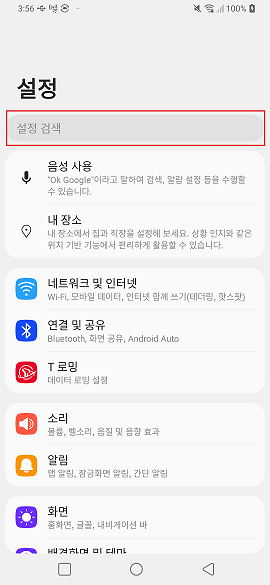
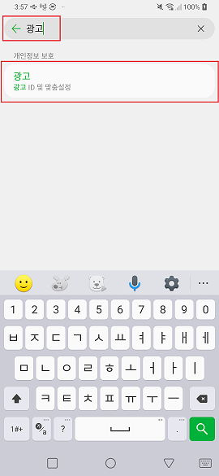
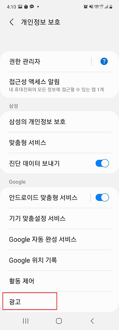
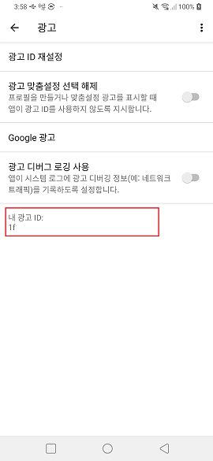
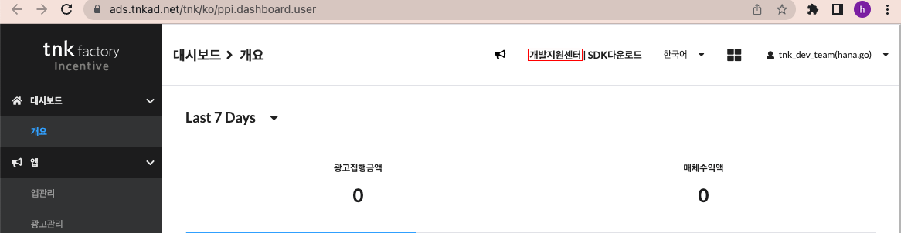
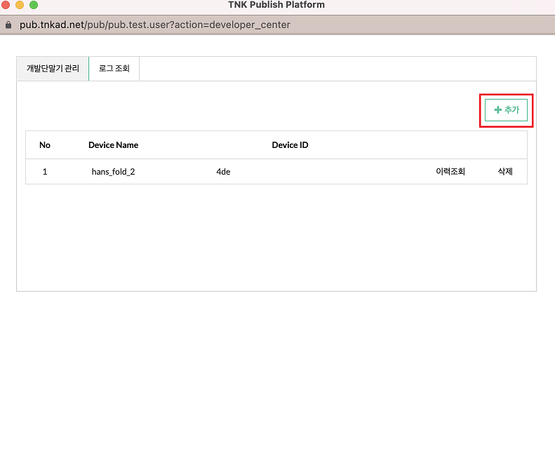
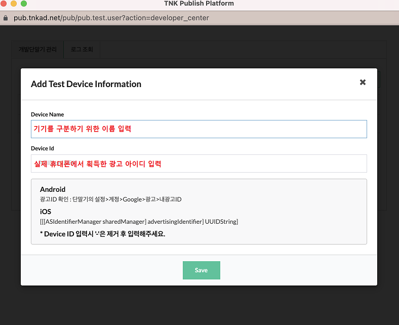
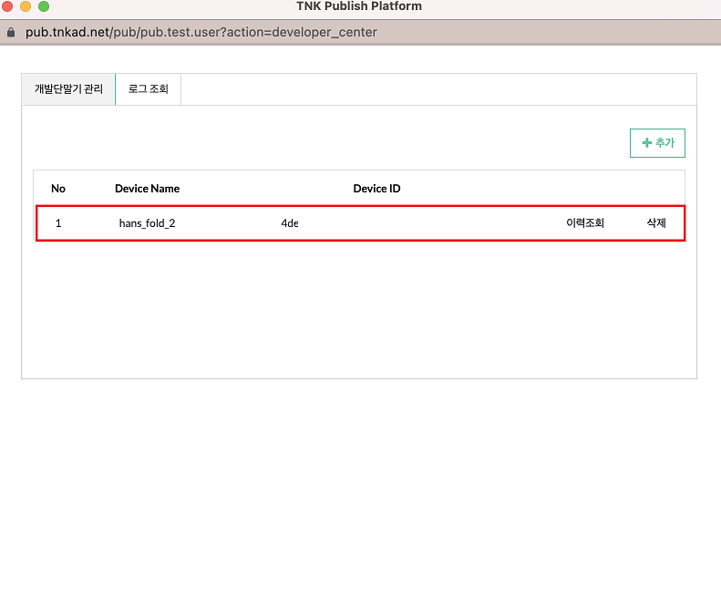

### 1. 광고 ID확인

publisher페이지에서 테스트 기기를 등록 하실 수 있습니다.

**테스트 단말의 광고 ID 확인**
테스트 기기를 등록 하기 위해서는 먼저 기기의 광고 ID를 확인 할 필요가 있습니다.

<p>기기의 `설정`화면에서 검색 버튼을 누른 후 "광고"를 입력합니다.</p>


<p>광고/광고 ID 및 맟춤 설정을 선택합니다.</p>


<p>이동 한 화면 하단의 `광고`메뉴를 선택합니다.</p>


<p>해당 화면의 `내 광고 ID` 또는 `이 기기의 광고 ID`라는 항목으로 적혀있는 문자가 광고 ID입니다.</p>



### 2. 광고 ID 테스트 단말 등록

<p>먼저 Publisher페이지로 진입 후 페이지 상단의 개발지원센터 메뉴를 선택합니다.</p>


<p>팝업 창이 출력되면 우측 상단의 +추가 버튼을 누릅니다.</p>


<p>테스트 단말 정보를 입력하는 화면이 출력되면 기기를 구분하기 위한 이름과 단말기에서 획득한 광고 ID값을 입력합니다.</p>

```diff
- 주의 : 입력시 '-'문자는 포함하지 않도록 입력해 주시기 바랍니다.
```


<p>저장 버튼을 누르면 아래와 같이 목록에 기기가 추가 되어있는 것을 확인 하실 수 있습니다.</p>


